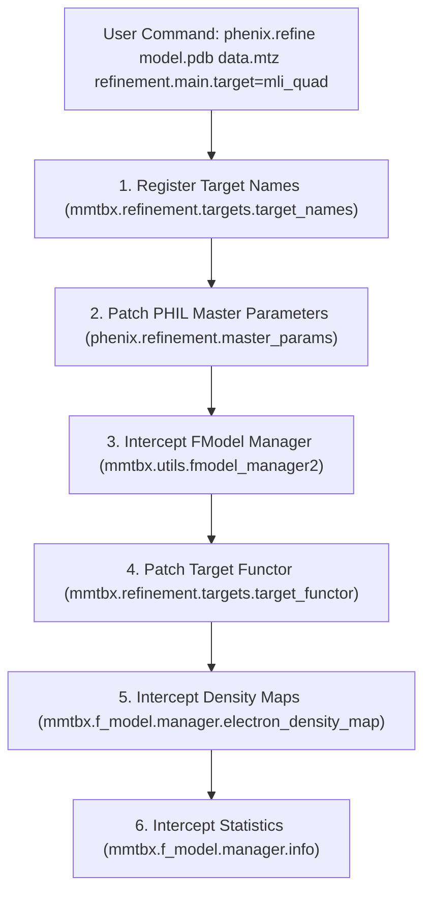
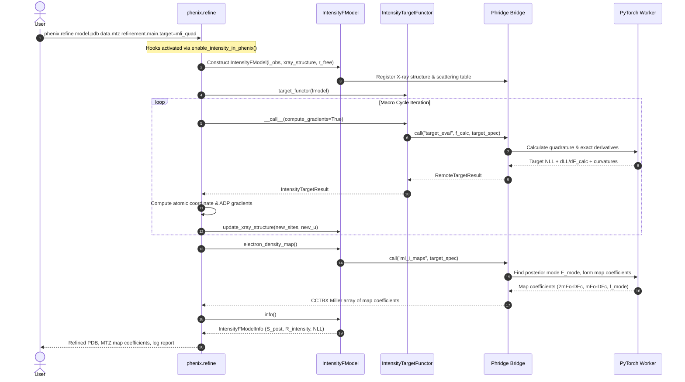

# Interfacing with `phenix.refine` for Intensity-Based Likelihood (`mli_quad`)

This document provides a comprehensive technical reference on how **Phridge** interfaces with `phenix.refine` and `mmtbx` to enable direct intensity-based likelihood refinement (`mli_quad` / `mli`).

---

## 1. Executive Summary & Problem Formulation

### The Traditional Amplitude Paradigm
In conventional macromolecular refinement with `phenix.refine`, experimental intensities $I_{\text{obs}} \pm \sigma(I)$ are converted into structure factor amplitudes $|F_{\text{obs}}| \pm \sigma(F)$ via French-Wilson truncation prior to refinement. The model is then optimized against amplitude-based maximum likelihood targets (`ml`, `mlhl`, `ml_sad`, `ls`):

$$-\ln L(|F_c|) = -\sum_h \ln P(|F_{\text{obs}, h}| \mid |F_{c, h}|, \sigma_A, \Sigma_N)$$

This conversion suffers from fundamental statistical flaws:
1. **Truncation of Negative Observations**: In background-subtracted diffraction experiments, weak reflections often have $I_{\text{obs}} \le 0$. French-Wilson imposes an artificial non-negative prior, squashing observation variance and creating an artificial intensity/amplitude noise floor.
2. **Phase and Contrast Erasure**: High-resolution Fourier phases depend critically on the contrast provided by weak reflections. Artificially inflating weak $|F_{\text{obs}}|$ values obscures faint electron density features (e.g. ordered water networks, sub-stoichiometric ligands).
3. **Improper Scoring**: Legacy $R$-factors ($R_{\text{work}}$, $R_{\text{free}}$) are dominated by low-resolution, high-intensity reflections, obscuring genuine coordinate improvements in high-resolution shells.

### The Direct Intensity Likelihood Solution
Phridge's intensity engine directly evaluates the joint marginalization integral over the unobserved error-free normalized amplitude $E$:

$$L(E_c) = \int_0^\infty f_{\text{prior}}(E \mid E_c, \sigma_A) \cdot f_{\text{noise}}\!\left(Z_o \mid E^2, \sigma_Z, \nu\right) dE$$

where:
- $f_{\text{prior}}$ is the **Rice distribution** for acentric reflections and the **Woolfson distribution** for centric reflections.
- $f_{\text{noise}}$ is either a normal noise distribution or a heavy-tailed **Student-$t$ noise distribution** with degrees of freedom $\nu$.
- $Z_o = I_{\text{obs}} / (\varepsilon \Sigma)$ and $\sigma_Z = \sigma(I_{\text{obs}}) / (\varepsilon \Sigma)$ are normalized experimental intensities.
- Derivatives w.r.t. structure factors $\frac{\partial \text{LL}}{\partial F_c}$ are evaluated analytically via **Fisher's identity** or automatic differentiation without ever forming $|F_{\text{obs}}|$.

---

## 2. System Architecture & Process Separation

To prevent environment incompatibilities between CCTBX (frequently running in Python 3.9 or 3.10 with specialized C++ shared objects) and PyTorch (running modern CUDA/MPS autograd kernels), Phridge uses a decoupled client-server architecture:

```
┌─────────────────────────────────────────────────────────────────────────┐
│                      PHENIX / CCTBX CLIENT RUNTIME                      │
│                                                                         │
│   phenix.refine / mmtbx                                                 │
│       ├── refinement.main.target = mli_quad                             │
│       ├── IntensityFModel (subclass of mmtbx.f_model.manager)           │
│       ├── IntensityTargetFunctor & IntensityTargetResult                │
│       ├── IntensityElectronDensityMap                                   │
│       └── IntensityFModelInfo (S_post/S_prior & R_intensity)           │
│                                                                         │
│   phridge.client.convert / Bridge                                       │
│       └── LinkML Serialization: PackedMiller, PackedXrayStructure       │
└────────────────────────────────────┬────────────────────────────────────┘
                                     │
                     Redis Streams / In-Memory Queue
                     RPC Operations:
                       • ml_i_target_and_gradients
                       • target_eval
                       • ml_i_maps
                       • ml_i_nuisance_fit
                                     │
┌────────────────────────────────────▼────────────────────────────────────┐
│                       PYTORCH / PHRIDGE WORKER                          │
│                                                                         │
│   phridge.contrib.intensity_ll.ops                                      │
│       ├── Differentiable Structure Factor Calculation (direct/fft)      │
│       ├── Adaptive Hybrid Quadrature (Gauss-Hermite & Gauss-Legendre)   │
│       ├── Student-t Heavy-Tailed Precision Mixture                      │
│       ├── Two-stage nuisance: intensity ML Wilson Σ, then σ_A (+ β)     │
│       ├── Fisher's Identity Exact Derivatives w.r.t. F_calc             │
│       ├── Block-Diagonal Gauss-Newton Curvatures & Preconditioning     │
│       └── Posterior Mode Amplitudes (E_mode -> F_mode)                  │
└─────────────────────────────────────────────────────────────────────────┘
```

The Phenix client requires **zero PyTorch dependencies**; all heavy tensor calculations are dispatched over the `Bridge`. For unified environments or test pipelines, `Bridge(memory=True)` executes the worker in-process.

---

## 3. The Interception Mechanism (`phenix_hook.py`)

The integration hook (`phridge.client.intensity.phenix_hook`) dynamically patches six core touchpoints in `mmtbx` and `phenix.refine` when `enable_intensity_in_phenix()` is invoked:



### Touchpoint 1: Target Registration
CCTBX maintains a global dictionary of recognized refinement targets in `mmtbx.refinement.targets.target_names`. The hook injects:
```python
target_names["mli_quad"] = target_attributes(family="ml", specialization="i")
target_names["mli"] = target_names["mli_quad"]
```
This registers `mli_quad` and its alias `mli` with the target attributes required by CCTBX macro cycles.

### Touchpoint 2: PHIL Parameter Schema Augmentation
When `phenix.refine` parses input arguments, `libtbx.phil` validates choices strictly. Without patching, `refinement.main.target=mli_quad` raises a choice error. The hook intercepts `phenix.refinement.master_params()`:
1. Locates `refinement.main.target`.
2. Injects the tokens `mli_quad` and `mli` into `node.words`.
3. Updates `node.caption` to include `MLI_QUAD`.
4. Wraps `phenix.refinement.misc.set_data_target_type` so any detection of `mli` standardizes to `"mli_quad"`.

### Touchpoint 3: FModel Manager Construction (`IntensityFModel`)
When `phenix.refine` sets up data managers via `mmtbx.utils.fmodel_manager2`:
```python
def patched_fmodel_manager2(f_obs, r_free_flags, ..., twin_law=None, target_name=None, i_obs=None, **kwargs):
    is_intensity_target = target_name in ("mli", "mli_quad", "ml_i")
    has_intensity_data = i_obs is not None or getattr(f_obs, "is_xray_intensity_array", lambda: False)()
    has_twin = bool(twin_law) or bool(kwargs.get("twin")) or bool(kwargs.get("is_twin"))

    if is_intensity_target or (has_intensity_data and target_name is None):
        if has_twin:
            raise IntensityTwinningError(
                "Twinning is not supported for intensity-based likelihood ('mli_quad') refinement: "
                "twin is True or twin_law was provided."
            )
        return IntensityFModel(
            i_obs=i_obs if i_obs is not None else f_obs,
            f_obs=f_obs,
            xray_structure=xray_structure,
            r_free_flags=r_free_flags,
            target_name=target_name or "mli_quad",
            ...
        )
```
- **Twinning Guard (Hard Error)**: Twinning is explicitly not supported for `mli_quad`. If `twin_law`, `twin=True`, or `is_twin=True` is encountered, a hard error (`IntensityTwinningError`, subclassing `RuntimeError`, `ValueError`, and `NotImplementedError`) is immediately raised.
- `IntensityFModel` subclasses `mmtbx.f_model.manager`.
- It maintains **amplitude scaffolding** (`self.f_obs()`) for legacy CCTBX routines (e.g. resolution binner, symmetry checks) while preserving genuine observed intensities `self.i_obs()` for the refinement engine.
- This bypasses French-Wilson amplitude conversion completely when raw intensities are supplied in the MTZ.

### Touchpoint 4: Target Functor Evaluation & Gradient Routing
During refinement macro cycles (coordinate minimization, simulated annealing, rigid body, B-factor optimization), `phenix.refine` calls `mmtbx.refinement.targets.target_functor(manager)`. The hook wraps `target_functor.__new__`:
```python
def patched_new(cls, manager, alpha_beta=None):
    if getattr(manager, "target_name", None) in ("mli", "mli_quad", "ml_i"):
        return IntensityTargetFunctor(manager, alpha_beta=alpha_beta)
    return orig_new(cls)
```

`IntensityTargetFunctor` calls the Phridge worker:
1. Dispatches `target_eval` with the current $F_{\text{model}}$ and target parameters.
2. Returns an `IntensityTargetResult` conforming to `mmtbx.refinement.targets.target_result_mixin`.
3. Returns target values:
   - `target_work()`: Negative log-likelihood on working reflections $W$.
   - `target_test()`: Negative log-likelihood on audit reflections $A$.
4. Computes exact derivatives w.r.t. structure factors:
   $$\frac{\partial T}{\partial F_{\text{calc}}} = \text{scale} \cdot \frac{\partial T}{\partial F_{\text{model}}}$$
5. By default, CCTBX `structure_factor_gradients_w` turns those into site / ADP / occupancy gradients.
6. With `--precondition` / `PHRIDGE_PRECONDITION=1`, `IntensityTargetResult.gradients_wrt_atomic_parameters` instead returns **packed Gauss–Newton–preconditioned** atomic gradients from the intensity worker (Cartesian sites, occupancy, $U_{\mathrm{iso}}$, and $U^*$). Weight selection should be re-run under that metric (see `PHRIDGE_WEIGHT_METRIC`).

### Touchpoint 5: Electron Density Map Synthesis
At the conclusion of macro cycles or when generating map coefficients, `phenix.refine` calls `fmodel.electron_density_map()`. The hook routes this to `IntensityElectronDensityMap`:
- Intercepts requests for `2mFo-DFc` and `mFo-DFc` maps.
- Dispatches `ml_i_maps` to the PyTorch worker.
- Evaluates the **Bayesian posterior mode amplitude** $E_{\text{mode}}$ via Newton's method on the posterior density:
  $$F_{\text{mode}} = \text{scale} \cdot \sqrt{\varepsilon \Sigma} \cdot E_{\text{mode}}$$
- Returns Fourier coefficients using the MAP estimator:
  - $2mF_o - DF_c$ equivalent: $(2 F_{\text{mode}} - |F_c|) \exp(i \phi_c)$
  - $mF_o - DF_c$ equivalent: $(F_{\text{mode}} - |F_c|) \exp(i \phi_c)$
  - Gradient and Newton difference density maps for rapid ligand and solvent placement.

### Touchpoint 6: Statistical Reporting (the S family)
Legacy $R$-factors do not represent proper scoring metrics under direct intensity modeling. `IntensityFModelInfo` overrides `mmtbx.f_model.manager.info`:
1. **S_post / S_prior** (`s_post_*`, `s_prior_*`): the expected residual $|E - k_S E_C|$ under the posterior, and the same functional under the prior. Same functional, different measure — **not** an R factor, and never labeled `r_work`/`r_free`. See [`maps.md` §9](../src/phridge/contrib/intensity_ll/maps.md).
2. **Direct Intensity R** (`r_intensity_*`): $\sum|I_{\mathrm{obs}}-|F_c|^2|/\sum|I_{\mathrm{obs}}|$ — a genuine point-estimate R on intensities, with no shrinkage, so it keeps the R label.
3. **French–Wilson amplitude R** (`r_work`/`r_free`/`r_all`, aliased `r_*_french_wilson`): the one conventional R factor in the output. It fills the mandated `R VALUE` / `FREE R VALUE` fields in REMARK 3 and is what `r_factors()` returns.
4. **Shrunken-amplitude diagnostics** (`r_post_*`, `r_mode_*`): biased low by posterior shrinkage, so they are demoted to a verbose block and never presented as R factors.
5. **Overall anisotropic B** (`aniso_scale()`): the PDB REMARK 3 tensor, fitted from the applied `k_anisotropic` array because `b_cart` on the fmodel is `None`. Reported on the banner, in the stats-report header, in REMARK 3, and in the scaling log.

**Every reported R names its amplitudes.** Under `mli_quad` the refinement target never
forms `F_obs` at all, so an unlabeled R is uninterpretable — and there are three
different things a reader could mistake for "the R factor". `F_obs` for the reported R is
the French–Wilson posterior amplitude from `I_obs` under the *Wilson prior alone, with no
model*, which is what keeps it model-free on the observation side and comparable with
deposited values. It is deliberately **not** the model-informed posterior mean `<F>`:
that one shrinks toward `sigma_A E_C`, so it improves as the data get worse, and it puts
the model on both sides of the residual. `tests/test_s_statistic_naming.py` asserts that
every printed line carrying an R label and a number also names French–Wilson (or is the
direct-intensity R).
5. **`show_all`** prints the overall banner plus a resolution table
   (`show_rfactors_targets_in_bins`) with `S_post` / `S_prior`, `data%`, $\sigma_A$, and `scale_k1`.
   The post-scale stats report (`PHRIDGE_STATS_REPORT`) adds `S_post` / `S_prior` columns to the I/σ bins,
   repeats the agreement statistics in its header (French–Wilson R, direct intensity R, and the
   posterior point estimates under a "NOT R factors" heading), and appends the `CC_I` table below.

**The `CC_I` table.** `CC_I = corr(I_obs, I_calc)` split by **fixed** I/σ bin (columns)
and resolution shell (rows). Each shell prints two lines: `CC_I` work/free, and the
percentage of that shell's reflections in each bin. Mean σ_A is reported per shell.

```
shell   d_max   d_min    σ_A     Nw    Nf     <0       0-1       1-2       2-3       3-5       5-9        >9       all
    1  29.794  20.537  0.909   4593   407 0.23/   . -.08/   . 0.09/   . 0.08/   . 0.21/   . 0.17/0.07 0.88/0.88 0.91/0.91
                                               2.2%      3.1%      4.8%      5.2%      8.7%     14.7%     61.2%    100.0%
    ...
    8   1.855   1.800  0.399   4628   372 0.03/0.09 0.11/0.12 0.20/0.21 0.22/0.54 0.27/0.27 0.44/   .    ./   . 0.34/0.29
                                              17.9%     25.3%     23.5%     15.9%     12.3%      4.6%      0.4%    100.0%
  all                         36885  3115 -.48/-.45 0.65/0.67 0.74/0.79 0.77/0.80 0.79/0.81 0.77/0.74 0.88/0.87 0.92/0.92
                                               8.0%     11.4%     12.4%     10.1%     13.0%     14.2%     30.9%    100.0%
```

The bins are **fixed boundaries** (`PHRIDGE_CC_ISIG_EDGES`, default `0,1,2,3,5,9`), not
quantiles, so a column means the same I/σ band in every shell, in every run, and across
data sets — quantile columns could not be compared between refinements. The populations
are therefore uneven by design, and that imbalance is itself a diagnostic: in the example
above the strong `>9` bin falls from 61% of the lowest-resolution shell to 0.4% of the
outermost, while `<0` rises from 2% to 18%. That is why every `CC_I` sits directly above
its own population share.

**Reading down a column is the σ_A scan.** I/σ is held fixed, so the only thing varying is
resolution and hence σ_A — read against the σ_A column, which falls 0.909 → 0.399 in the
example. Reading across a row holds resolution and σ_A fixed and varies I/σ. Cells with
fewer than 30 reflections show `.` for the CC but still report their share.

Three interpretation hazards, all in the printed legend. Within-cell CC is attenuated by
**range restriction** — a narrow I/σ band selects on `I_obs` itself — so compare cells with
each other, never with the `all` column. **The `<0` column is the extreme of that**:
conditioning on `I_obs < 0` means a larger `I_calc` needs more negative noise to get
there, so its CC is driven negative by selection alone (−0.48 above) and must be read as a
population count, not as model quality. And adjacent cells invert routinely — at a few
hundred reflections per cell the CC standard error is around 0.04 — which is why the
regression test asserts a trend (first bin below last, lower half below upper half) rather
than strict monotonicity.
6. Formats an integrated summary banner directly into the `phenix.refine` output log:
```
+----------------------------------------------------------------------------+
| Intensity Likelihood Refinement (mli_quad)                                 |
|                                                                            |
| R (French-Wilson):  r_work= 0.1912   r_free= 0.2233   r_all= 0.1935         |
| Direct Intensity R: r_work= 0.2814   r_free= 0.3120   r_all= 0.2831         |
| S_post:             work= 0.2700   free= 0.2900   S_prior_w/f= 0.2700/0.2700|
| S diagnostics:      k_S= 0.9628   E_C outliers= 0                           |
| CC posterior <F> vs |F_c| (shrunken): work= 0.9412   free= 0.9310           |
| CC_I  I_obs vs I_calc (model-free):   work= 0.9388   free= 0.9280           |
| Target NLL:         target_work= 12450.2104   target_free= 1238.9402        |
| Scale Factor k:     scale_k1= 1.0421   Student-t nu: 7.0                    |
| Aniso B (scale) Ų: B11=  -1.500  B22=  -1.500  B33=   3.000  aniso=  4.500 |
|                     B12=   0.000  B13=   0.000  B23=   0.000                |
+----------------------------------------------------------------------------+
```
`S_post(free)` plays the role conventionally played by R_free, with the shrinkage
pathology removed.

**The overall anisotropic B is fitted from the scale that is actually applied.** `b_cart`
on the fmodel is `None` by construction — it exists only so mmtbx internals that touch
the attribute do not trip — so the anisotropic B cannot be read off the scaling object.
`fit_aniso_scale()` recovers it from the `k_anisotropic` array instead, which is what
multiplies `F_calc` inside `f_model()`. Because `log k(h) = c - 2π² hᵀU*h` is linear in
the six components of `U*` and in `c`, this is a 7-parameter linear least squares: no
optimizer, no starting point, nothing to converge. `u_cart = O U* Oᵀ` and `B = 8π²U`
follow cctbx conventions, and the round trip is exact to ~1e-16 in the tests.

Three things about the reported numbers:

- `aniso` is the spread of the principal values, and it is the number to watch. It is the
  part only the anisotropic scale can supply.
- `B_iso equiv` (trace/3, in the stats-report header) is **not** independent: the
  isotropic part of the scale is degenerate with `k_isotropic`, which carries its own
  resolution dependence. The header labels it `shared with k_iso` for that reason.
- `log-RMS resid` is the honesty check. The fit assumes the Debye–Waller form; if a
  scaling path applied something else, the reported B is only that array's best
  anisotropic projection and the residual is how much was left behind.

The same tensor is written to REMARK 3 under the mandated `OVERALL ANISOTROPIC B VALUE`
field, with the provenance stated in the block, and is logged by `update_all_scales()`
right where it was fitted. If some scaling path ever does populate `b_cart` and it
disagrees with the applied array by more than 0.05 Ų, the scaling log says so — the
deposited tensor must be the one that multiplied `F_calc`.

**The two CCs have different provenance and the banner says which is which.** The
posterior CC correlates `|F_calc|` against `<F>`, the *model-conditioned* posterior mean
amplitude — the model is on both sides, so the value climbs toward 1 as the data weaken.
At fixed model quality σ_A = 0.75 it reads 0.75 on good data and **0.99** on data so
noisy that the model-free `CC_I` has fallen to 0.03. Holding reflections out does not
protect the free value: the contamination enters per reflection through `E_C`, so
`cc_free` is affected exactly as much as `cc_work`. `CC_I` (raw `I_obs` vs `I_calc`) is
the model-free one; prefer it.

---

## 4. Complete Execution Lifecycle

The following sequence illustrates the complete life cycle of an iteration during refinement:



---

## 5. How to Run `phenix.refine` with `mli_quad`

### Method 1: The `phridge-refine` CLI (Recommended)
Phridge provides a dedicated entrypoint `phridge-refine` that automatically installs the hooks into the current Python runtime before executing `phenix.refine`:

```bash
phridge-refine model.pdb data.mtz \
    refinement.main.target=mli_quad \
    refinement.main.number_of_macro_cycles=5
```

### Method 2: In-Process Scripting with `phenix.python`
If executing inside custom refinement pipelines or Jupyter notebooks:

```python
import phenix.refinement
from phridge.client.intensity import enable_intensity_in_phenix

# 1. Activate the mli_quad hooks
enable_intensity_in_phenix()

# 2. Run standard phenix.refine command line runner
from phenix.command_line import refine
refine.run([
    "model.pdb",
    "data.mtz",
    "refinement.main.target=mli_quad",
    "refinement.main.number_of_macro_cycles=3",
])
```

### Method 3: Direct API / Custom Minimizer Integration
For researchers writing custom refinement workflows using `cctbx` and `mmtbx.f_model`:

```python
from iotbx import reflection_file_reader
from iotbx.pdb import combined_status
import iotbx.pdb
from phridge.client.intensity import IntensityFModel, enable_intensity_in_phenix

enable_intensity_in_phenix()

# Read inputs
pdb_io = iotbx.pdb.input(file_name="model.pdb")
xray_structure = pdb_io.xray_structure_simple()

mtz_io = reflection_file_reader.any_reflection_file("data.mtz")
miller_arrays = mtz_io.as_miller_arrays()
i_obs = next(a for a in miller_arrays if a.is_xray_intensity_array())
r_free_flags = next(a for a in miller_arrays if "free" in a.info().label_string().lower())

# Build the IntensityFModel
fmodel = IntensityFModel(
    i_obs=i_obs,
    xray_structure=xray_structure,
    r_free_flags=r_free_flags,
    target_name="mli_quad",
    nu=7.0,  # Student-t degrees of freedom
    memory=True,  # In-process bridge for development
)

# Macro-cycle target and gradients
tg = fmodel.target_and_gradients(preconditioned=True)
print(f"Target NLL: {tg.target():.4f}")
print(f"Cartesian gradients (first 3 atoms):\n{list(tg.gradients.d_target_d_site_cart()[:3])}")

# Compute electron density maps
edm = fmodel.electron_density_map()
map_coeffs_2fofc = edm.map_coefficients(map_type="2mFo-DFc")
map_coeffs_fofc = edm.map_coefficients(map_type="mFo-DFc")
```

---

## 6. Environment knobs

| Variable | Default | Meaning |
|---|---|---|
| `PHRIDGE_REDIS_URL` | (required for Redis bridge) | Worker Redis URL |
| `PHRIDGE_NU` | (engine default) | Student-t ν |
| `PHRIDGE_FIT_NU` | off | Fit ν during `update_all_scales` |
| `PHRIDGE_NU_MODE` | **`bins`** | ν fit: same resolution **bins** as σ_A (default) or scalar `global` |
| `PHRIDGE_PRECONDITION` | off | Gauss–Newton diagonal preconditioning of **XYZ, occupancy, and ADP** grads (Phenix uses packed worker grads instead of CCTBX SF→atom) |
| `PHRIDGE_MEMORY` | **on** | In-process `Bridge(memory=True)` (avoids Redis socket-read hangs). Set `0` / `--redis` for Redis worker |
| `PHRIDGE_HEARTBEAT` | **on** | Alive prints while waiting (target evals, scale updates, Redis waits) |
| `PHRIDGE_HEARTBEAT_INTERVAL` | **30** | Seconds between heartbeat lines |
| `PHRIDGE_STATS_REPORT` | **on** | After each `update_all_scales`, print resolution bins of I/σ, negatives, I/σ&lt;1..5, **σ_A(s)**, and data-fraction vs Wilson |
| `PHRIDGE_STATS_BIN_SIZE` | `500` | Reflections per stats bin |
| `PHRIDGE_WILSON_MODEL` | **`anisotropic`** | Fits Σ_W as a 3×3 B tensor and constrains `k_anisotropic` to isotropic. `isotropic` reverts to a scalar B_W |
| `PHRIDGE_BETA_MODE` | **`free`** | Fits β per shell independently of σ_A, so a Wilson normalization error cannot be laundered into σ_A. The fitted β is the prior variance and reaches the target, gradients, maps, omit maps and surrogate. `constrained` restores β = Σ_W(1−σ_A²) |
| `PHRIDGE_SIGMA_A_SHAPE` | **`free`** | σ_A per shell, regularized by smoothness. `monotone` restores the cumulative-drop profile, which cannot represent a dip |
| `PHRIDGE_SMOOTH_SIGMA_A` | `1.0` | Second-difference smoothness on the σ_A logits. **Tune-set choice only** |
| `PHRIDGE_SMOOTH_BETA` | `1.0` | Second-difference smoothness on the β logits. **Tune-set choice only** |
| `PHRIDGE_BETA_CONSISTENCY_PRIOR` | `0.0` (off) | Soft pull of β toward 1−σ_A², for data too weak to determine both |
| `PHRIDGE_CC_SHELLS` | `8` | Resolution shells (rows) in the `CC_I` table (1–40) |
| `PHRIDGE_CC_ISIG_EDGES` | `0,1,2,3,5,9` | Fixed I/σ bin edges (columns) in the `CC_I` table |
| `PHRIDGE_SIGMA_A_MODE` | **`bins`** | σ_A(s) fit: per-resolution **bins** (monotone, default) or stiff Read curve (`read`) |
| `PHRIDGE_SIGMA_A_BINS` | auto | Number of σ_A shells when mode=`bins` |
| `PHRIDGE_SIGMA_A_TV_NORM` | `0` | Total-variation penalty λ_TV on adjacent σ_A **and** ν bin values (bins mode; e.g. `0.04`) |
| `PHRIDGE_FIT_SIGMA_WILSON` | **on** | Intensity-only ML Wilson fit of \(\Sigma_0>0\), \(B_W\) (no model / no \(\sigma_A\)); then freeze \(\Sigma\) and fit \(\sigma_A\). Set `0` to keep the moment-plot \(\Sigma\) only |
| `PHRIDGE_OMIT_WINDOWS` | off | After each `update_all_scales`, write stitched omit map MTZ (`{prefix}_omit_windows.mtz`) |
| `PHRIDGE_SPATIAL_SIGMA_A` | off | Inverse-mask spatial σ_A: two-channel \(F_{\mathrm{eff}}\) mix (``--spatial-sigmaA``) |
| `PHRIDGE_SPATIAL_SIGMA_A_D_MIN` | `15` | Envelope cutoff in Å for the φ map |
| `PHRIDGE_SPATIAL_SIGMA_A_LAMBDA_U` | `1` | \(u^2\) prior on the spatial contrast (tune-set only) |
| `PHRIDGE_SPATIAL_SIGMA_A_V2` | off | Per-atom error model (spatial σ_A v2). When off, no `SpatialSigmaAV2` block is packed |
| `PHRIDGE_SPATIAL_SIGMA_A_V2_FISHER` | off | Fisher-closure \(U_j\) (implies v2). Off by default |
| `PHRIDGE_OMIT_BOX_SIZE` | `10` | Omit box edge length in Å |
| `PHRIDGE_OMIT_MODE` | **`boxes`** | `boxes` or `residue_blocks` |
| `PHRIDGE_OMIT_PREFIX` | `mli_omit` | Output prefix → ``{prefix}_omit_windows.mtz`` |
| `PHRIDGE_OMIT_CHUNK_SIZE` | auto | Windows per map-coefficient chunk |
| `PHRIDGE_OMIT_RESOLUTION_FACTOR` | `0.25` | FFT grid for real-space stitching |
| `PHRIDGE_OMIT_SAVE_NPZ` | off | Also write diagnostic per-window ``*_omit_windows.npz`` |
| `PHRIDGE_VERBOSE_TARGET` | **off** | Per-eval `mli_quad` banners (client + worker); set `1` to enable |
| `PHRIDGE_WEIGHT_METRIC` | **`nll`** | Rank XYZ/ADP weight trials by free-set NLL (`nll`) or classic R-free (`rfree`) |
| `PHRIDGE_TARGET_MODE` | **`exact`** | `exact` or `interleaved`; mirrors `refinement.target_mode` (see §6c) |
| `PHRIDGE_INTERLEAVED_TOL` | `0` | Accept a block when `NLL_1 <= NLL_0 + tol` (per-reflection-mean exact NLL) |
| `PHRIDGE_INTERLEAVED_MAX_HALVINGS` | `1` | Rejected-block retries with halved budget before the macro cycle falls back to fully exact |
| `PHRIDGE_INTERLEAVED_REFRESH` | **`full`** | Surrogate refresh: `full` or `visible_fraction` |

**Intensities / French–Wilson:** `mli_quad` **never** runs French–Wilson *on the refinement path* and **never** reconstructs `I` as `F²`. The driver forces `xray_data.french_wilson_scale=False`, extract patches build a `√max(I,0)` amplitude scaffold without dropping reflections, and any `as_intensity_array()` / `french_wilson_scale` fallback raises `IntensityDataError`. The one sanctioned exception is `f_obs_french_wilson()`, which calls the *unpatched* `french_wilson_scale` purely to produce the reported R factor (§3, touchpoint 6): the disable exists to keep converted amplitudes out of the target, and an R factor has to have a real `F_obs`. The `√max(I,0)` scaffold is never used for an R — it is a shape carrier for cctbx bookkeeping, and R against it would be neither French–Wilson nor meaningful.

Weight selection rewiring (when `PHRIDGE_WEIGHT_METRIC=nll` and target is `mli_quad`):

- **XYZ** — Phenix still records R-factors (needed for its post-select assert). The scorer additionally stores free/work NLL per trial and picks the lowest **free-set NLL** among geometry-acceptable trials.
- **ADP** — Trial ranking columns are filled with NLL (so the usual R-gap filters become no-ops at NLL scale); the winner is the lowest free-set NLL. True R is still printed in the trial table.

CLI aliases: `--verbose-target`, `--weight-metric=nll|rfree`, `--sigma-a-bins=N`, `--tv-norm=λ`, `--fit-nu`, `--nu-mode=bins|global`, `--fit-sigma-wilson` / `--no-fit-sigma-wilson`, `--omit-windows` / `--omit-box-size` / `--omit-prefix`, `--spatial-sigmaA` / `--spatial-sigma-a`, `--spatial-sigmaA-v2` / `--spatial-sigmaA-v2-fisher`, `--interleaved` / `--exact` / `--interleaved-tol=T` / `--interleaved-max-halvings=N` / `--interleaved-refresh=MODE` on `phenix_refine_mli.py` / `run_phenix_intensity.sh`.

Windowed omit coefficients (`ml_i_omit_windows`): see [`maps.md` §8](../src/phridge/contrib/intensity_ll/maps.md). Solvent/scales stay those of the full model; residual β is increased by omitted scattering and encoded as an effective $\sigma_A$ for the Rice maps API. Per-window coeffs are stitched in real space; default artifact is ``{prefix}_omit_windows.mtz`` (``FWT`` / ``DELFWT`` of the composite map); optional npz via ``PHRIDGE_OMIT_SAVE_NPZ=1``.

---

## 6b. Two-stage nuisance fit (`ml_i_nuisance_fit`)

On each `update_all_scales`, Phridge fits Wilson scale and $\sigma_A$ on the **tune** set (work reflections) in two stages. This is the default path that keeps $\sigma_A$ well-behaved in practice.

### Why not joint $(\Sigma_0, \sigma_A)$?

Maximizing the intensity NLL over both overall Wilson scale $\Sigma_0$ and $\sigma_A$ is degenerate: the optimizer can drive $\sigma_A \to 1$ while $\Sigma_0 \to \infty$ (Rice width $a = 1-\sigma_A^2$ collapses). Freeing those two together is what produced $\sigma_A$ stuck at $0.999$.

The classical remedy is the Read / cctbx split into **correlation** and **residual scale**:

| Component | Symbol | Role |
|---|---|---|
| Correlation | $\alpha = \sigma_A$ | Model–data agreement |
| Residual Wilson | $\beta = \Sigma\,(1-\sigma_A^2)$ | Unexplained intensity variance |

Phridge reports $\beta_h$ after the fit. A future joint residual/correlation parameterization should free $(\sigma_A,\beta)$, not $(\sigma_A,\Sigma_0)$.

### Stage 1 — Intensity-only ML Wilson (no model)

$$
\Sigma(s) = \Sigma_0\,\exp(-0.5\,B_W s^2),\qquad \Sigma_0 = e^{\ell} > 0
$$

1. Moment Wilson plot initializes $(\Sigma_0, B_W)$.
2. L-BFGS refines them under a **pure Wilson prior** ($\sigma_A \to 0$) times Gaussian noise on $I_{\mathrm{obs}}\pm\sigma_I$ — **no $F_{\mathrm{calc}}$**.
3. The quadrature returns $\log p(Z)$ with $Z = I/(\varepsilon\Sigma)$. Stage 1 uses the intensity density
   $$
   \log p(I) = \log p(Z) - \log(\varepsilon\Sigma).
   $$
   Omitting the Jacobian sends $\Sigma_0\to\infty$.

Disable with `--no-fit-sigma-wilson` / `PHRIDGE_FIT_SIGMA_WILSON=0` to keep the moment-plot $\Sigma$ only.

### Stage 2 — Freeze $\Sigma$, fit $\sigma_A$ (+ optional $\nu$)

With $\Sigma(s)$ held fixed:

- Default: monotone decreasing $\sigma_A$ in resolution bins (`PHRIDGE_SIGMA_A_MODE=bins`).
- Optional: Read-style curve (`=read`), TV on adjacent bins (`--tv-norm` / `PHRIDGE_SIGMA_A_TV_NORM`), shell count (`--sigma-a-bins`).
- Optional Student-$t$ $\nu$ (`--fit-nu`):
  - **`PHRIDGE_NU_MODE=bins`** (default): same resolution shells as $\sigma_A$, co-refined in L-BFGS; `--tv-norm` also penalizes adjacent $\nu$ jumps (scaled by $1/10$ so $\nu$ and $\sigma_A$ TV terms share $\lambda$).
  - **`=global`**: single scalar $\nu$ via bounded 1-D search (previous behaviour).
  - Per-reflection $\nu(s)$ is returned and used in subsequent target / map evaluations.

Standalone `phridge-intensity` retains overlapping bins / PAVA / TV for its own shell-wise $\sigma_A$ / $\nu$ path; the Phenix worker uses the two-stage procedure above.

---

## 6c. `refinement.target_mode` — interleaved refinement

`target_mode` picks how often the exact quadrature is actually evaluated. It is opt-in;
`exact` is the default and the behaviour of every earlier release.

```
refinement.target_mode = *exact interleaved
```

```bash
# equivalent ways to switch it on
./run_phenix_intensity.sh --interleaved model.pdb data.mtz
phenix.python scripts/phenix_refine_mli.py --interleaved model.pdb data.mtz
phenix.refine ... refinement.target_mode=interleaved      # via the PHIL injection
PHRIDGE_TARGET_MODE=interleaved phridge-refine ...        # env mirror
```

**`exact`** — every target call runs the adaptive quadrature. That is hundreds of calls
per macro cycle: bulk-solvent scaling, the weight scan, every LBFGS line-search step.

**`interleaved`** — each macro cycle becomes checkpoint → inner block → adjudication:

1. **Checkpoint (exact).** One exact evaluation gives `NLL_0`, the scores, the curvatures
   and the posterior moments, and fits a per-reflection Rice surrogate to match the exact
   score *and* curvature at the current model. All statistics and all nuisance refits
   (σ_A(s), ν) happen here and only here, from the exact posterior.
2. **Inner block (surrogate).** The macro cycle's inner machinery runs on the stock `ml_f`
   path fed with the fitted per-reflection arrays. No quadrature is evaluated during the
   block.
3. **Adjudication (exact).** One exact evaluation gives `NLL_1`. Accept if
   `NLL_1 <= NLL_0 + tol` (default `tol=0`, so no uphill step is ever accepted). On
   rejection the surrogate is refreshed at the midpoint model and the block re-runs with
   iteration count and step scale halved; a second rejection runs that macro cycle fully
   exact.

**The exact NLL is the sole arbiter.** No block is accepted, and no statistic is computed,
from a surrogate value. **The final macro cycle always runs fully exact**, so deposited
and published statistics never touch the surrogate.

The math — Fisher's identity for the score, Louis' identity for the curvature, why `α_p`
is pinned to σ_A and `β_p` is per-reflection, and the fallback ladder — is in
[`surrogate.md`](../src/phridge/contrib/intensity_ll/surrogate.md). Measured on the
synthetic end-to-end test, 168 exact evaluations become 43 (a factor of 3.9) with the
final exact NLL agreeing to six decimals and coordinates to 0.0015 Å.

### Reading the telemetry

Every line says **when** (macro cycle) and **where** (refinement stage) it happened, and
each block announces itself before it runs rather than only reporting afterwards:

```
[interleaved] macro cycle 1/4: interleaving enabled -- inner blocks in this cycle run on the surrogate and each is adjudicated by an exact evaluation
[interleaved] macro cycle 1/4 | coordinates (xyz) minimization | block 1: INTERLEAVING HERE -- exact checkpoint, then a 20 it inner block on the surrogate, then an exact adjudication
[interleaved] macro cycle 1/4 | coordinates (xyz) minimization | block 1: checkpoint (exact) NLL_0 = 1.978692 over 728 reflections (3 fit fallback, 0 routed exact)
[interleaved] macro cycle 1/4 | coordinates (xyz) minimization | block 1: accepted | NLL 1.978692 -> 0.748573 | delta exact -1.230120, surrogate-predicted -1.211102 | exact evals 2 | inner evals 25 | fit fallbacks 3/728 | budget 20 it x 1.00
[interleaved] macro cycle 2/4 | B-factors (ADP) minimization | block 2: rejected | NLL 0.748573 -> 0.751300 | delta exact +0.002727, surrogate-predicted +0.028792 | exact evals 2 | inner evals 16 | fit fallbacks 1/728 | budget 20 it x 1.00
[interleaved] macro cycle 2/4 | B-factors (ADP) minimization | block 2: refreshing at the midpoint model and retrying with the block halved (10 it x 0.50)
[interleaved] macro cycle 2/4 | B-factors (ADP) minimization | block 2: accepted | NLL 0.748573 -> 0.726023 | delta exact -0.022550, surrogate-predicted -0.022330 | exact evals 3 | inner evals 8 | fit fallbacks 1/728 | budget 10 it x 0.50
[interleaved] macro cycle 4/4 | coordinates (xyz) minimization | block 4: running fully exact (final macro cycle) -- no surrogate is used here
[interleaved] macro cycle 4/4 | coordinates (xyz) minimization | block 4: exact | NLL 0.725864 | exact evals 1 | inner evals 0 | budget 20 it x 1.00
[interleaved] where: coordinates (xyz) minimization -- 3 block(s) [2 accepted, 1 exact] | exact evals 5, inner evals 51
[interleaved] where: B-factors (ADP) minimization -- 2 block(s) [1 accepted, 1 rejected] | exact evals 5, inner evals 24
[interleaved] 3 accepted, 1 rejected, 0 exact fallback | exact evals 7, inner (surrogate) evals 95
```

* The `macro cycle N/M: ...` line is emitted at the scale-update substage, so the log
  marks the "when" even for a cycle whose blocks all end up exact.
* The `where:` roll-up at the end groups blocks by stage. With dozens of blocks this is
  how you see that (say) every rejection came from the ADP stage.
* Stage names come from the `refine_xyz` / `refine_adp` / `refine_occupancies` flags on
  the wrapped LBFGS call; the macro cycle comes from its `macro_cycle` keyword, falling
  back to the engine's own counter.
* A rejected block keeps its macro-cycle number and reappears with a halved budget — that
  is the ladder working, not a failure.
* The gap between `delta exact` and `surrogate-predicted` is the trust diagnostic. It
  decides nothing; it tells you how well the surrogate is tracking.
* `fit fallbacks n/N` counts reflections that kept their closed-form initialization
  instead of a converged fit. A handful is normal (weak reflections at small `E_C` whose
  likelihood is locally convex); a large or growing count is worth investigating.
* **A rising rejection rate means shorten the blocks**, not widen `tol`. Above 50% the
  report says so explicitly.

### Where it hooks in

`patch_minimization_blocks()` wraps `mmtbx.refinement.minimization.lbfgs.__init__`: that
constructor performs the whole minimization, so one construction is exactly one
re-runnable inner block. The controller only ever talks to a `BlockRunner`
(`save_state` / `restore_state` / `interpolate_state` / `run(budget)`), so the same ladder
drives Phenix's LBFGS and any `torch.optim` optimizer — LBFGS, Adam, AdamW, SGD — through
`TorchOptimBlockRunner`. Every interaction with Phenix internals is guarded; a version
whose interface does not match degrades to exact mode rather than breaking a refinement.

---

## 7. Verification and Regression Testing

The interface is validated through dedicated test suites covering all integration layers:

| Test File | Verified Touchpoints |
|---|---|
| `tests/test_sigma_a_nuisance_bins.py` | Intensity-only ML Wilson ($\Sigma_0>0$, Jacobian), frozen-$\Sigma$ $\sigma_A$ bins / Read / TV, bin-wise $\nu$ + TV, $\beta=\Sigma(1-\sigma_A^2)$, no $\sigma_A\to 1$ collapse. |
| `tests/test_intensity_engine.py` | `IntensityFModel` inheritance from `mmtbx.f_model.manager`, structure factor caching, `target_and_gradients` with and without preconditioning, component-wise gradient accessors, posterior mode $E_{\text{mode}}$, and L-BFGS convergence. |
| `tests/test_phenix_refine_hook.py` | Registration of `mli_quad` in `mmtbx.refinement.targets.target_names`, PHIL choice validation, `fmodel_manager2` returning `IntensityFModel`, `target_functor` returning `IntensityTargetFunctor`, map synthesis via `compute_map_coefficients`, and clean import verification (confirming zero PyTorch imports on client side). |
| `tests/contrib/test_interleaved.py` | Surrogate fit against an independent numpy dense-grid oracle across six regimes; Louis' identity vs central differences of the analytic score; the per-reflection-`β` necessity guard (a shell median must degrade the gradient error by >2×); shared stationary point with the exact target; end-to-end equivalence of `target_mode=interleaved` and `exact` (same final exact NLL, same coordinates, >3× fewer exact evaluations, non-increasing exact NLL across accepted blocks); the reject → halve → exact-fallback ladder; and the guard that the internal surrogate arrays never reach user-visible output. |

To run the full test suite:
```bash
pytest tests/test_phenix_refine_hook.py tests/test_intensity_engine.py tests/test_sigma_a_nuisance_bins.py -v
```
