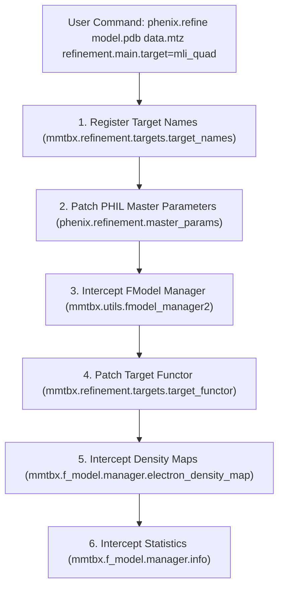

# Interfacing with `phenix.refine` for Intensity-Based Likelihood (`mli_quad`)

This document provides a comprehensive technical reference on how **Phridge** interfaces with `phenix.refine` and `mmtbx` to enable direct intensity-based likelihood refinement (`mli_quad` / `mli`).

---

## 1. Executive Summary & Problem Formulation

### The Traditional Amplitude Paradigm
In conventional macromolecular refinement with `phenix.refine`, experimental intensities $I_{\text{obs}} \pm \sigma(I)$ are converted into structure factor amplitudes $|F_{\text{obs}}| \pm \sigma(F)$ via French-Wilson truncation prior to refinement. The model is then optimized against amplitude-based maximum likelihood targets (`ml`, `mlhl`, `ml_sad`, `ls`):

$$-\ln L(|F_c|) = -\sum_h \ln P(|F_{\text{obs}, h}| \mid |F_{c, h}|, \sigma_A, \Sigma_N)$$

This conversion suffers from fundamental statistical flaws:
1. **Truncation of Negative Observations**: In background-subtracted diffraction experiments, weak reflections often have $I_{\text{obs}} \le 0$. French-Wilson imposes an artificial non-negative prior, squashing observation variance and creating an artificial intensity/amplitude noise floor.
2. **Phase and Contrast Erasure**: High-resolution Fourier phases depend critically on the contrast provided by weak reflections. Artificially inflating weak $|F_{\text{obs}}|$ values obscures faint electron density features (e.g. ordered water networks, sub-stoichiometric ligands).
3. **Improper Scoring**: Legacy $R$-factors ($R_{\text{work}}$, $R_{\text{free}}$) are dominated by low-resolution, high-intensity reflections, obscuring genuine coordinate improvements in high-resolution shells.

### The Direct Intensity Likelihood Solution
Phridge's intensity engine directly evaluates the joint marginalization integral over the unobserved error-free normalized amplitude $E$:

$$L(E_c) = \int_0^\infty f_{\text{prior}}(E \mid E_c, \sigma_A) \cdot f_{\text{noise}}\!\left(Z_o \mid E^2, \sigma_Z, \nu\right) dE$$

where:
- $f_{\text{prior}}$ is the **Rice distribution** for acentric reflections and the **Woolfson distribution** for centric reflections.
- $f_{\text{noise}}$ is either a normal noise distribution or a heavy-tailed **Student-$t$ noise distribution** with degrees of freedom $\nu$.
- $Z_o = I_{\text{obs}} / (\varepsilon \Sigma)$ and $\sigma_Z = \sigma(I_{\text{obs}}) / (\varepsilon \Sigma)$ are normalized experimental intensities.
- Derivatives w.r.t. structure factors $\frac{\partial \text{LL}}{\partial F_c}$ are evaluated analytically via **Fisher's identity** or automatic differentiation without ever forming $|F_{\text{obs}}|$.

---

## 2. System Architecture & Process Separation

To prevent environment incompatibilities between CCTBX (frequently running in Python 3.9 or 3.10 with specialized C++ shared objects) and PyTorch (running modern CUDA/MPS autograd kernels), Phridge uses a decoupled client-server architecture:

```
┌─────────────────────────────────────────────────────────────────────────┐
│                      PHENIX / CCTBX CLIENT RUNTIME                      │
│                                                                         │
│   phenix.refine / mmtbx                                                 │
│       ├── refinement.main.target = mli_quad                             │
│       ├── IntensityFModel (subclass of mmtbx.f_model.manager)           │
│       ├── IntensityTargetFunctor & IntensityTargetResult                │
│       ├── IntensityElectronDensityMap                                   │
│       └── IntensityFModelInfo (inferred R_mode & R_intensity)           │
│                                                                         │
│   phridge.client.convert / Bridge                                       │
│       └── LinkML Serialization: PackedMiller, PackedXrayStructure       │
└────────────────────────────────────┬────────────────────────────────────┘
                                     │
                     Redis Streams / In-Memory Queue
                     RPC Operations:
                       • ml_i_target_and_gradients
                       • target_eval
                       • ml_i_maps
                       • ml_i_nuisance_fit
                                     │
┌────────────────────────────────────▼────────────────────────────────────┐
│                       PYTORCH / PHRIDGE WORKER                          │
│                                                                         │
│   phridge.contrib.intensity_ll.ops                                      │
│       ├── Differentiable Structure Factor Calculation (direct/fft)      │
│       ├── Adaptive Hybrid Quadrature (Gauss-Hermite & Gauss-Legendre)   │
│       ├── Student-t Heavy-Tailed Precision Mixture                      │
│       ├── Fisher's Identity Exact Derivatives w.r.t. F_calc             │
│       ├── Block-Diagonal Gauss-Newton Curvatures & Preconditioning     │
│       └── Posterior Mode Amplitudes (E_mode -> F_mode)                  │
└─────────────────────────────────────────────────────────────────────────┘
```

The Phenix client requires **zero PyTorch dependencies**; all heavy tensor calculations are dispatched over the `Bridge`. For unified environments or test pipelines, `Bridge(memory=True)` executes the worker in-process.

---

## 3. The Interception Mechanism (`phenix_hook.py`)

The integration hook (`phridge.client.intensity.phenix_hook`) dynamically patches six core touchpoints in `mmtbx` and `phenix.refine` when `enable_intensity_in_phenix()` is invoked:



### Touchpoint 1: Target Registration
CCTBX maintains a global dictionary of recognized refinement targets in `mmtbx.refinement.targets.target_names`. The hook injects:
```python
target_names["mli_quad"] = target_attributes(family="ml", specialization="i")
target_names["mli"] = target_names["mli_quad"]
```
This registers `mli_quad` and its alias `mli` with the target attributes required by CCTBX macro cycles.

### Touchpoint 2: PHIL Parameter Schema Augmentation
When `phenix.refine` parses input arguments, `libtbx.phil` validates choices strictly. Without patching, `refinement.main.target=mli_quad` raises a choice error. The hook intercepts `phenix.refinement.master_params()`:
1. Locates `refinement.main.target`.
2. Injects the tokens `mli_quad` and `mli` into `node.words`.
3. Updates `node.caption` to include `MLI_QUAD`.
4. Wraps `phenix.refinement.misc.set_data_target_type` so any detection of `mli` standardizes to `"mli_quad"`.

### Touchpoint 3: FModel Manager Construction (`IntensityFModel`)
When `phenix.refine` sets up data managers via `mmtbx.utils.fmodel_manager2`:
```python
def patched_fmodel_manager2(f_obs, r_free_flags, ..., twin_law=None, target_name=None, i_obs=None, **kwargs):
    is_intensity_target = target_name in ("mli", "mli_quad", "ml_i")
    has_intensity_data = i_obs is not None or getattr(f_obs, "is_xray_intensity_array", lambda: False)()
    has_twin = bool(twin_law) or bool(kwargs.get("twin")) or bool(kwargs.get("is_twin"))

    if is_intensity_target or (has_intensity_data and target_name is None):
        if has_twin:
            raise IntensityTwinningError(
                "Twinning is not supported for intensity-based likelihood ('mli_quad') refinement: "
                "twin is True or twin_law was provided."
            )
        return IntensityFModel(
            i_obs=i_obs if i_obs is not None else f_obs,
            f_obs=f_obs,
            xray_structure=xray_structure,
            r_free_flags=r_free_flags,
            target_name=target_name or "mli_quad",
            ...
        )
```
- **Twinning Guard (Hard Error)**: Twinning is explicitly not supported for `mli_quad`. If `twin_law`, `twin=True`, or `is_twin=True` is encountered, a hard error (`IntensityTwinningError`, subclassing `RuntimeError`, `ValueError`, and `NotImplementedError`) is immediately raised.
- `IntensityFModel` subclasses `mmtbx.f_model.manager`.
- It maintains **amplitude scaffolding** (`self.f_obs()`) for legacy CCTBX routines (e.g. resolution binner, symmetry checks) while preserving genuine observed intensities `self.i_obs()` for the refinement engine.
- This bypasses French-Wilson amplitude conversion completely when raw intensities are supplied in the MTZ.

### Touchpoint 4: Target Functor Evaluation & Gradient Routing
During refinement macro cycles (coordinate minimization, simulated annealing, rigid body, B-factor optimization), `phenix.refine` calls `mmtbx.refinement.targets.target_functor(manager)`. The hook wraps `target_functor.__new__`:
```python
def patched_new(cls, manager, alpha_beta=None):
    if getattr(manager, "target_name", None) in ("mli", "mli_quad", "ml_i"):
        return IntensityTargetFunctor(manager, alpha_beta=alpha_beta)
    return orig_new(cls)
```

`IntensityTargetFunctor` calls the Phridge worker:
1. Dispatches `target_eval` with the current $F_{\text{model}}$ and target parameters.
2. Returns an `IntensityTargetResult` conforming to `mmtbx.refinement.targets.target_result_mixin`.
3. Returns target values:
   - `target_work()`: Negative log-likelihood on working reflections $W$.
   - `target_test()`: Negative log-likelihood on audit reflections $A$.
4. Computes exact derivatives w.r.t. structure factors:
   $$\frac{\partial T}{\partial F_{\text{calc}}} = \text{scale} \cdot \frac{\partial T}{\partial F_{\text{model}}}$$
5. By default, CCTBX `structure_factor_gradients_w` turns those into site / ADP / occupancy gradients.
6. With `--precondition` / `PHRIDGE_PRECONDITION=1`, `IntensityTargetResult.gradients_wrt_atomic_parameters` instead returns **packed Gauss–Newton–preconditioned** atomic gradients from the intensity worker (Cartesian sites, occupancy, $U_{\mathrm{iso}}$, and $U^*$). Weight selection should be re-run under that metric (see `PHRIDGE_WEIGHT_METRIC`).

### Touchpoint 5: Electron Density Map Synthesis
At the conclusion of macro cycles or when generating map coefficients, `phenix.refine` calls `fmodel.electron_density_map()`. The hook routes this to `IntensityElectronDensityMap`:
- Intercepts requests for `2mFo-DFc` and `mFo-DFc` maps.
- Dispatches `ml_i_maps` to the PyTorch worker.
- Evaluates the **Bayesian posterior mode amplitude** $E_{\text{mode}}$ via Newton's method on the posterior density:
  $$F_{\text{mode}} = \text{scale} \cdot \sqrt{\varepsilon \Sigma} \cdot E_{\text{mode}}$$
- Returns Fourier coefficients using the MAP estimator:
  - $2mF_o - DF_c$ equivalent: $(2 F_{\text{mode}} - |F_c|) \exp(i \phi_c)$
  - $mF_o - DF_c$ equivalent: $(F_{\text{mode}} - |F_c|) \exp(i \phi_c)$
  - Gradient and Newton difference density maps for rapid ligand and solvent placement.

### Touchpoint 6: Statistical Reporting & R-Factors
Legacy $R$-factors do not represent proper scoring metrics under direct intensity modeling. `IntensityFModelInfo` overrides `mmtbx.f_model.manager.info`:
1. **Posterior Mode Amplitude R-factors**:
   $$R_{\text{mode}} = \frac{\sum_h \big| F_{\text{mode}, h} - |F_{c, h}| \big|}{\sum_h F_{\text{mode}, h}}$$
   Reported as `r_work`, `r_free`, and `r_all`.
2. **Direct Intensity R-factors**:
   $$R_{\text{intensity}} = \frac{\sum_h \big| I_{\text{obs}, h} - |F_{c, h}|^2 \big|}{\sum_h I_{\text{obs}, h}}$$
   Reported as `r_intensity_work`, `r_intensity_free`, and `r_intensity_all`.
3. Formats an integrated summary banner directly into the `phenix.refine` output log:
```
+----------------------------------------------------------------------------+
| Intensity Likelihood Refinement (mli_quad)                                 |
|                                                                            |
| Posterior Mode:   r_work= 0.2259   r_free= 0.2686   r_all= 0.2285          |
| Direct Intensity:  r_work= 0.2814   r_free= 0.3120   r_all= 0.2831         |
| Target NLL:       target_work= 12450.2104   target_free= 1238.9402         |
| Scale Factor k:   scale_k1= 1.0421   Student-t nu: 7.0                     |
+----------------------------------------------------------------------------+
```

---

## 4. Complete Execution Lifecycle

The following sequence illustrates the complete life cycle of an iteration during refinement:


---

## 5. How to Run `phenix.refine` with `mli_quad`

### Method 1: The `phridge-refine` CLI (Recommended)
Phridge provides a dedicated entrypoint `phridge-refine` that automatically installs the hooks into the current Python runtime before executing `phenix.refine`:

```bash
phridge-refine model.pdb data.mtz \
    refinement.main.target=mli_quad \
    refinement.main.number_of_macro_cycles=5
```

### Method 2: In-Process Scripting with `phenix.python`
If executing inside custom refinement pipelines or Jupyter notebooks:

```python
import phenix.refinement
from phridge.client.intensity import enable_intensity_in_phenix

# 1. Activate the mli_quad hooks
enable_intensity_in_phenix()

# 2. Run standard phenix.refine command line runner
from phenix.command_line import refine
refine.run([
    "model.pdb",
    "data.mtz",
    "refinement.main.target=mli_quad",
    "refinement.main.number_of_macro_cycles=3",
])
```

### Method 3: Direct API / Custom Minimizer Integration
For researchers writing custom refinement workflows using `cctbx` and `mmtbx.f_model`:

```python
from iotbx import reflection_file_reader
from iotbx.pdb import combined_status
import iotbx.pdb
from phridge.client.intensity import IntensityFModel, enable_intensity_in_phenix

enable_intensity_in_phenix()

# Read inputs
pdb_io = iotbx.pdb.input(file_name="model.pdb")
xray_structure = pdb_io.xray_structure_simple()

mtz_io = reflection_file_reader.any_reflection_file("data.mtz")
miller_arrays = mtz_io.as_miller_arrays()
i_obs = next(a for a in miller_arrays if a.is_xray_intensity_array())
r_free_flags = next(a for a in miller_arrays if "free" in a.info().label_string().lower())

# Build the IntensityFModel
fmodel = IntensityFModel(
    i_obs=i_obs,
    xray_structure=xray_structure,
    r_free_flags=r_free_flags,
    target_name="mli_quad",
    nu=7.0,  # Student-t degrees of freedom
    memory=True,  # In-process bridge for development
)

# Macro-cycle target and gradients
tg = fmodel.target_and_gradients(preconditioned=True)
print(f"Target NLL: {tg.target():.4f}")
print(f"Cartesian gradients (first 3 atoms):\n{list(tg.gradients.d_target_d_site_cart()[:3])}")

# Compute electron density maps
edm = fmodel.electron_density_map()
map_coeffs_2fofc = edm.map_coefficients(map_type="2mFo-DFc")
map_coeffs_fofc = edm.map_coefficients(map_type="mFo-DFc")
```

---

## 6. Environment knobs

| Variable | Default | Meaning |
|---|---|---|
| `PHRIDGE_REDIS_URL` | (required for Redis bridge) | Worker Redis URL |
| `PHRIDGE_NU` | (engine default) | Student-t ν |
| `PHRIDGE_FIT_NU` | off | Fit ν during `update_all_scales` |
| `PHRIDGE_PRECONDITION` | off | Gauss–Newton diagonal preconditioning of **XYZ, occupancy, and ADP** grads (Phenix uses packed worker grads instead of CCTBX SF→atom) |
| `PHRIDGE_MEMORY` | **on** | In-process `Bridge(memory=True)` (avoids Redis socket-read hangs). Set `0` / `--redis` for Redis worker |
| `PHRIDGE_HEARTBEAT` | **on** | Alive prints while waiting (target evals, scale updates, Redis waits) |
| `PHRIDGE_HEARTBEAT_INTERVAL` | **30** | Seconds between heartbeat lines |
| `PHRIDGE_STATS_REPORT` | **on** | After each `update_all_scales`, print resolution bins of I/σ, negatives, I/σ&lt;1..5, **σ_A(s)**, and data-fraction vs Wilson |
| `PHRIDGE_STATS_BIN_SIZE` | `500` | Reflections per stats bin |
| `PHRIDGE_SIGMA_A_MODE` | **`bins`** | σ_A(s) fit: per-resolution **bins** (monotone, default) or stiff Read curve (`read`) |
| `PHRIDGE_SIGMA_A_BINS` | auto | Number of σ_A shells when mode=`bins` |
| `PHRIDGE_VERBOSE_TARGET` | **off** | Per-eval `mli_quad` banners (client + worker); set `1` to enable |
| `PHRIDGE_WEIGHT_METRIC` | **`nll`** | Rank XYZ/ADP weight trials by free-set NLL (`nll`) or classic R-free (`rfree`) |

**Intensities / French–Wilson:** `mli_quad` **never** runs French–Wilson and **never** reconstructs `I` as `F²`. The driver forces `xray_data.french_wilson_scale=False`, extract patches build a `√max(I,0)` amplitude scaffold without dropping reflections, and any `as_intensity_array()` / `french_wilson_scale` fallback raises `IntensityDataError`.

Weight selection rewiring (when `PHRIDGE_WEIGHT_METRIC=nll` and target is `mli_quad`):

- **XYZ** — Phenix still records R-factors (needed for its post-select assert). The scorer additionally stores free/work NLL per trial and picks the lowest **free-set NLL** among geometry-acceptable trials.
- **ADP** — Trial ranking columns are filled with NLL (so the usual R-gap filters become no-ops at NLL scale); the winner is the lowest free-set NLL. True R is still printed in the trial table.

CLI aliases: `--verbose-target`, `--weight-metric=nll|rfree` on `phenix_refine_mli.py` / `run_phenix_intensity.sh`.

---

## 7. Verification and Regression Testing

The interface is validated through dedicated test suites covering all integration layers:

| Test File | Verified Touchpoints |
|---|---|
| `tests/test_intensity_engine.py` | `IntensityFModel` inheritance from `mmtbx.f_model.manager`, structure factor caching, `target_and_gradients` with and without preconditioning, component-wise gradient accessors, posterior mode $E_{\text{mode}}$, and L-BFGS convergence. |
| `tests/test_phenix_refine_hook.py` | Registration of `mli_quad` in `mmtbx.refinement.targets.target_names`, PHIL choice validation, `fmodel_manager2` returning `IntensityFModel`, `target_functor` returning `IntensityTargetFunctor`, map synthesis via `compute_map_coefficients`, and clean import verification (confirming zero PyTorch imports on client side). |

To run the full test suite:
```bash
pytest tests/test_phenix_refine_hook.py tests/test_intensity_engine.py -v
```
