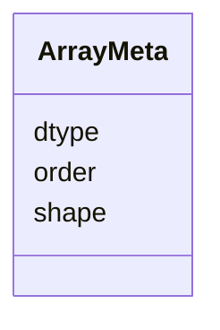

---
search:
  boost: 10.0
---

# Class: ArrayMeta 

<div data-search-exclude markdown="1">


URI: [phridge:ArrayMeta](https://github.com/phzwart/phridge/schema/phridge/ArrayMeta)





<!-- no inheritance hierarchy -->

## Slots

| Name | Cardinality and Range | Description | Inheritance |
| ---  | --- | --- | --- |
| [dtype](dtype.md) | 1 <br/> [String](String.md) | numpy dtype name (float64, int32, complex128, …) | direct |
| [shape](shape.md) | 1..* <br/> [Integer](Integer.md) |  | direct |
| [order](order.md) | 0..1 <br/> [String](String.md) | Memory order; v1 is C | direct |


## Identifier and Mapping Information


### Schema Source


* from schema: https://github.com/phzwart/phridge/schema/phridge


## Mappings

| Mapping Type | Mapped Value |
| ---  | ---  |
| self | phridge:ArrayMeta |
| native | phridge:ArrayMeta |


## LinkML Source

<!-- TODO: investigate https://stackoverflow.com/questions/37606292/how-to-create-tabbed-code-blocks-in-mkdocs-or-sphinx -->

### Direct

<details>
```yaml
name: ArrayMeta
from_schema: https://github.com/phzwart/phridge/schema/phridge
rank: 1000
attributes:
  dtype:
    name: dtype
    description: numpy dtype name (float64, int32, complex128, …)
    from_schema: https://github.com/phzwart/phridge/schema/phridge
    rank: 1000
    domain_of:
    - ArrayMeta
    - ObjectRef
    - RealMap
    - ComplexMap
    - EmMap
    - CartesianSites
    - FractionalSites
    required: true
  shape:
    name: shape
    from_schema: https://github.com/phzwart/phridge/schema/phridge
    rank: 1000
    domain_of:
    - ArrayMeta
    - ObjectRef
    range: integer
    required: true
    multivalued: true
  order:
    name: order
    description: Memory order; v1 is C
    from_schema: https://github.com/phzwart/phridge/schema/phridge
    rank: 1000
    domain_of:
    - ArrayMeta

```
</details>

### Induced

<details>
```yaml
name: ArrayMeta
from_schema: https://github.com/phzwart/phridge/schema/phridge
rank: 1000
attributes:
  dtype:
    name: dtype
    description: numpy dtype name (float64, int32, complex128, …)
    from_schema: https://github.com/phzwart/phridge/schema/phridge
    rank: 1000
    owner: ArrayMeta
    domain_of:
    - ArrayMeta
    - ObjectRef
    - RealMap
    - ComplexMap
    - EmMap
    - CartesianSites
    - FractionalSites
    range: string
    required: true
  shape:
    name: shape
    from_schema: https://github.com/phzwart/phridge/schema/phridge
    rank: 1000
    owner: ArrayMeta
    domain_of:
    - ArrayMeta
    - ObjectRef
    range: integer
    required: true
    multivalued: true
  order:
    name: order
    description: Memory order; v1 is C
    from_schema: https://github.com/phzwart/phridge/schema/phridge
    rank: 1000
    owner: ArrayMeta
    domain_of:
    - ArrayMeta
    range: string

```
</details></div>