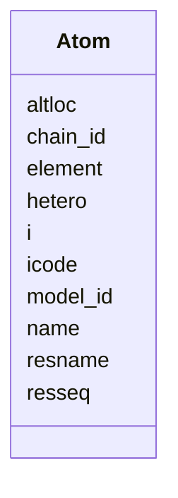

---
search:
  boost: 10.0
---

# Class: Atom 


_One iotbx.pdb.hierarchy atom label. xyz/occ/b live in the parent Hierarchy npz at the same index._

__


<div data-search-exclude markdown="1">


URI: [phridge:Atom](https://github.com/phzwart/phridge/schema/phridge/Atom)





<!-- no inheritance hierarchy -->

## Slots

| Name | Cardinality and Range | Description | Inheritance |
| ---  | --- | --- | --- |
| [i](i.md) | 1 <br/> [Integer](Integer.md) | Row index into packed xyz; same i_seq as scatterers and restraints | direct |
| [name](name.md) | 1 <br/> [String](String.md) |  | direct |
| [element](element.md) | 1 <br/> [String](String.md) |  | direct |
| [model_id](model_id.md) | 0..1 <br/> [String](String.md) | Model id string (usually "1") | direct |
| [chain_id](chain_id.md) | 1 <br/> [String](String.md) |  | direct |
| [resseq](resseq.md) | 1 <br/> [Integer](Integer.md) |  | direct |
| [icode](icode.md) | 0..1 <br/> [String](String.md) | Insertion code; empty if none | direct |
| [resname](resname.md) | 1 <br/> [String](String.md) |  | direct |
| [altloc](altloc.md) | 0..1 <br/> [String](String.md) | Alternate conformer; empty if none | direct |
| [hetero](hetero.md) | 1 <br/> [Boolean](Boolean.md) |  | direct |


## Usages

| used by | used in | type | used |
| ---  | --- | --- | --- |
| [Hierarchy](Hierarchy.md) | [atoms](atoms.md) | range | [Atom](Atom.md) |


## Identifier and Mapping Information


### Schema Source


* from schema: https://github.com/phzwart/phridge/schema/phridge


## Mappings

| Mapping Type | Mapped Value |
| ---  | ---  |
| self | phridge:Atom |
| native | phridge:Atom |


## LinkML Source

<!-- TODO: investigate https://stackoverflow.com/questions/37606292/how-to-create-tabbed-code-blocks-in-mkdocs-or-sphinx -->

### Direct

<details>
```yaml
name: Atom
description: 'One iotbx.pdb.hierarchy atom label. xyz/occ/b live in the parent Hierarchy
  npz at the same index.

  '
from_schema: https://github.com/phzwart/phridge/schema/phridge
rank: 1000
attributes:
  i:
    name: i
    description: Row index into packed xyz; same i_seq as scatterers and restraints
    from_schema: https://github.com/phzwart/phridge/schema/cctbx_coordinates
    rank: 1000
    domain_of:
    - Atom
    - Scatterer
    range: integer
    required: true
  name:
    name: name
    from_schema: https://github.com/phzwart/phridge/schema/cctbx_coordinates
    domain_of:
    - SlotBinding
    - OpSpec
    - Atom
    required: true
  element:
    name: element
    from_schema: https://github.com/phzwart/phridge/schema/cctbx_coordinates
    rank: 1000
    domain_of:
    - Atom
    required: true
  model_id:
    name: model_id
    description: Model id string (usually "1")
    from_schema: https://github.com/phzwart/phridge/schema/cctbx_coordinates
    rank: 1000
    domain_of:
    - Atom
  chain_id:
    name: chain_id
    from_schema: https://github.com/phzwart/phridge/schema/cctbx_coordinates
    rank: 1000
    domain_of:
    - Atom
    required: true
  resseq:
    name: resseq
    from_schema: https://github.com/phzwart/phridge/schema/cctbx_coordinates
    rank: 1000
    domain_of:
    - Atom
    range: integer
    required: true
  icode:
    name: icode
    description: Insertion code; empty if none
    from_schema: https://github.com/phzwart/phridge/schema/cctbx_coordinates
    rank: 1000
    domain_of:
    - Atom
  resname:
    name: resname
    from_schema: https://github.com/phzwart/phridge/schema/cctbx_coordinates
    rank: 1000
    domain_of:
    - Atom
    required: true
  altloc:
    name: altloc
    description: Alternate conformer; empty if none
    from_schema: https://github.com/phzwart/phridge/schema/cctbx_coordinates
    rank: 1000
    domain_of:
    - Atom
  hetero:
    name: hetero
    from_schema: https://github.com/phzwart/phridge/schema/cctbx_coordinates
    rank: 1000
    domain_of:
    - Atom
    range: boolean
    required: true

```
</details>

### Induced

<details>
```yaml
name: Atom
description: 'One iotbx.pdb.hierarchy atom label. xyz/occ/b live in the parent Hierarchy
  npz at the same index.

  '
from_schema: https://github.com/phzwart/phridge/schema/phridge
rank: 1000
attributes:
  i:
    name: i
    description: Row index into packed xyz; same i_seq as scatterers and restraints
    from_schema: https://github.com/phzwart/phridge/schema/cctbx_coordinates
    rank: 1000
    owner: Atom
    domain_of:
    - Atom
    - Scatterer
    range: integer
    required: true
  name:
    name: name
    from_schema: https://github.com/phzwart/phridge/schema/cctbx_coordinates
    owner: Atom
    domain_of:
    - SlotBinding
    - OpSpec
    - Atom
    range: string
    required: true
  element:
    name: element
    from_schema: https://github.com/phzwart/phridge/schema/cctbx_coordinates
    rank: 1000
    owner: Atom
    domain_of:
    - Atom
    range: string
    required: true
  model_id:
    name: model_id
    description: Model id string (usually "1")
    from_schema: https://github.com/phzwart/phridge/schema/cctbx_coordinates
    rank: 1000
    owner: Atom
    domain_of:
    - Atom
    range: string
  chain_id:
    name: chain_id
    from_schema: https://github.com/phzwart/phridge/schema/cctbx_coordinates
    rank: 1000
    owner: Atom
    domain_of:
    - Atom
    range: string
    required: true
  resseq:
    name: resseq
    from_schema: https://github.com/phzwart/phridge/schema/cctbx_coordinates
    rank: 1000
    owner: Atom
    domain_of:
    - Atom
    range: integer
    required: true
  icode:
    name: icode
    description: Insertion code; empty if none
    from_schema: https://github.com/phzwart/phridge/schema/cctbx_coordinates
    rank: 1000
    owner: Atom
    domain_of:
    - Atom
    range: string
  resname:
    name: resname
    from_schema: https://github.com/phzwart/phridge/schema/cctbx_coordinates
    rank: 1000
    owner: Atom
    domain_of:
    - Atom
    range: string
    required: true
  altloc:
    name: altloc
    description: Alternate conformer; empty if none
    from_schema: https://github.com/phzwart/phridge/schema/cctbx_coordinates
    rank: 1000
    owner: Atom
    domain_of:
    - Atom
    range: string
  hetero:
    name: hetero
    from_schema: https://github.com/phzwart/phridge/schema/cctbx_coordinates
    rank: 1000
    owner: Atom
    domain_of:
    - Atom
    range: boolean
    required: true

```
</details></div>