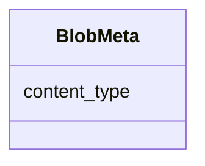

---
search:
  boost: 10.0
---

# Class: BlobMeta 

<div data-search-exclude markdown="1">


URI: [phridge:BlobMeta](https://github.com/phzwart/phridge/schema/phridge/BlobMeta)





<!-- no inheritance hierarchy -->

## Slots

| Name | Cardinality and Range | Description | Inheritance |
| ---  | --- | --- | --- |
| [content_type](content_type.md) | 1 <br/> [String](String.md) |  | direct |


## Identifier and Mapping Information


### Schema Source


* from schema: https://github.com/phzwart/phridge/schema/phridge


## Mappings

| Mapping Type | Mapped Value |
| ---  | ---  |
| self | phridge:BlobMeta |
| native | phridge:BlobMeta |


## LinkML Source

<!-- TODO: investigate https://stackoverflow.com/questions/37606292/how-to-create-tabbed-code-blocks-in-mkdocs-or-sphinx -->

### Direct

<details>
```yaml
name: BlobMeta
from_schema: https://github.com/phzwart/phridge/schema/phridge
rank: 1000
attributes:
  content_type:
    name: content_type
    from_schema: https://github.com/phzwart/phridge/schema/phridge
    rank: 1000
    domain_of:
    - BlobMeta
    required: true

```
</details>

### Induced

<details>
```yaml
name: BlobMeta
from_schema: https://github.com/phzwart/phridge/schema/phridge
rank: 1000
attributes:
  content_type:
    name: content_type
    from_schema: https://github.com/phzwart/phridge/schema/phridge
    rank: 1000
    owner: BlobMeta
    domain_of:
    - BlobMeta
    range: string
    required: true

```
</details></div>