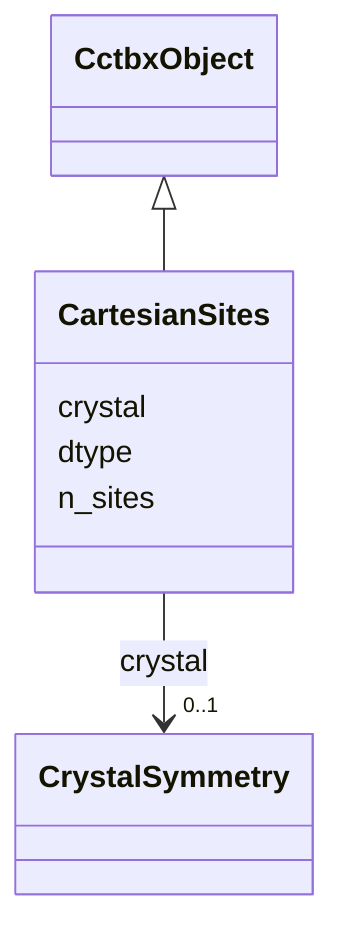

---
search:
  boost: 10.0
---

# Class: CartesianSites 


_cctbx xrs.sites_cart() / hierarchy atoms xyz in Å. npz array xyz float64[N,3]._

__


<div data-search-exclude markdown="1">


URI: [phridge:CartesianSites](https://github.com/phzwart/phridge/schema/phridge/CartesianSites)





## Inheritance
* [CctbxObject](CctbxObject.md)
    * **CartesianSites**


## Slots

| Name | Cardinality and Range | Description | Inheritance |
| ---  | --- | --- | --- |
| [crystal](crystal.md) | 0..1 <br/> [CrystalSymmetry](CrystalSymmetry.md) | Optional; needed to convert to fractional | direct |
| [n_sites](n_sites.md) | 1 <br/> [Integer](Integer.md) |  | direct |
| [dtype](dtype.md) | 1 <br/> [String](String.md) |  | direct |


## Identifier and Mapping Information


### Schema Source


* from schema: https://github.com/phzwart/phridge/schema/phridge


## Mappings

| Mapping Type | Mapped Value |
| ---  | ---  |
| self | phridge:CartesianSites |
| native | phridge:CartesianSites |


## LinkML Source

<!-- TODO: investigate https://stackoverflow.com/questions/37606292/how-to-create-tabbed-code-blocks-in-mkdocs-or-sphinx -->

### Direct

<details>
```yaml
name: CartesianSites
description: 'cctbx xrs.sites_cart() / hierarchy atoms xyz in Å. npz array xyz float64[N,3].

  '
from_schema: https://github.com/phzwart/phridge/schema/phridge
rank: 1000
is_a: CctbxObject
attributes:
  crystal:
    name: crystal
    description: Optional; needed to convert to fractional
    from_schema: https://github.com/phzwart/phridge/schema/cctbx_coordinates
    domain_of:
    - MillerArray
    - HendricksonLattman
    - ReflectionFile
    - CrystalGridding
    - RealMap
    - ComplexMap
    - EmMap
    - CartesianSites
    - FractionalSites
    - Hierarchy
    - XrayStructure
    - GeometryRestraints
    range: CrystalSymmetry
    inlined: true
  n_sites:
    name: n_sites
    from_schema: https://github.com/phzwart/phridge/schema/cctbx_coordinates
    rank: 1000
    domain_of:
    - CartesianSites
    - FractionalSites
    - GeometryRestraints
    - ModelGeometry
    range: integer
    required: true
  dtype:
    name: dtype
    from_schema: https://github.com/phzwart/phridge/schema/cctbx_coordinates
    domain_of:
    - ArrayMeta
    - ObjectRef
    - RealMap
    - ComplexMap
    - EmMap
    - CartesianSites
    - FractionalSites
    - SfEngineParams
    required: true

```
</details>

### Induced

<details>
```yaml
name: CartesianSites
description: 'cctbx xrs.sites_cart() / hierarchy atoms xyz in Å. npz array xyz float64[N,3].

  '
from_schema: https://github.com/phzwart/phridge/schema/phridge
rank: 1000
is_a: CctbxObject
attributes:
  crystal:
    name: crystal
    description: Optional; needed to convert to fractional
    from_schema: https://github.com/phzwart/phridge/schema/cctbx_coordinates
    owner: CartesianSites
    domain_of:
    - MillerArray
    - HendricksonLattman
    - ReflectionFile
    - CrystalGridding
    - RealMap
    - ComplexMap
    - EmMap
    - CartesianSites
    - FractionalSites
    - Hierarchy
    - XrayStructure
    - GeometryRestraints
    range: CrystalSymmetry
    inlined: true
  n_sites:
    name: n_sites
    from_schema: https://github.com/phzwart/phridge/schema/cctbx_coordinates
    rank: 1000
    owner: CartesianSites
    domain_of:
    - CartesianSites
    - FractionalSites
    - GeometryRestraints
    - ModelGeometry
    range: integer
    required: true
  dtype:
    name: dtype
    from_schema: https://github.com/phzwart/phridge/schema/cctbx_coordinates
    owner: CartesianSites
    domain_of:
    - ArrayMeta
    - ObjectRef
    - RealMap
    - ComplexMap
    - EmMap
    - CartesianSites
    - FractionalSites
    - SfEngineParams
    range: string
    required: true

```
</details></div>