---
search:
  boost: 10.0
---

# Class: CctbxObject 


_Base for canonical phenix/cctbx types. Metadata in JSON; array buffers in a packed npz referenced by ObjectRef.key._

__


<div data-search-exclude markdown="1">


* __NOTE__: this is an abstract class and should not be instantiated directly


URI: [phridge:CctbxObject](https://github.com/phzwart/phridge/schema/phridge/CctbxObject)

```mermaid
 classDiagram
    class CctbxObject
    click CctbxObject href "../CctbxObject/"
      CctbxObject <|-- CrystalSymmetry
        click CrystalSymmetry href "../CrystalSymmetry/"
      CctbxObject <|-- MillerArray
        click MillerArray href "../MillerArray/"
      CctbxObject <|-- HendricksonLattman
        click HendricksonLattman href "../HendricksonLattman/"
      CctbxObject <|-- ReflectionFile
        click ReflectionFile href "../ReflectionFile/"
      CctbxObject <|-- CrystalGridding
        click CrystalGridding href "../CrystalGridding/"
      CctbxObject <|-- RealMap
        click RealMap href "../RealMap/"
      CctbxObject <|-- ComplexMap
        click ComplexMap href "../ComplexMap/"
      CctbxObject <|-- MapCoefficients
        click MapCoefficients href "../MapCoefficients/"
      CctbxObject <|-- EmMap
        click EmMap href "../EmMap/"
      CctbxObject <|-- CartesianSites
        click CartesianSites href "../CartesianSites/"
      CctbxObject <|-- FractionalSites
        click FractionalSites href "../FractionalSites/"
      CctbxObject <|-- Hierarchy
        click Hierarchy href "../Hierarchy/"
      CctbxObject <|-- XrayStructure
        click XrayStructure href "../XrayStructure/"
      CctbxObject <|-- GeometryRestraints
        click GeometryRestraints href "../GeometryRestraints/"
      CctbxObject <|-- ModelGeometry
        click ModelGeometry href "../ModelGeometry/"
      CctbxObject <|-- ScatteringTable
        click ScatteringTable href "../ScatteringTable/"
      CctbxObject <|-- SfEngineParams
        click SfEngineParams href "../SfEngineParams/"
      CctbxObject <|-- SfGradients
        click SfGradients href "../SfGradients/"
      CctbxObject <|-- TargetResult
        click TargetResult href "../TargetResult/"
      
      
```





## Inheritance
* **CctbxObject**
    * [CrystalSymmetry](CrystalSymmetry.md)
    * [MillerArray](MillerArray.md)
    * [HendricksonLattman](HendricksonLattman.md)
    * [ReflectionFile](ReflectionFile.md)
    * [CrystalGridding](CrystalGridding.md)
    * [RealMap](RealMap.md)
    * [ComplexMap](ComplexMap.md)
    * [MapCoefficients](MapCoefficients.md)
    * [EmMap](EmMap.md)
    * [CartesianSites](CartesianSites.md)
    * [FractionalSites](FractionalSites.md)
    * [Hierarchy](Hierarchy.md)
    * [XrayStructure](XrayStructure.md)
    * [GeometryRestraints](GeometryRestraints.md)
    * [ModelGeometry](ModelGeometry.md)
    * [ScatteringTable](ScatteringTable.md)
    * [SfEngineParams](SfEngineParams.md)
    * [SfGradients](SfGradients.md)
    * [TargetResult](TargetResult.md)


## Slots

| Name | Cardinality and Range | Description | Inheritance |
| ---  | --- | --- | --- |


## Identifier and Mapping Information


### Schema Source


* from schema: https://github.com/phzwart/phridge/schema/phridge


## Mappings

| Mapping Type | Mapped Value |
| ---  | ---  |
| self | phridge:CctbxObject |
| native | phridge:CctbxObject |


## LinkML Source

<!-- TODO: investigate https://stackoverflow.com/questions/37606292/how-to-create-tabbed-code-blocks-in-mkdocs-or-sphinx -->

### Direct

<details>
```yaml
name: CctbxObject
description: 'Base for canonical phenix/cctbx types. Metadata in JSON; array buffers
  in a packed npz referenced by ObjectRef.key.

  '
from_schema: https://github.com/phzwart/phridge/schema/phridge
rank: 1000
abstract: true

```
</details>

### Induced

<details>
```yaml
name: CctbxObject
description: 'Base for canonical phenix/cctbx types. Metadata in JSON; array buffers
  in a packed npz referenced by ObjectRef.key.

  '
from_schema: https://github.com/phzwart/phridge/schema/phridge
rank: 1000
abstract: true

```
</details></div>