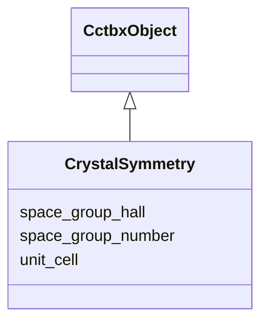

---
search:
  boost: 10.0
---

# Class: CrystalSymmetry 


_Canonical form of cctbx.crystal.symmetry. JSON only; no binary blob. v1 stores Hall + IT number and does not normalize non-standard settings or reindexing. Converters must fail loudly if crystal.symmetry cannot be reconstructed._

__


<div data-search-exclude markdown="1">


URI: [phridge:CrystalSymmetry](https://github.com/phzwart/phridge/schema/phridge/CrystalSymmetry)





## Inheritance
* [CctbxObject](CctbxObject.md)
    * **CrystalSymmetry**


## Slots

| Name | Cardinality and Range | Description | Inheritance |
| ---  | --- | --- | --- |
| [unit_cell](unit_cell.md) | 1..* <br/> [Float](Float.md) | a, b, c (Å), alpha, beta, gamma (degrees) | direct |
| [space_group_hall](space_group_hall.md) | 1 <br/> [String](String.md) | Hall symbol as understood by cctbx | direct |
| [space_group_number](space_group_number.md) | 0..1 <br/> [Integer](Integer.md) | International Tables space-group number when known | direct |


## Usages

| used by | used in | type | used |
| ---  | --- | --- | --- |
| [MillerArray](MillerArray.md) | [crystal](crystal.md) | range | [CrystalSymmetry](CrystalSymmetry.md) |
| [HendricksonLattman](HendricksonLattman.md) | [crystal](crystal.md) | range | [CrystalSymmetry](CrystalSymmetry.md) |
| [ReflectionFile](ReflectionFile.md) | [crystal](crystal.md) | range | [CrystalSymmetry](CrystalSymmetry.md) |
| [CrystalGridding](CrystalGridding.md) | [crystal](crystal.md) | range | [CrystalSymmetry](CrystalSymmetry.md) |
| [RealMap](RealMap.md) | [crystal](crystal.md) | range | [CrystalSymmetry](CrystalSymmetry.md) |
| [ComplexMap](ComplexMap.md) | [crystal](crystal.md) | range | [CrystalSymmetry](CrystalSymmetry.md) |
| [EmMap](EmMap.md) | [crystal](crystal.md) | range | [CrystalSymmetry](CrystalSymmetry.md) |
| [CartesianSites](CartesianSites.md) | [crystal](crystal.md) | range | [CrystalSymmetry](CrystalSymmetry.md) |
| [FractionalSites](FractionalSites.md) | [crystal](crystal.md) | range | [CrystalSymmetry](CrystalSymmetry.md) |
| [Hierarchy](Hierarchy.md) | [crystal](crystal.md) | range | [CrystalSymmetry](CrystalSymmetry.md) |
| [XrayStructure](XrayStructure.md) | [crystal](crystal.md) | range | [CrystalSymmetry](CrystalSymmetry.md) |
| [GeometryRestraints](GeometryRestraints.md) | [crystal](crystal.md) | range | [CrystalSymmetry](CrystalSymmetry.md) |


## Identifier and Mapping Information


### Schema Source


* from schema: https://github.com/phzwart/phridge/schema/phridge


## Mappings

| Mapping Type | Mapped Value |
| ---  | ---  |
| self | phridge:CrystalSymmetry |
| native | phridge:CrystalSymmetry |


## LinkML Source

<!-- TODO: investigate https://stackoverflow.com/questions/37606292/how-to-create-tabbed-code-blocks-in-mkdocs-or-sphinx -->

### Direct

<details>
```yaml
name: CrystalSymmetry
description: 'Canonical form of cctbx.crystal.symmetry. JSON only; no binary blob.
  v1 stores Hall + IT number and does not normalize non-standard settings or reindexing.
  Converters must fail loudly if crystal.symmetry cannot be reconstructed.

  '
from_schema: https://github.com/phzwart/phridge/schema/phridge
rank: 1000
is_a: CctbxObject
attributes:
  unit_cell:
    name: unit_cell
    description: a, b, c (Å), alpha, beta, gamma (degrees)
    from_schema: https://github.com/phzwart/phridge/schema/cctbx
    rank: 1000
    domain_of:
    - CrystalSymmetry
    range: float
    required: true
    multivalued: true
    minimum_cardinality: 6
    maximum_cardinality: 6
  space_group_hall:
    name: space_group_hall
    description: Hall symbol as understood by cctbx.sgtbx
    from_schema: https://github.com/phzwart/phridge/schema/cctbx
    rank: 1000
    domain_of:
    - CrystalSymmetry
    required: true
  space_group_number:
    name: space_group_number
    description: International Tables space-group number when known
    from_schema: https://github.com/phzwart/phridge/schema/cctbx
    rank: 1000
    domain_of:
    - CrystalSymmetry
    range: integer

```
</details>

### Induced

<details>
```yaml
name: CrystalSymmetry
description: 'Canonical form of cctbx.crystal.symmetry. JSON only; no binary blob.
  v1 stores Hall + IT number and does not normalize non-standard settings or reindexing.
  Converters must fail loudly if crystal.symmetry cannot be reconstructed.

  '
from_schema: https://github.com/phzwart/phridge/schema/phridge
rank: 1000
is_a: CctbxObject
attributes:
  unit_cell:
    name: unit_cell
    description: a, b, c (Å), alpha, beta, gamma (degrees)
    from_schema: https://github.com/phzwart/phridge/schema/cctbx
    rank: 1000
    owner: CrystalSymmetry
    domain_of:
    - CrystalSymmetry
    range: float
    required: true
    multivalued: true
    minimum_cardinality: 6
    maximum_cardinality: 6
  space_group_hall:
    name: space_group_hall
    description: Hall symbol as understood by cctbx.sgtbx
    from_schema: https://github.com/phzwart/phridge/schema/cctbx
    rank: 1000
    owner: CrystalSymmetry
    domain_of:
    - CrystalSymmetry
    range: string
    required: true
  space_group_number:
    name: space_group_number
    description: International Tables space-group number when known
    from_schema: https://github.com/phzwart/phridge/schema/cctbx
    rank: 1000
    owner: CrystalSymmetry
    domain_of:
    - CrystalSymmetry
    range: integer

```
</details></div>