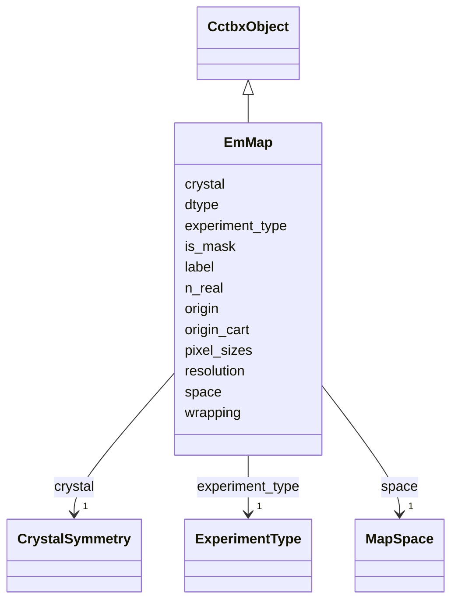

---
search:
  boost: 10.0
---

# Class: EmMap 


_Canonical iotbx.map_manager map (cryo-EM or wrapping MX). Packed data same as RealMap. Extra metadata is EM/MRC specific origin, voxel size, wrapping, and experiment_type._

__


<div data-search-exclude markdown="1">


URI: [phridge:EmMap](https://github.com/phzwart/phridge/schema/phridge/EmMap)





## Inheritance
* [CctbxObject](CctbxObject.md)
    * **EmMap**


## Slots

| Name | Cardinality and Range | Description | Inheritance |
| ---  | --- | --- | --- |
| [label](label.md) | 0..1 <br/> [String](String.md) |  | direct |
| [crystal](crystal.md) | 1 <br/> [CrystalSymmetry](CrystalSymmetry.md) |  | direct |
| [origin](origin.md) | 1..* <br/> [Integer](Integer.md) | Grid origin | direct |
| [n_real](n_real.md) | 1..* <br/> [Integer](Integer.md) |  | direct |
| [space](space.md) | 1 <br/> [MapSpace](MapSpace.md) |  | direct |
| [dtype](dtype.md) | 1 <br/> [String](String.md) |  | direct |
| [experiment_type](experiment_type.md) | 1 <br/> [ExperimentType](ExperimentType.md) |  | direct |
| [wrapping](wrapping.md) | 1 <br/> [Boolean](Boolean.md) |  | direct |
| [is_mask](is_mask.md) | 1 <br/> [Boolean](Boolean.md) |  | direct |
| [pixel_sizes](pixel_sizes.md) | 3..* <br/> [Float](Float.md) | Voxel size (Å) along a, b, c | direct |
| [origin_cart](origin_cart.md) | 3..* <br/> [Float](Float.md) | Cartesian origin shift (Å), map_manager | direct |
| [resolution](resolution.md) | 0..1 <br/> [Float](Float.md) | Nominal high resolution (Å) when known | direct |


## Identifier and Mapping Information


### Schema Source


* from schema: https://github.com/phzwart/phridge/schema/phridge


## Mappings

| Mapping Type | Mapped Value |
| ---  | ---  |
| self | phridge:EmMap |
| native | phridge:EmMap |


## LinkML Source

<!-- TODO: investigate https://stackoverflow.com/questions/37606292/how-to-create-tabbed-code-blocks-in-mkdocs-or-sphinx -->

### Direct

<details>
```yaml
name: EmMap
description: 'Canonical iotbx.map_manager map (cryo-EM or wrapping MX). Packed data
  same as RealMap. Extra metadata is EM/MRC specific origin, voxel size, wrapping,
  and experiment_type.

  '
from_schema: https://github.com/phzwart/phridge/schema/phridge
rank: 1000
is_a: CctbxObject
attributes:
  label:
    name: label
    from_schema: https://github.com/phzwart/phridge/schema/cctbx_maps
    domain_of:
    - MillerArray
    - HendricksonLattman
    - ReflectionColumn
    - RealMap
    - ComplexMap
    - MapCoefficients
    - EmMap
  crystal:
    name: crystal
    from_schema: https://github.com/phzwart/phridge/schema/cctbx_maps
    domain_of:
    - MillerArray
    - HendricksonLattman
    - ReflectionFile
    - CrystalGridding
    - RealMap
    - ComplexMap
    - EmMap
    - CartesianSites
    - FractionalSites
    - Hierarchy
    - XrayStructure
    - GeometryRestraints
    range: CrystalSymmetry
    required: true
    inlined: true
  origin:
    name: origin
    description: Grid origin
    from_schema: https://github.com/phzwart/phridge/schema/cctbx_maps
    domain_of:
    - RealMap
    - ComplexMap
    - EmMap
    range: integer
    required: true
    multivalued: true
    minimum_cardinality: 3
    maximum_cardinality: 3
  n_real:
    name: n_real
    from_schema: https://github.com/phzwart/phridge/schema/cctbx_maps
    domain_of:
    - CrystalGridding
    - RealMap
    - ComplexMap
    - EmMap
    - SfEngineParams
    range: integer
    required: true
    multivalued: true
    minimum_cardinality: 3
    maximum_cardinality: 3
  space:
    name: space
    from_schema: https://github.com/phzwart/phridge/schema/cctbx_maps
    domain_of:
    - CrystalGridding
    - RealMap
    - ComplexMap
    - EmMap
    range: MapSpace
    required: true
  dtype:
    name: dtype
    from_schema: https://github.com/phzwart/phridge/schema/cctbx_maps
    domain_of:
    - ArrayMeta
    - ObjectRef
    - RealMap
    - ComplexMap
    - EmMap
    - CartesianSites
    - FractionalSites
    - SfEngineParams
    required: true
  experiment_type:
    name: experiment_type
    from_schema: https://github.com/phzwart/phridge/schema/cctbx_maps
    rank: 1000
    domain_of:
    - EmMap
    range: ExperimentType
    required: true
  wrapping:
    name: wrapping
    from_schema: https://github.com/phzwart/phridge/schema/cctbx_maps
    rank: 1000
    domain_of:
    - EmMap
    range: boolean
    required: true
  is_mask:
    name: is_mask
    from_schema: https://github.com/phzwart/phridge/schema/cctbx_maps
    rank: 1000
    domain_of:
    - EmMap
    range: boolean
    required: true
  pixel_sizes:
    name: pixel_sizes
    description: Voxel size (Å) along a, b, c
    from_schema: https://github.com/phzwart/phridge/schema/cctbx_maps
    rank: 1000
    domain_of:
    - EmMap
    range: float
    multivalued: true
    minimum_cardinality: 3
    maximum_cardinality: 3
  origin_cart:
    name: origin_cart
    description: Cartesian origin shift (Å), map_manager.shift_cart
    from_schema: https://github.com/phzwart/phridge/schema/cctbx_maps
    rank: 1000
    domain_of:
    - EmMap
    range: float
    multivalued: true
    minimum_cardinality: 3
    maximum_cardinality: 3
  resolution:
    name: resolution
    description: Nominal high resolution (Å) when known
    from_schema: https://github.com/phzwart/phridge/schema/cctbx_maps
    rank: 1000
    domain_of:
    - EmMap
    range: float

```
</details>

### Induced

<details>
```yaml
name: EmMap
description: 'Canonical iotbx.map_manager map (cryo-EM or wrapping MX). Packed data
  same as RealMap. Extra metadata is EM/MRC specific origin, voxel size, wrapping,
  and experiment_type.

  '
from_schema: https://github.com/phzwart/phridge/schema/phridge
rank: 1000
is_a: CctbxObject
attributes:
  label:
    name: label
    from_schema: https://github.com/phzwart/phridge/schema/cctbx_maps
    owner: EmMap
    domain_of:
    - MillerArray
    - HendricksonLattman
    - ReflectionColumn
    - RealMap
    - ComplexMap
    - MapCoefficients
    - EmMap
    range: string
  crystal:
    name: crystal
    from_schema: https://github.com/phzwart/phridge/schema/cctbx_maps
    owner: EmMap
    domain_of:
    - MillerArray
    - HendricksonLattman
    - ReflectionFile
    - CrystalGridding
    - RealMap
    - ComplexMap
    - EmMap
    - CartesianSites
    - FractionalSites
    - Hierarchy
    - XrayStructure
    - GeometryRestraints
    range: CrystalSymmetry
    required: true
    inlined: true
  origin:
    name: origin
    description: Grid origin
    from_schema: https://github.com/phzwart/phridge/schema/cctbx_maps
    owner: EmMap
    domain_of:
    - RealMap
    - ComplexMap
    - EmMap
    range: integer
    required: true
    multivalued: true
    minimum_cardinality: 3
    maximum_cardinality: 3
  n_real:
    name: n_real
    from_schema: https://github.com/phzwart/phridge/schema/cctbx_maps
    owner: EmMap
    domain_of:
    - CrystalGridding
    - RealMap
    - ComplexMap
    - EmMap
    - SfEngineParams
    range: integer
    required: true
    multivalued: true
    minimum_cardinality: 3
    maximum_cardinality: 3
  space:
    name: space
    from_schema: https://github.com/phzwart/phridge/schema/cctbx_maps
    owner: EmMap
    domain_of:
    - CrystalGridding
    - RealMap
    - ComplexMap
    - EmMap
    range: MapSpace
    required: true
  dtype:
    name: dtype
    from_schema: https://github.com/phzwart/phridge/schema/cctbx_maps
    owner: EmMap
    domain_of:
    - ArrayMeta
    - ObjectRef
    - RealMap
    - ComplexMap
    - EmMap
    - CartesianSites
    - FractionalSites
    - SfEngineParams
    range: string
    required: true
  experiment_type:
    name: experiment_type
    from_schema: https://github.com/phzwart/phridge/schema/cctbx_maps
    rank: 1000
    owner: EmMap
    domain_of:
    - EmMap
    range: ExperimentType
    required: true
  wrapping:
    name: wrapping
    from_schema: https://github.com/phzwart/phridge/schema/cctbx_maps
    rank: 1000
    owner: EmMap
    domain_of:
    - EmMap
    range: boolean
    required: true
  is_mask:
    name: is_mask
    from_schema: https://github.com/phzwart/phridge/schema/cctbx_maps
    rank: 1000
    owner: EmMap
    domain_of:
    - EmMap
    range: boolean
    required: true
  pixel_sizes:
    name: pixel_sizes
    description: Voxel size (Å) along a, b, c
    from_schema: https://github.com/phzwart/phridge/schema/cctbx_maps
    rank: 1000
    owner: EmMap
    domain_of:
    - EmMap
    range: float
    multivalued: true
    minimum_cardinality: 3
    maximum_cardinality: 3
  origin_cart:
    name: origin_cart
    description: Cartesian origin shift (Å), map_manager.shift_cart
    from_schema: https://github.com/phzwart/phridge/schema/cctbx_maps
    rank: 1000
    owner: EmMap
    domain_of:
    - EmMap
    range: float
    multivalued: true
    minimum_cardinality: 3
    maximum_cardinality: 3
  resolution:
    name: resolution
    description: Nominal high resolution (Å) when known
    from_schema: https://github.com/phzwart/phridge/schema/cctbx_maps
    rank: 1000
    owner: EmMap
    domain_of:
    - EmMap
    range: float

```
</details></div>