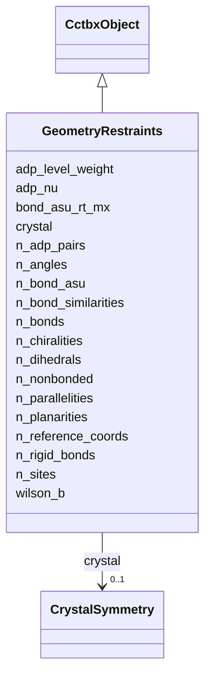

---
search:
  boost: 10.0
---

# Class: GeometryRestraints


_Canonical cctbx.geometry_restraints.manager proxy tables. i_seq values index the corresponding Hierarchy / XrayStructure._

__


<div data-search-exclude markdown="1">


URI: [phridge:GeometryRestraints](https://github.com/phzwart/phridge/schema/phridge/GeometryRestraints)





## Inheritance
* [CctbxObject](CctbxObject.md)
    * **GeometryRestraints**


## Slots

| Name | Cardinality and Range | Description | Inheritance |
| ---  | --- | --- | --- |
| [crystal](crystal.md) | 0..1 <br/> [CrystalSymmetry](CrystalSymmetry.md) |  | direct |
| [n_sites](n_sites.md) | 1 <br/> [Integer](Integer.md) | Atom/scatterer count in the i_seq space | direct |
| [n_bonds](n_bonds.md) | 1 <br/> [Integer](Integer.md) |  | direct |
| [n_bond_asu](n_bond_asu.md) | 1 <br/> [Integer](Integer.md) |  | direct |
| [n_angles](n_angles.md) | 1 <br/> [Integer](Integer.md) |  | direct |
| [n_dihedrals](n_dihedrals.md) | 1 <br/> [Integer](Integer.md) |  | direct |
| [n_chiralities](n_chiralities.md) | 1 <br/> [Integer](Integer.md) |  | direct |
| [n_planarities](n_planarities.md) | 1 <br/> [Integer](Integer.md) |  | direct |
| [n_parallelities](n_parallelities.md) | 1 <br/> [Integer](Integer.md) |  | direct |
| [n_nonbonded](n_nonbonded.md) | 1 <br/> [Integer](Integer.md) |  | direct |
| [n_reference_coords](n_reference_coords.md) | 1 <br/> [Integer](Integer.md) |  | direct |
| [n_bond_similarities](n_bond_similarities.md) | 1 <br/> [Integer](Integer.md) |  | direct |
| [bond_asu_rt_mx](bond_asu_rt_mx.md) | * <br/> [String](String.md) | sgtbx | direct |
| [n_adp_pairs](n_adp_pairs.md) | 0..1 <br/> [Integer](Integer.md) |  | direct |
| [n_rigid_bonds](n_rigid_bonds.md) | 0..1 <br/> [Integer](Integer.md) |  | direct |
| [wilson_b](wilson_b.md) | 0..1 <br/> [Float](Float.md) |  | direct |
| [adp_nu](adp_nu.md) | 0..1 <br/> [Float](Float.md) |  | direct |
| [adp_level_weight](adp_level_weight.md) | 0..1 <br/> [Float](Float.md) |  | direct |


## Identifier and Mapping Information


### Schema Source


* from schema: https://github.com/phzwart/phridge/schema/phridge


## Mappings

| Mapping Type | Mapped Value |
| ---  | ---  |
| self | phridge:GeometryRestraints |
| native | phridge:GeometryRestraints |


## LinkML Source

<!-- TODO: investigate https://stackoverflow.com/questions/37606292/how-to-create-tabbed-code-blocks-in-mkdocs-or-sphinx -->

### Direct

<details>
```yaml
name: GeometryRestraints
description: 'Canonical cctbx.geometry_restraints.manager proxy tables. i_seq values
  index the corresponding Hierarchy / XrayStructure.

  '
from_schema: https://github.com/phzwart/phridge/schema/phridge
rank: 1000
is_a: CctbxObject
attributes:
  crystal:
    name: crystal
    from_schema: https://github.com/phzwart/phridge/schema/cctbx_geometry
    domain_of:
    - MillerArray
    - HendricksonLattman
    - ReflectionFile
    - CrystalGridding
    - RealMap
    - ComplexMap
    - EmMap
    - CartesianSites
    - FractionalSites
    - Hierarchy
    - XrayStructure
    - GeometryRestraints
    range: CrystalSymmetry
    inlined: true
  n_sites:
    name: n_sites
    description: Atom/scatterer count in the i_seq space
    from_schema: https://github.com/phzwart/phridge/schema/cctbx_geometry
    domain_of:
    - CartesianSites
    - FractionalSites
    - GeometryRestraints
    - ModelGeometry
    range: integer
    required: true
  n_bonds:
    name: n_bonds
    from_schema: https://github.com/phzwart/phridge/schema/cctbx_geometry
    rank: 1000
    domain_of:
    - GeometryRestraints
    range: integer
    required: true
  n_bond_asu:
    name: n_bond_asu
    from_schema: https://github.com/phzwart/phridge/schema/cctbx_geometry
    rank: 1000
    domain_of:
    - GeometryRestraints
    range: integer
    required: true
  n_angles:
    name: n_angles
    from_schema: https://github.com/phzwart/phridge/schema/cctbx_geometry
    rank: 1000
    domain_of:
    - GeometryRestraints
    range: integer
    required: true
  n_dihedrals:
    name: n_dihedrals
    from_schema: https://github.com/phzwart/phridge/schema/cctbx_geometry
    rank: 1000
    domain_of:
    - GeometryRestraints
    range: integer
    required: true
  n_chiralities:
    name: n_chiralities
    from_schema: https://github.com/phzwart/phridge/schema/cctbx_geometry
    rank: 1000
    domain_of:
    - GeometryRestraints
    range: integer
    required: true
  n_planarities:
    name: n_planarities
    from_schema: https://github.com/phzwart/phridge/schema/cctbx_geometry
    rank: 1000
    domain_of:
    - GeometryRestraints
    range: integer
    required: true
  n_parallelities:
    name: n_parallelities
    from_schema: https://github.com/phzwart/phridge/schema/cctbx_geometry
    rank: 1000
    domain_of:
    - GeometryRestraints
    range: integer
    required: true
  n_nonbonded:
    name: n_nonbonded
    from_schema: https://github.com/phzwart/phridge/schema/cctbx_geometry
    rank: 1000
    domain_of:
    - GeometryRestraints
    range: integer
    required: true
  n_reference_coords:
    name: n_reference_coords
    from_schema: https://github.com/phzwart/phridge/schema/cctbx_geometry
    rank: 1000
    domain_of:
    - GeometryRestraints
    range: integer
    required: true
  n_bond_similarities:
    name: n_bond_similarities
    from_schema: https://github.com/phzwart/phridge/schema/cctbx_geometry
    rank: 1000
    domain_of:
    - GeometryRestraints
    range: integer
    required: true
  bond_asu_rt_mx:
    name: bond_asu_rt_mx
    description: sgtbx.rt_mx.as_xyz() for each ASU bond, same order as bond_asu_i_seqs
    from_schema: https://github.com/phzwart/phridge/schema/cctbx_geometry
    rank: 1000
    domain_of:
    - GeometryRestraints
    multivalued: true
  n_adp_pairs:
    name: n_adp_pairs
    from_schema: https://github.com/phzwart/phridge/schema/cctbx_geometry
    rank: 1000
    domain_of:
    - GeometryRestraints
    range: integer
    required: false
  n_rigid_bonds:
    name: n_rigid_bonds
    from_schema: https://github.com/phzwart/phridge/schema/cctbx_geometry
    rank: 1000
    domain_of:
    - GeometryRestraints
    range: integer
    required: false
  wilson_b:
    name: wilson_b
    from_schema: https://github.com/phzwart/phridge/schema/cctbx_geometry
    rank: 1000
    domain_of:
    - GeometryRestraints
    range: float
    required: false
  adp_nu:
    name: adp_nu
    from_schema: https://github.com/phzwart/phridge/schema/cctbx_geometry
    rank: 1000
    domain_of:
    - GeometryRestraints
    range: float
    required: false
  adp_level_weight:
    name: adp_level_weight
    from_schema: https://github.com/phzwart/phridge/schema/cctbx_geometry
    rank: 1000
    domain_of:
    - GeometryRestraints
    range: float
    required: false

```
</details>

### Induced

<details>
```yaml
name: GeometryRestraints
description: 'Canonical cctbx.geometry_restraints.manager proxy tables. i_seq values
  index the corresponding Hierarchy / XrayStructure.

  '
from_schema: https://github.com/phzwart/phridge/schema/phridge
rank: 1000
is_a: CctbxObject
attributes:
  crystal:
    name: crystal
    from_schema: https://github.com/phzwart/phridge/schema/cctbx_geometry
    owner: GeometryRestraints
    domain_of:
    - MillerArray
    - HendricksonLattman
    - ReflectionFile
    - CrystalGridding
    - RealMap
    - ComplexMap
    - EmMap
    - CartesianSites
    - FractionalSites
    - Hierarchy
    - XrayStructure
    - GeometryRestraints
    range: CrystalSymmetry
    inlined: true
  n_sites:
    name: n_sites
    description: Atom/scatterer count in the i_seq space
    from_schema: https://github.com/phzwart/phridge/schema/cctbx_geometry
    owner: GeometryRestraints
    domain_of:
    - CartesianSites
    - FractionalSites
    - GeometryRestraints
    - ModelGeometry
    range: integer
    required: true
  n_bonds:
    name: n_bonds
    from_schema: https://github.com/phzwart/phridge/schema/cctbx_geometry
    rank: 1000
    owner: GeometryRestraints
    domain_of:
    - GeometryRestraints
    range: integer
    required: true
  n_bond_asu:
    name: n_bond_asu
    from_schema: https://github.com/phzwart/phridge/schema/cctbx_geometry
    rank: 1000
    owner: GeometryRestraints
    domain_of:
    - GeometryRestraints
    range: integer
    required: true
  n_angles:
    name: n_angles
    from_schema: https://github.com/phzwart/phridge/schema/cctbx_geometry
    rank: 1000
    owner: GeometryRestraints
    domain_of:
    - GeometryRestraints
    range: integer
    required: true
  n_dihedrals:
    name: n_dihedrals
    from_schema: https://github.com/phzwart/phridge/schema/cctbx_geometry
    rank: 1000
    owner: GeometryRestraints
    domain_of:
    - GeometryRestraints
    range: integer
    required: true
  n_chiralities:
    name: n_chiralities
    from_schema: https://github.com/phzwart/phridge/schema/cctbx_geometry
    rank: 1000
    owner: GeometryRestraints
    domain_of:
    - GeometryRestraints
    range: integer
    required: true
  n_planarities:
    name: n_planarities
    from_schema: https://github.com/phzwart/phridge/schema/cctbx_geometry
    rank: 1000
    owner: GeometryRestraints
    domain_of:
    - GeometryRestraints
    range: integer
    required: true
  n_parallelities:
    name: n_parallelities
    from_schema: https://github.com/phzwart/phridge/schema/cctbx_geometry
    rank: 1000
    owner: GeometryRestraints
    domain_of:
    - GeometryRestraints
    range: integer
    required: true
  n_nonbonded:
    name: n_nonbonded
    from_schema: https://github.com/phzwart/phridge/schema/cctbx_geometry
    rank: 1000
    owner: GeometryRestraints
    domain_of:
    - GeometryRestraints
    range: integer
    required: true
  n_reference_coords:
    name: n_reference_coords
    from_schema: https://github.com/phzwart/phridge/schema/cctbx_geometry
    rank: 1000
    owner: GeometryRestraints
    domain_of:
    - GeometryRestraints
    range: integer
    required: true
  n_bond_similarities:
    name: n_bond_similarities
    from_schema: https://github.com/phzwart/phridge/schema/cctbx_geometry
    rank: 1000
    owner: GeometryRestraints
    domain_of:
    - GeometryRestraints
    range: integer
    required: true
  bond_asu_rt_mx:
    name: bond_asu_rt_mx
    description: sgtbx.rt_mx.as_xyz() for each ASU bond, same order as bond_asu_i_seqs
    from_schema: https://github.com/phzwart/phridge/schema/cctbx_geometry
    rank: 1000
    owner: GeometryRestraints
    domain_of:
    - GeometryRestraints
    range: string
    multivalued: true
  n_adp_pairs:
    name: n_adp_pairs
    from_schema: https://github.com/phzwart/phridge/schema/cctbx_geometry
    rank: 1000
    owner: GeometryRestraints
    domain_of:
    - GeometryRestraints
    range: integer
    required: false
  n_rigid_bonds:
    name: n_rigid_bonds
    from_schema: https://github.com/phzwart/phridge/schema/cctbx_geometry
    rank: 1000
    owner: GeometryRestraints
    domain_of:
    - GeometryRestraints
    range: integer
    required: false
  wilson_b:
    name: wilson_b
    from_schema: https://github.com/phzwart/phridge/schema/cctbx_geometry
    rank: 1000
    owner: GeometryRestraints
    domain_of:
    - GeometryRestraints
    range: float
    required: false
  adp_nu:
    name: adp_nu
    from_schema: https://github.com/phzwart/phridge/schema/cctbx_geometry
    rank: 1000
    owner: GeometryRestraints
    domain_of:
    - GeometryRestraints
    range: float
    required: false
  adp_level_weight:
    name: adp_level_weight
    from_schema: https://github.com/phzwart/phridge/schema/cctbx_geometry
    rank: 1000
    owner: GeometryRestraints
    domain_of:
    - GeometryRestraints
    range: float
    required: false

```
</details></div>