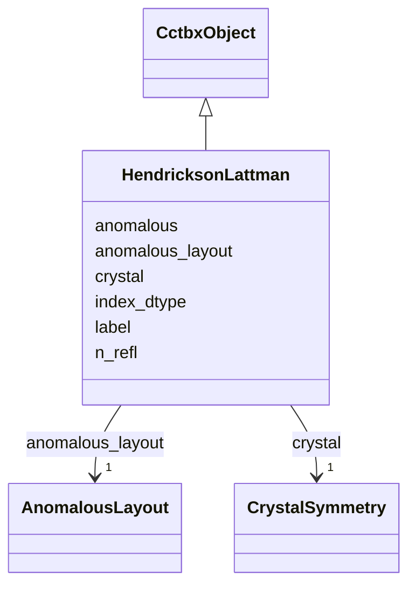

---
search:
  boost: 10.0
---

# Class: HendricksonLattman 


_Canonical HL coefficients (cctbx miller array of hendrickson_lattman). npz arrays A,B,C,D float64[N] plus hkl._

__


<div data-search-exclude markdown="1">


URI: [phridge:HendricksonLattman](https://github.com/phzwart/phridge/schema/phridge/HendricksonLattman)





## Inheritance
* [CctbxObject](CctbxObject.md)
    * **HendricksonLattman**


## Slots

| Name | Cardinality and Range | Description | Inheritance |
| ---  | --- | --- | --- |
| [label](label.md) | 0..1 <br/> [String](String.md) |  | direct |
| [crystal](crystal.md) | 1 <br/> [CrystalSymmetry](CrystalSymmetry.md) |  | direct |
| [anomalous](anomalous.md) | 1 <br/> [Boolean](Boolean.md) |  | direct |
| [anomalous_layout](anomalous_layout.md) | 1 <br/> [AnomalousLayout](AnomalousLayout.md) |  | direct |
| [n_refl](n_refl.md) | 1 <br/> [Integer](Integer.md) |  | direct |
| [index_dtype](index_dtype.md) | 1 <br/> [String](String.md) |  | direct |


## Identifier and Mapping Information


### Schema Source


* from schema: https://github.com/phzwart/phridge/schema/phridge


## Mappings

| Mapping Type | Mapped Value |
| ---  | ---  |
| self | phridge:HendricksonLattman |
| native | phridge:HendricksonLattman |


## LinkML Source

<!-- TODO: investigate https://stackoverflow.com/questions/37606292/how-to-create-tabbed-code-blocks-in-mkdocs-or-sphinx -->

### Direct

<details>
```yaml
name: HendricksonLattman
description: 'Canonical HL coefficients (cctbx miller array of hendrickson_lattman).
  npz arrays A,B,C,D float64[N] plus hkl.

  '
from_schema: https://github.com/phzwart/phridge/schema/phridge
rank: 1000
is_a: CctbxObject
attributes:
  label:
    name: label
    from_schema: https://github.com/phzwart/phridge/schema/cctbx_reflections
    domain_of:
    - MillerArray
    - HendricksonLattman
    - ReflectionColumn
    - RealMap
    - ComplexMap
    - MapCoefficients
    - EmMap
  crystal:
    name: crystal
    from_schema: https://github.com/phzwart/phridge/schema/cctbx_reflections
    domain_of:
    - MillerArray
    - HendricksonLattman
    - ReflectionFile
    - CrystalGridding
    - RealMap
    - ComplexMap
    - EmMap
    - CartesianSites
    - FractionalSites
    - Hierarchy
    - XrayStructure
    - GeometryRestraints
    range: CrystalSymmetry
    required: true
    inlined: true
  anomalous:
    name: anomalous
    from_schema: https://github.com/phzwart/phridge/schema/cctbx_reflections
    domain_of:
    - MillerArray
    - HendricksonLattman
    - ReflectionColumn
    range: boolean
    required: true
  anomalous_layout:
    name: anomalous_layout
    from_schema: https://github.com/phzwart/phridge/schema/cctbx_reflections
    domain_of:
    - MillerArray
    - HendricksonLattman
    - ReflectionFile
    range: AnomalousLayout
    required: true
  n_refl:
    name: n_refl
    from_schema: https://github.com/phzwart/phridge/schema/cctbx_reflections
    domain_of:
    - MillerArray
    - HendricksonLattman
    - ReflectionFile
    range: integer
    required: true
  index_dtype:
    name: index_dtype
    from_schema: https://github.com/phzwart/phridge/schema/cctbx_reflections
    domain_of:
    - MillerArray
    - HendricksonLattman
    - ReflectionFile
    required: true

```
</details>

### Induced

<details>
```yaml
name: HendricksonLattman
description: 'Canonical HL coefficients (cctbx miller array of hendrickson_lattman).
  npz arrays A,B,C,D float64[N] plus hkl.

  '
from_schema: https://github.com/phzwart/phridge/schema/phridge
rank: 1000
is_a: CctbxObject
attributes:
  label:
    name: label
    from_schema: https://github.com/phzwart/phridge/schema/cctbx_reflections
    owner: HendricksonLattman
    domain_of:
    - MillerArray
    - HendricksonLattman
    - ReflectionColumn
    - RealMap
    - ComplexMap
    - MapCoefficients
    - EmMap
    range: string
  crystal:
    name: crystal
    from_schema: https://github.com/phzwart/phridge/schema/cctbx_reflections
    owner: HendricksonLattman
    domain_of:
    - MillerArray
    - HendricksonLattman
    - ReflectionFile
    - CrystalGridding
    - RealMap
    - ComplexMap
    - EmMap
    - CartesianSites
    - FractionalSites
    - Hierarchy
    - XrayStructure
    - GeometryRestraints
    range: CrystalSymmetry
    required: true
    inlined: true
  anomalous:
    name: anomalous
    from_schema: https://github.com/phzwart/phridge/schema/cctbx_reflections
    owner: HendricksonLattman
    domain_of:
    - MillerArray
    - HendricksonLattman
    - ReflectionColumn
    range: boolean
    required: true
  anomalous_layout:
    name: anomalous_layout
    from_schema: https://github.com/phzwart/phridge/schema/cctbx_reflections
    owner: HendricksonLattman
    domain_of:
    - MillerArray
    - HendricksonLattman
    - ReflectionFile
    range: AnomalousLayout
    required: true
  n_refl:
    name: n_refl
    from_schema: https://github.com/phzwart/phridge/schema/cctbx_reflections
    owner: HendricksonLattman
    domain_of:
    - MillerArray
    - HendricksonLattman
    - ReflectionFile
    range: integer
    required: true
  index_dtype:
    name: index_dtype
    from_schema: https://github.com/phzwart/phridge/schema/cctbx_reflections
    owner: HendricksonLattman
    domain_of:
    - MillerArray
    - HendricksonLattman
    - ReflectionFile
    range: string
    required: true

```
</details></div>