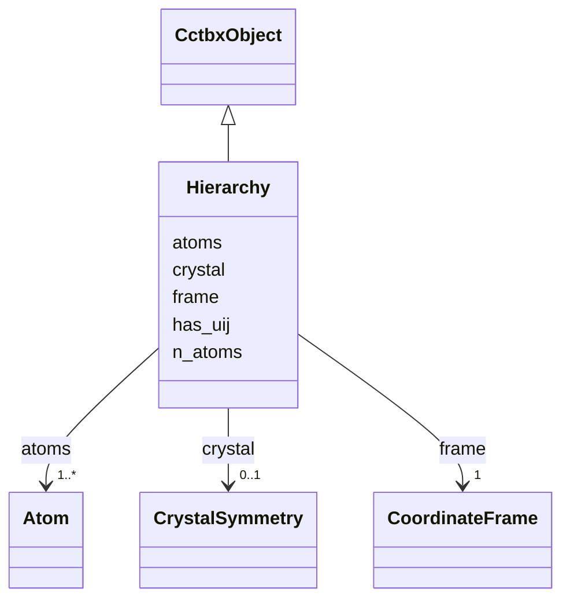

---
search:
  boost: 10.0
---

# Class: Hierarchy 


_Canonical iotbx.pdb.hierarchy.root. Cartesian frame. npz: xyz, occupancy, b_iso; optional u_cart [N,6] U in Ų and uij_defined uint8 mask (PDB ANISOU)._

__


<div data-search-exclude markdown="1">


URI: [phridge:Hierarchy](https://github.com/phzwart/phridge/schema/phridge/Hierarchy)





## Inheritance
* [CctbxObject](CctbxObject.md)
    * **Hierarchy**


## Slots

| Name | Cardinality and Range | Description | Inheritance |
| ---  | --- | --- | --- |
| [crystal](crystal.md) | 0..1 <br/> [CrystalSymmetry](CrystalSymmetry.md) |  | direct |
| [n_atoms](n_atoms.md) | 1 <br/> [Integer](Integer.md) |  | direct |
| [frame](frame.md) | 1 <br/> [CoordinateFrame](CoordinateFrame.md) |  | direct |
| [has_uij](has_uij.md) | 1 <br/> [Boolean](Boolean.md) | True if u_cart is present in the npz | direct |
| [atoms](atoms.md) | 1..* <br/> [Atom](Atom.md) |  | direct |


## Identifier and Mapping Information


### Schema Source


* from schema: https://github.com/phzwart/phridge/schema/phridge


## Mappings

| Mapping Type | Mapped Value |
| ---  | ---  |
| self | phridge:Hierarchy |
| native | phridge:Hierarchy |


## LinkML Source

<!-- TODO: investigate https://stackoverflow.com/questions/37606292/how-to-create-tabbed-code-blocks-in-mkdocs-or-sphinx -->

### Direct

<details>
```yaml
name: Hierarchy
description: 'Canonical iotbx.pdb.hierarchy.root. Cartesian frame. npz: xyz, occupancy,
  b_iso; optional u_cart [N,6] U in Ų and uij_defined uint8 mask (PDB ANISOU).

  '
from_schema: https://github.com/phzwart/phridge/schema/phridge
rank: 1000
is_a: CctbxObject
attributes:
  crystal:
    name: crystal
    from_schema: https://github.com/phzwart/phridge/schema/cctbx_coordinates
    domain_of:
    - MillerArray
    - HendricksonLattman
    - ReflectionFile
    - CrystalGridding
    - RealMap
    - ComplexMap
    - EmMap
    - CartesianSites
    - FractionalSites
    - Hierarchy
    - XrayStructure
    - GeometryRestraints
    range: CrystalSymmetry
    inlined: true
  n_atoms:
    name: n_atoms
    from_schema: https://github.com/phzwart/phridge/schema/cctbx_coordinates
    rank: 1000
    domain_of:
    - Hierarchy
    range: integer
    required: true
  frame:
    name: frame
    from_schema: https://github.com/phzwart/phridge/schema/cctbx_coordinates
    rank: 1000
    domain_of:
    - Hierarchy
    range: CoordinateFrame
    required: true
  has_uij:
    name: has_uij
    description: True if u_cart is present in the npz
    from_schema: https://github.com/phzwart/phridge/schema/cctbx_coordinates
    rank: 1000
    domain_of:
    - Hierarchy
    range: boolean
    required: true
  atoms:
    name: atoms
    from_schema: https://github.com/phzwart/phridge/schema/cctbx_coordinates
    rank: 1000
    domain_of:
    - Hierarchy
    range: Atom
    required: true
    multivalued: true
    inlined: true

```
</details>

### Induced

<details>
```yaml
name: Hierarchy
description: 'Canonical iotbx.pdb.hierarchy.root. Cartesian frame. npz: xyz, occupancy,
  b_iso; optional u_cart [N,6] U in Ų and uij_defined uint8 mask (PDB ANISOU).

  '
from_schema: https://github.com/phzwart/phridge/schema/phridge
rank: 1000
is_a: CctbxObject
attributes:
  crystal:
    name: crystal
    from_schema: https://github.com/phzwart/phridge/schema/cctbx_coordinates
    owner: Hierarchy
    domain_of:
    - MillerArray
    - HendricksonLattman
    - ReflectionFile
    - CrystalGridding
    - RealMap
    - ComplexMap
    - EmMap
    - CartesianSites
    - FractionalSites
    - Hierarchy
    - XrayStructure
    - GeometryRestraints
    range: CrystalSymmetry
    inlined: true
  n_atoms:
    name: n_atoms
    from_schema: https://github.com/phzwart/phridge/schema/cctbx_coordinates
    rank: 1000
    owner: Hierarchy
    domain_of:
    - Hierarchy
    range: integer
    required: true
  frame:
    name: frame
    from_schema: https://github.com/phzwart/phridge/schema/cctbx_coordinates
    rank: 1000
    owner: Hierarchy
    domain_of:
    - Hierarchy
    range: CoordinateFrame
    required: true
  has_uij:
    name: has_uij
    description: True if u_cart is present in the npz
    from_schema: https://github.com/phzwart/phridge/schema/cctbx_coordinates
    rank: 1000
    owner: Hierarchy
    domain_of:
    - Hierarchy
    range: boolean
    required: true
  atoms:
    name: atoms
    from_schema: https://github.com/phzwart/phridge/schema/cctbx_coordinates
    rank: 1000
    owner: Hierarchy
    domain_of:
    - Hierarchy
    range: Atom
    required: true
    multivalued: true
    inlined: true

```
</details></div>