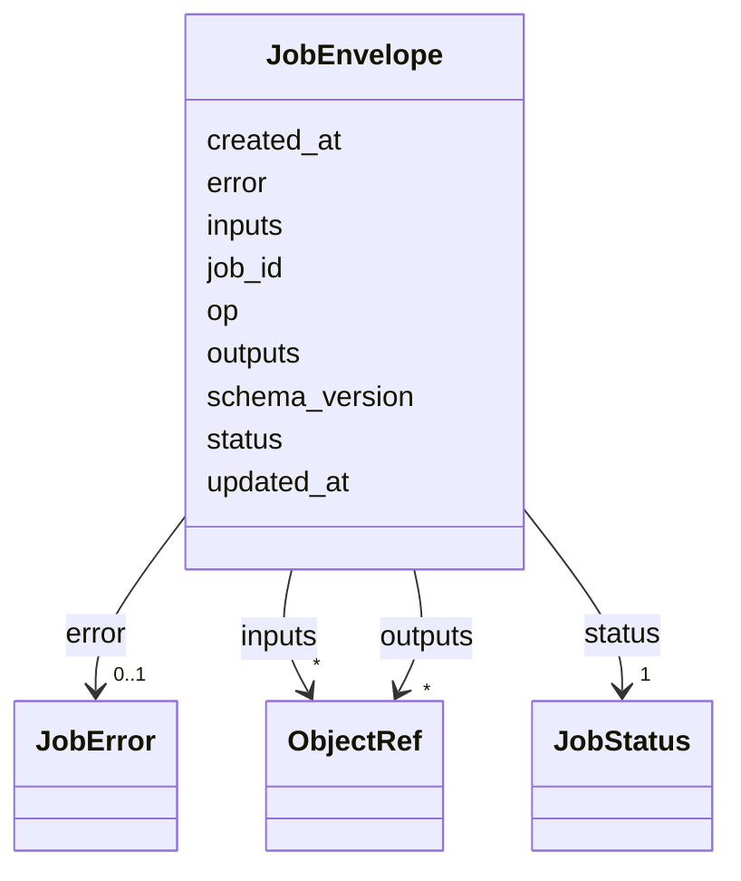

---
search:
  boost: 10.0
---

# Class: JobEnvelope 

<div data-search-exclude markdown="1">


URI: [phridge:JobEnvelope](https://github.com/phzwart/phridge/schema/phridge/JobEnvelope)





<!-- no inheritance hierarchy -->

## Slots

| Name | Cardinality and Range | Description | Inheritance |
| ---  | --- | --- | --- |
| [job_id](job_id.md) | 1 <br/> [String](String.md) |  | direct |
| [op](op.md) | 1 <br/> [String](String.md) |  | direct |
| [schema_version](schema_version.md) | 1 <br/> [Integer](Integer.md) | Must match this schema file version (1) | direct |
| [inputs](inputs.md) | * <br/> [ObjectRef](ObjectRef.md) | Map of input name to ObjectRef | direct |
| [outputs](outputs.md) | * <br/> [ObjectRef](ObjectRef.md) | Map of output name to ObjectRef (filled by worker) | direct |
| [status](status.md) | 1 <br/> [JobStatus](JobStatus.md) |  | direct |
| [error](error.md) | 0..1 <br/> [JobError](JobError.md) |  | direct |
| [created_at](created_at.md) | 0..1 <br/> [Datetime](Datetime.md) |  | direct |
| [updated_at](updated_at.md) | 0..1 <br/> [Datetime](Datetime.md) |  | direct |


## Identifier and Mapping Information


### Schema Source


* from schema: https://github.com/phzwart/phridge/schema/phridge


## Mappings

| Mapping Type | Mapped Value |
| ---  | ---  |
| self | phridge:JobEnvelope |
| native | phridge:JobEnvelope |


## LinkML Source

<!-- TODO: investigate https://stackoverflow.com/questions/37606292/how-to-create-tabbed-code-blocks-in-mkdocs-or-sphinx -->

### Direct

<details>
```yaml
name: JobEnvelope
from_schema: https://github.com/phzwart/phridge/schema/phridge
rank: 1000
attributes:
  job_id:
    name: job_id
    from_schema: https://github.com/phzwart/phridge/schema/phridge
    rank: 1000
    identifier: true
    domain_of:
    - JobEnvelope
    required: true
  op:
    name: op
    from_schema: https://github.com/phzwart/phridge/schema/phridge
    rank: 1000
    domain_of:
    - JobEnvelope
    required: true
  schema_version:
    name: schema_version
    description: Must match this schema file version (1)
    from_schema: https://github.com/phzwart/phridge/schema/phridge
    rank: 1000
    domain_of:
    - JobEnvelope
    - OpSpec
    range: integer
    required: true
    equals_number: 1
  inputs:
    name: inputs
    description: Map of input name to ObjectRef
    from_schema: https://github.com/phzwart/phridge/schema/phridge
    rank: 1000
    domain_of:
    - JobEnvelope
    - OpSpec
    range: ObjectRef
    multivalued: true
    inlined: true
    inlined_as_list: false
  outputs:
    name: outputs
    description: Map of output name to ObjectRef (filled by worker)
    from_schema: https://github.com/phzwart/phridge/schema/phridge
    rank: 1000
    domain_of:
    - JobEnvelope
    - OpSpec
    range: ObjectRef
    multivalued: true
    inlined: true
    inlined_as_list: false
  status:
    name: status
    from_schema: https://github.com/phzwart/phridge/schema/phridge
    rank: 1000
    domain_of:
    - JobEnvelope
    range: JobStatus
    required: true
  error:
    name: error
    from_schema: https://github.com/phzwart/phridge/schema/phridge
    rank: 1000
    domain_of:
    - JobEnvelope
    range: JobError
    inlined: true
  created_at:
    name: created_at
    from_schema: https://github.com/phzwart/phridge/schema/phridge
    rank: 1000
    domain_of:
    - JobEnvelope
    range: datetime
  updated_at:
    name: updated_at
    from_schema: https://github.com/phzwart/phridge/schema/phridge
    rank: 1000
    domain_of:
    - JobEnvelope
    range: datetime

```
</details>

### Induced

<details>
```yaml
name: JobEnvelope
from_schema: https://github.com/phzwart/phridge/schema/phridge
rank: 1000
attributes:
  job_id:
    name: job_id
    from_schema: https://github.com/phzwart/phridge/schema/phridge
    rank: 1000
    identifier: true
    owner: JobEnvelope
    domain_of:
    - JobEnvelope
    range: string
    required: true
  op:
    name: op
    from_schema: https://github.com/phzwart/phridge/schema/phridge
    rank: 1000
    owner: JobEnvelope
    domain_of:
    - JobEnvelope
    range: string
    required: true
  schema_version:
    name: schema_version
    description: Must match this schema file version (1)
    from_schema: https://github.com/phzwart/phridge/schema/phridge
    rank: 1000
    owner: JobEnvelope
    domain_of:
    - JobEnvelope
    - OpSpec
    range: integer
    required: true
    equals_number: 1
  inputs:
    name: inputs
    description: Map of input name to ObjectRef
    from_schema: https://github.com/phzwart/phridge/schema/phridge
    rank: 1000
    owner: JobEnvelope
    domain_of:
    - JobEnvelope
    - OpSpec
    range: ObjectRef
    multivalued: true
    inlined: true
    inlined_as_list: false
  outputs:
    name: outputs
    description: Map of output name to ObjectRef (filled by worker)
    from_schema: https://github.com/phzwart/phridge/schema/phridge
    rank: 1000
    owner: JobEnvelope
    domain_of:
    - JobEnvelope
    - OpSpec
    range: ObjectRef
    multivalued: true
    inlined: true
    inlined_as_list: false
  status:
    name: status
    from_schema: https://github.com/phzwart/phridge/schema/phridge
    rank: 1000
    owner: JobEnvelope
    domain_of:
    - JobEnvelope
    range: JobStatus
    required: true
  error:
    name: error
    from_schema: https://github.com/phzwart/phridge/schema/phridge
    rank: 1000
    owner: JobEnvelope
    domain_of:
    - JobEnvelope
    range: JobError
    inlined: true
  created_at:
    name: created_at
    from_schema: https://github.com/phzwart/phridge/schema/phridge
    rank: 1000
    owner: JobEnvelope
    domain_of:
    - JobEnvelope
    range: datetime
  updated_at:
    name: updated_at
    from_schema: https://github.com/phzwart/phridge/schema/phridge
    rank: 1000
    owner: JobEnvelope
    domain_of:
    - JobEnvelope
    range: datetime

```
</details></div>