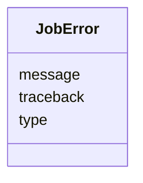

---
search:
  boost: 10.0
---

# Class: JobError 

<div data-search-exclude markdown="1">


URI: [phridge:JobError](https://github.com/phzwart/phridge/schema/phridge/JobError)





<!-- no inheritance hierarchy -->

## Slots

| Name | Cardinality and Range | Description | Inheritance |
| ---  | --- | --- | --- |
| [type](type.md) | 1 <br/> [String](String.md) |  | direct |
| [message](message.md) | 1 <br/> [String](String.md) |  | direct |
| [traceback](traceback.md) | 0..1 <br/> [String](String.md) |  | direct |


## Usages

| used by | used in | type | used |
| ---  | --- | --- | --- |
| [JobEnvelope](JobEnvelope.md) | [error](error.md) | range | [JobError](JobError.md) |


## Identifier and Mapping Information


### Schema Source


* from schema: https://github.com/phzwart/phridge/schema/phridge


## Mappings

| Mapping Type | Mapped Value |
| ---  | ---  |
| self | phridge:JobError |
| native | phridge:JobError |


## LinkML Source

<!-- TODO: investigate https://stackoverflow.com/questions/37606292/how-to-create-tabbed-code-blocks-in-mkdocs-or-sphinx -->

### Direct

<details>
```yaml
name: JobError
from_schema: https://github.com/phzwart/phridge/schema/phridge
rank: 1000
attributes:
  type:
    name: type
    from_schema: https://github.com/phzwart/phridge/schema/phridge
    rank: 1000
    domain_of:
    - JobError
    - SlotBinding
    required: true
  message:
    name: message
    from_schema: https://github.com/phzwart/phridge/schema/phridge
    rank: 1000
    domain_of:
    - JobError
    required: true
  traceback:
    name: traceback
    from_schema: https://github.com/phzwart/phridge/schema/phridge
    rank: 1000
    domain_of:
    - JobError
    required: false

```
</details>

### Induced

<details>
```yaml
name: JobError
from_schema: https://github.com/phzwart/phridge/schema/phridge
rank: 1000
attributes:
  type:
    name: type
    from_schema: https://github.com/phzwart/phridge/schema/phridge
    rank: 1000
    owner: JobError
    domain_of:
    - JobError
    - SlotBinding
    range: string
    required: true
  message:
    name: message
    from_schema: https://github.com/phzwart/phridge/schema/phridge
    rank: 1000
    owner: JobError
    domain_of:
    - JobError
    range: string
    required: true
  traceback:
    name: traceback
    from_schema: https://github.com/phzwart/phridge/schema/phridge
    rank: 1000
    owner: JobError
    domain_of:
    - JobError
    range: string
    required: false

```
</details></div>