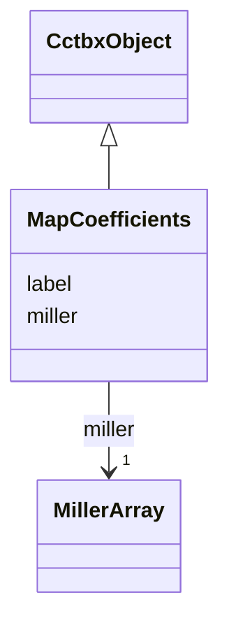

---
search:
  boost: 10.0
---

# Class: MapCoefficients 


_Complex miller array used as FFT map coefficients (cctbx miller array of Fcalc / 2mFo-DFc coefficients). npz: hkl int32[N,3], data complex128[N]._

__


<div data-search-exclude markdown="1">


URI: [phridge:MapCoefficients](https://github.com/phzwart/phridge/schema/phridge/MapCoefficients)





## Inheritance
* [CctbxObject](CctbxObject.md)
    * **MapCoefficients**


## Slots

| Name | Cardinality and Range | Description | Inheritance |
| ---  | --- | --- | --- |
| [label](label.md) | 0..1 <br/> [String](String.md) |  | direct |
| [miller](miller.md) | 1 <br/> [MillerArray](MillerArray.md) | Must have observation_type complex | direct |


## Identifier and Mapping Information


### Schema Source


* from schema: https://github.com/phzwart/phridge/schema/phridge


## Mappings

| Mapping Type | Mapped Value |
| ---  | ---  |
| self | phridge:MapCoefficients |
| native | phridge:MapCoefficients |


## LinkML Source

<!-- TODO: investigate https://stackoverflow.com/questions/37606292/how-to-create-tabbed-code-blocks-in-mkdocs-or-sphinx -->

### Direct

<details>
```yaml
name: MapCoefficients
description: 'Complex miller array used as FFT map coefficients (cctbx miller array
  of Fcalc / 2mFo-DFc coefficients). npz: hkl int32[N,3], data complex128[N].

  '
from_schema: https://github.com/phzwart/phridge/schema/phridge
rank: 1000
is_a: CctbxObject
attributes:
  label:
    name: label
    from_schema: https://github.com/phzwart/phridge/schema/cctbx_maps
    domain_of:
    - MillerArray
    - HendricksonLattman
    - ReflectionColumn
    - RealMap
    - ComplexMap
    - MapCoefficients
    - EmMap
  miller:
    name: miller
    description: Must have observation_type complex
    from_schema: https://github.com/phzwart/phridge/schema/cctbx_maps
    rank: 1000
    domain_of:
    - MapCoefficients
    range: MillerArray
    required: true
    inlined: true

```
</details>

### Induced

<details>
```yaml
name: MapCoefficients
description: 'Complex miller array used as FFT map coefficients (cctbx miller array
  of Fcalc / 2mFo-DFc coefficients). npz: hkl int32[N,3], data complex128[N].

  '
from_schema: https://github.com/phzwart/phridge/schema/phridge
rank: 1000
is_a: CctbxObject
attributes:
  label:
    name: label
    from_schema: https://github.com/phzwart/phridge/schema/cctbx_maps
    owner: MapCoefficients
    domain_of:
    - MillerArray
    - HendricksonLattman
    - ReflectionColumn
    - RealMap
    - ComplexMap
    - MapCoefficients
    - EmMap
    range: string
  miller:
    name: miller
    description: Must have observation_type complex
    from_schema: https://github.com/phzwart/phridge/schema/cctbx_maps
    rank: 1000
    owner: MapCoefficients
    domain_of:
    - MapCoefficients
    range: MillerArray
    required: true
    inlined: true

```
</details></div>