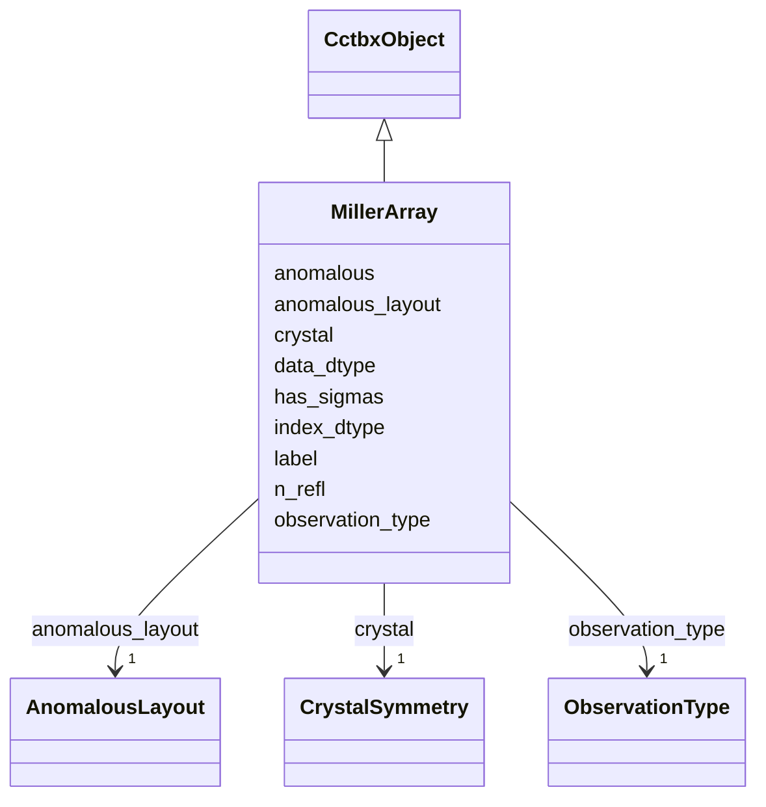

---
search:
  boost: 10.0
---

# Class: MillerArray 


_Canonical form of cctbx.miller.array. JSON metadata; buffers in one npz (hkl, data, optional sigmas)._

__


<div data-search-exclude markdown="1">


URI: [phridge:MillerArray](https://github.com/phzwart/phridge/schema/phridge/MillerArray)





## Inheritance
* [CctbxObject](CctbxObject.md)
    * **MillerArray**


## Slots

| Name | Cardinality and Range | Description | Inheritance |
| ---  | --- | --- | --- |
| [label](label.md) | 0..1 <br/> [String](String.md) | MTZ / miller array id (e | direct |
| [crystal](crystal.md) | 1 <br/> [CrystalSymmetry](CrystalSymmetry.md) |  | direct |
| [anomalous](anomalous.md) | 1 <br/> [Boolean](Boolean.md) |  | direct |
| [observation_type](observation_type.md) | 1 <br/> [ObservationType](ObservationType.md) |  | direct |
| [anomalous_layout](anomalous_layout.md) | 1 <br/> [AnomalousLayout](AnomalousLayout.md) | ASU vs both hemispheres; never inferred | direct |
| [n_refl](n_refl.md) | 1 <br/> [Integer](Integer.md) |  | direct |
| [has_sigmas](has_sigmas.md) | 1 <br/> [Boolean](Boolean.md) |  | direct |
| [index_dtype](index_dtype.md) | 1 <br/> [String](String.md) | Canonical store dtype for hkl; v1 is int32 | direct |
| [data_dtype](data_dtype.md) | 1 <br/> [String](String.md) | Canonical store dtype for data; v1 is float64 or complex128 | direct |


## Usages

| used by | used in | type | used |
| ---  | --- | --- | --- |
| [MapCoefficients](MapCoefficients.md) | [miller](miller.md) | range | [MillerArray](MillerArray.md) |


## Identifier and Mapping Information


### Schema Source


* from schema: https://github.com/phzwart/phridge/schema/phridge


## Mappings

| Mapping Type | Mapped Value |
| ---  | ---  |
| self | phridge:MillerArray |
| native | phridge:MillerArray |


## LinkML Source

<!-- TODO: investigate https://stackoverflow.com/questions/37606292/how-to-create-tabbed-code-blocks-in-mkdocs-or-sphinx -->

### Direct

<details>
```yaml
name: MillerArray
description: 'Canonical form of cctbx.miller.array. JSON metadata; buffers in one
  npz (hkl, data, optional sigmas).

  '
from_schema: https://github.com/phzwart/phridge/schema/phridge
rank: 1000
is_a: CctbxObject
attributes:
  label:
    name: label
    description: MTZ / miller array id (e.g. FOBS, IMEAN)
    from_schema: https://github.com/phzwart/phridge/schema/cctbx_reflections
    rank: 1000
    domain_of:
    - MillerArray
    - HendricksonLattman
    - ReflectionColumn
    - RealMap
    - ComplexMap
    - MapCoefficients
    - EmMap
  crystal:
    name: crystal
    from_schema: https://github.com/phzwart/phridge/schema/cctbx_reflections
    rank: 1000
    domain_of:
    - MillerArray
    - HendricksonLattman
    - ReflectionFile
    - CrystalGridding
    - RealMap
    - ComplexMap
    - EmMap
    - CartesianSites
    - FractionalSites
    - Hierarchy
    - XrayStructure
    - GeometryRestraints
    range: CrystalSymmetry
    required: true
    inlined: true
  anomalous:
    name: anomalous
    from_schema: https://github.com/phzwart/phridge/schema/cctbx_reflections
    rank: 1000
    domain_of:
    - MillerArray
    - HendricksonLattman
    - ReflectionColumn
    range: boolean
    required: true
  observation_type:
    name: observation_type
    from_schema: https://github.com/phzwart/phridge/schema/cctbx_reflections
    rank: 1000
    domain_of:
    - MillerArray
    - ReflectionColumn
    range: ObservationType
    required: true
  anomalous_layout:
    name: anomalous_layout
    description: ASU vs both hemispheres; never inferred
    from_schema: https://github.com/phzwart/phridge/schema/cctbx_reflections
    rank: 1000
    domain_of:
    - MillerArray
    - HendricksonLattman
    - ReflectionFile
    range: AnomalousLayout
    required: true
  n_refl:
    name: n_refl
    from_schema: https://github.com/phzwart/phridge/schema/cctbx_reflections
    rank: 1000
    domain_of:
    - MillerArray
    - HendricksonLattman
    - ReflectionFile
    - TargetResult
    range: integer
    required: true
  has_sigmas:
    name: has_sigmas
    from_schema: https://github.com/phzwart/phridge/schema/cctbx_reflections
    rank: 1000
    domain_of:
    - MillerArray
    - ReflectionColumn
    range: boolean
    required: true
  index_dtype:
    name: index_dtype
    description: Canonical store dtype for hkl; v1 is int32
    from_schema: https://github.com/phzwart/phridge/schema/cctbx_reflections
    rank: 1000
    domain_of:
    - MillerArray
    - HendricksonLattman
    - ReflectionFile
    required: true
  data_dtype:
    name: data_dtype
    description: Canonical store dtype for data; v1 is float64 or complex128
    from_schema: https://github.com/phzwart/phridge/schema/cctbx_reflections
    rank: 1000
    domain_of:
    - MillerArray
    - ReflectionColumn
    required: true

```
</details>

### Induced

<details>
```yaml
name: MillerArray
description: 'Canonical form of cctbx.miller.array. JSON metadata; buffers in one
  npz (hkl, data, optional sigmas).

  '
from_schema: https://github.com/phzwart/phridge/schema/phridge
rank: 1000
is_a: CctbxObject
attributes:
  label:
    name: label
    description: MTZ / miller array id (e.g. FOBS, IMEAN)
    from_schema: https://github.com/phzwart/phridge/schema/cctbx_reflections
    rank: 1000
    owner: MillerArray
    domain_of:
    - MillerArray
    - HendricksonLattman
    - ReflectionColumn
    - RealMap
    - ComplexMap
    - MapCoefficients
    - EmMap
    range: string
  crystal:
    name: crystal
    from_schema: https://github.com/phzwart/phridge/schema/cctbx_reflections
    rank: 1000
    owner: MillerArray
    domain_of:
    - MillerArray
    - HendricksonLattman
    - ReflectionFile
    - CrystalGridding
    - RealMap
    - ComplexMap
    - EmMap
    - CartesianSites
    - FractionalSites
    - Hierarchy
    - XrayStructure
    - GeometryRestraints
    range: CrystalSymmetry
    required: true
    inlined: true
  anomalous:
    name: anomalous
    from_schema: https://github.com/phzwart/phridge/schema/cctbx_reflections
    rank: 1000
    owner: MillerArray
    domain_of:
    - MillerArray
    - HendricksonLattman
    - ReflectionColumn
    range: boolean
    required: true
  observation_type:
    name: observation_type
    from_schema: https://github.com/phzwart/phridge/schema/cctbx_reflections
    rank: 1000
    owner: MillerArray
    domain_of:
    - MillerArray
    - ReflectionColumn
    range: ObservationType
    required: true
  anomalous_layout:
    name: anomalous_layout
    description: ASU vs both hemispheres; never inferred
    from_schema: https://github.com/phzwart/phridge/schema/cctbx_reflections
    rank: 1000
    owner: MillerArray
    domain_of:
    - MillerArray
    - HendricksonLattman
    - ReflectionFile
    range: AnomalousLayout
    required: true
  n_refl:
    name: n_refl
    from_schema: https://github.com/phzwart/phridge/schema/cctbx_reflections
    rank: 1000
    owner: MillerArray
    domain_of:
    - MillerArray
    - HendricksonLattman
    - ReflectionFile
    - TargetResult
    range: integer
    required: true
  has_sigmas:
    name: has_sigmas
    from_schema: https://github.com/phzwart/phridge/schema/cctbx_reflections
    rank: 1000
    owner: MillerArray
    domain_of:
    - MillerArray
    - ReflectionColumn
    range: boolean
    required: true
  index_dtype:
    name: index_dtype
    description: Canonical store dtype for hkl; v1 is int32
    from_schema: https://github.com/phzwart/phridge/schema/cctbx_reflections
    rank: 1000
    owner: MillerArray
    domain_of:
    - MillerArray
    - HendricksonLattman
    - ReflectionFile
    range: string
    required: true
  data_dtype:
    name: data_dtype
    description: Canonical store dtype for data; v1 is float64 or complex128
    from_schema: https://github.com/phzwart/phridge/schema/cctbx_reflections
    rank: 1000
    owner: MillerArray
    domain_of:
    - MillerArray
    - ReflectionColumn
    range: string
    required: true

```
</details></div>