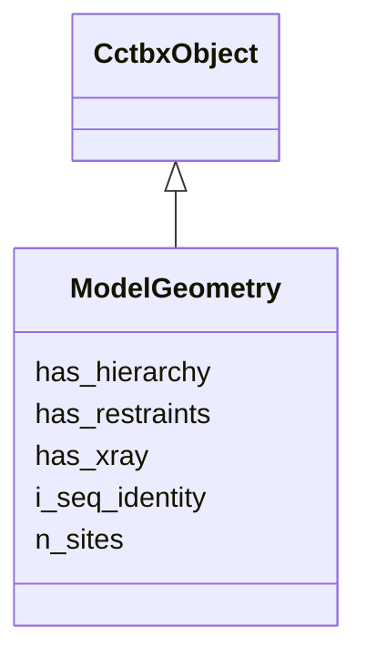

---
search:
  boost: 10.0
---

# Class: ModelGeometry 


_Correspondence header asserting that hierarchy, xray scatterers, and restraints share one i_seq space of size n_sites. Payloads remain separate ObjectRefs (Hierarchy, XrayStructure, GeometryRestraints) with matching n_atoms / n_scatterers / n_sites._

__


<div data-search-exclude markdown="1">


URI: [phridge:ModelGeometry](https://github.com/phzwart/phridge/schema/phridge/ModelGeometry)





## Inheritance
* [CctbxObject](CctbxObject.md)
    * **ModelGeometry**


## Slots

| Name | Cardinality and Range | Description | Inheritance |
| ---  | --- | --- | --- |
| [n_sites](n_sites.md) | 1 <br/> [Integer](Integer.md) |  | direct |
| [has_hierarchy](has_hierarchy.md) | 1 <br/> [Boolean](Boolean.md) |  | direct |
| [has_xray](has_xray.md) | 1 <br/> [Boolean](Boolean.md) |  | direct |
| [has_restraints](has_restraints.md) | 1 <br/> [Boolean](Boolean.md) |  | direct |
| [i_seq_identity](i_seq_identity.md) | 1 <br/> [Boolean](Boolean.md) | True when Hierarchy | direct |


## Identifier and Mapping Information


### Schema Source


* from schema: https://github.com/phzwart/phridge/schema/phridge


## Mappings

| Mapping Type | Mapped Value |
| ---  | ---  |
| self | phridge:ModelGeometry |
| native | phridge:ModelGeometry |


## LinkML Source

<!-- TODO: investigate https://stackoverflow.com/questions/37606292/how-to-create-tabbed-code-blocks-in-mkdocs-or-sphinx -->

### Direct

<details>
```yaml
name: ModelGeometry
description: 'Correspondence header asserting that hierarchy, xray scatterers, and
  restraints share one i_seq space of size n_sites. Payloads remain separate ObjectRefs
  (Hierarchy, XrayStructure, GeometryRestraints) with matching n_atoms / n_scatterers
  / n_sites.

  '
from_schema: https://github.com/phzwart/phridge/schema/phridge
rank: 1000
is_a: CctbxObject
attributes:
  n_sites:
    name: n_sites
    from_schema: https://github.com/phzwart/phridge/schema/cctbx_geometry
    domain_of:
    - CartesianSites
    - FractionalSites
    - GeometryRestraints
    - ModelGeometry
    range: integer
    required: true
  has_hierarchy:
    name: has_hierarchy
    from_schema: https://github.com/phzwart/phridge/schema/cctbx_geometry
    rank: 1000
    domain_of:
    - ModelGeometry
    range: boolean
    required: true
  has_xray:
    name: has_xray
    from_schema: https://github.com/phzwart/phridge/schema/cctbx_geometry
    rank: 1000
    domain_of:
    - ModelGeometry
    range: boolean
    required: true
  has_restraints:
    name: has_restraints
    from_schema: https://github.com/phzwart/phridge/schema/cctbx_geometry
    rank: 1000
    domain_of:
    - ModelGeometry
    range: boolean
    required: true
  i_seq_identity:
    name: i_seq_identity
    description: 'True when Hierarchy.atoms[i].i == XrayStructure.scatterers[i].i
      == i for all i in 0..n_sites-1, and every restraint i_seq is in that range.

      '
    from_schema: https://github.com/phzwart/phridge/schema/cctbx_geometry
    rank: 1000
    domain_of:
    - ModelGeometry
    range: boolean
    required: true

```
</details>

### Induced

<details>
```yaml
name: ModelGeometry
description: 'Correspondence header asserting that hierarchy, xray scatterers, and
  restraints share one i_seq space of size n_sites. Payloads remain separate ObjectRefs
  (Hierarchy, XrayStructure, GeometryRestraints) with matching n_atoms / n_scatterers
  / n_sites.

  '
from_schema: https://github.com/phzwart/phridge/schema/phridge
rank: 1000
is_a: CctbxObject
attributes:
  n_sites:
    name: n_sites
    from_schema: https://github.com/phzwart/phridge/schema/cctbx_geometry
    owner: ModelGeometry
    domain_of:
    - CartesianSites
    - FractionalSites
    - GeometryRestraints
    - ModelGeometry
    range: integer
    required: true
  has_hierarchy:
    name: has_hierarchy
    from_schema: https://github.com/phzwart/phridge/schema/cctbx_geometry
    rank: 1000
    owner: ModelGeometry
    domain_of:
    - ModelGeometry
    range: boolean
    required: true
  has_xray:
    name: has_xray
    from_schema: https://github.com/phzwart/phridge/schema/cctbx_geometry
    rank: 1000
    owner: ModelGeometry
    domain_of:
    - ModelGeometry
    range: boolean
    required: true
  has_restraints:
    name: has_restraints
    from_schema: https://github.com/phzwart/phridge/schema/cctbx_geometry
    rank: 1000
    owner: ModelGeometry
    domain_of:
    - ModelGeometry
    range: boolean
    required: true
  i_seq_identity:
    name: i_seq_identity
    description: 'True when Hierarchy.atoms[i].i == XrayStructure.scatterers[i].i
      == i for all i in 0..n_sites-1, and every restraint i_seq is in that range.

      '
    from_schema: https://github.com/phzwart/phridge/schema/cctbx_geometry
    rank: 1000
    owner: ModelGeometry
    domain_of:
    - ModelGeometry
    range: boolean
    required: true

```
</details></div>