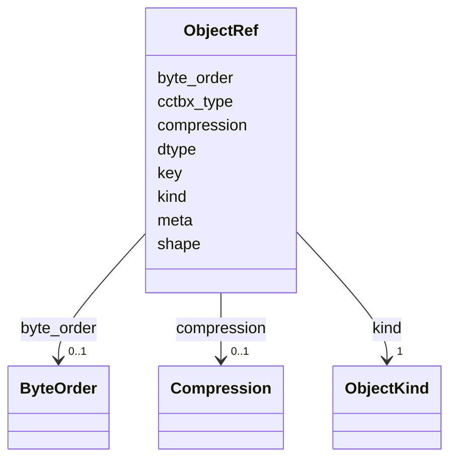

---
search:
  boost: 10.0
---

# Class: ObjectRef 


_Pointer at bytes in Redis plus enough metadata to decode them. For kind=cctbx, meta is the inlined cctbx class (CrystalSymmetry, MillerArray, or RealMap). Binary buffers for miller/map are a packed npz at key._

__


<div data-search-exclude markdown="1">


URI: [phridge:ObjectRef](https://github.com/phzwart/phridge/schema/phridge/ObjectRef)





<!-- no inheritance hierarchy -->

## Slots

| Name | Cardinality and Range | Description | Inheritance |
| ---  | --- | --- | --- |
| [kind](kind.md) | 1 <br/> [ObjectKind](ObjectKind.md) |  | direct |
| [key](key.md) | 0..1 <br/> [String](String.md) | Redis key for bytes; omitted for JSON-only CrystalSymmetry | direct |
| [dtype](dtype.md) | 0..1 <br/> [String](String.md) | Element dtype when kind=array | direct |
| [shape](shape.md) | * <br/> [Integer](Integer.md) | Shape when kind=array | direct |
| [byte_order](byte_order.md) | 0..1 <br/> [ByteOrder](ByteOrder.md) |  | direct |
| [compression](compression.md) | 0..1 <br/> [Compression](Compression.md) |  | direct |
| [cctbx_type](cctbx_type.md) | 0..1 <br/> [String](String.md) | Cctbx class name when kind=cctbx (MillerArray, RealMap, CrystalSymmetry) | direct |
| [meta](meta.md) | 0..1 <br/> [String](String.md) | Kind-specific JSON (ArrayMeta, BlobMeta, or a CctbxObject) | direct |


## Usages

| used by | used in | type | used |
| ---  | --- | --- | --- |
| [JobEnvelope](JobEnvelope.md) | [inputs](inputs.md) | range | [ObjectRef](ObjectRef.md) |
| [JobEnvelope](JobEnvelope.md) | [outputs](outputs.md) | range | [ObjectRef](ObjectRef.md) |


## Rules


### cctbx ObjectRef names a class and carries meta

| Rule Applied | Preconditions | Postconditions | Elseconditions |
|--------------|---------------|----------------|----------------|
| slot_conditions |```{'kind': {'equals_string': 'cctbx'}}``` |```{'cctbx_type': {'required': True}, 'meta': {'required': True}}``` | |


### array ObjectRef has a Redis key

| Rule Applied | Preconditions | Postconditions | Elseconditions |
|--------------|---------------|----------------|----------------|
| slot_conditions |```{'kind': {'equals_string': 'array'}}``` |```{'key': {'required': True}}``` | |


## Identifier and Mapping Information


### Schema Source


* from schema: https://github.com/phzwart/phridge/schema/phridge


## Mappings

| Mapping Type | Mapped Value |
| ---  | ---  |
| self | phridge:ObjectRef |
| native | phridge:ObjectRef |


## LinkML Source

<!-- TODO: investigate https://stackoverflow.com/questions/37606292/how-to-create-tabbed-code-blocks-in-mkdocs-or-sphinx -->

### Direct

<details>
```yaml
name: ObjectRef
description: 'Pointer at bytes in Redis plus enough metadata to decode them. For kind=cctbx,
  meta is the inlined cctbx class (CrystalSymmetry, MillerArray, or RealMap). Binary
  buffers for miller/map are a packed npz at key.

  '
from_schema: https://github.com/phzwart/phridge/schema/phridge
rank: 1000
attributes:
  kind:
    name: kind
    from_schema: https://github.com/phzwart/phridge/schema/phridge
    rank: 1000
    domain_of:
    - ObjectRef
    range: ObjectKind
    required: true
  key:
    name: key
    description: Redis key for bytes; omitted for JSON-only CrystalSymmetry
    from_schema: https://github.com/phzwart/phridge/schema/phridge
    rank: 1000
    domain_of:
    - ObjectRef
  dtype:
    name: dtype
    description: Element dtype when kind=array
    from_schema: https://github.com/phzwart/phridge/schema/phridge
    domain_of:
    - ArrayMeta
    - ObjectRef
    - RealMap
    - ComplexMap
    - EmMap
    - CartesianSites
    - FractionalSites
  shape:
    name: shape
    description: Shape when kind=array
    from_schema: https://github.com/phzwart/phridge/schema/phridge
    domain_of:
    - ArrayMeta
    - ObjectRef
    range: integer
    multivalued: true
  byte_order:
    name: byte_order
    from_schema: https://github.com/phzwart/phridge/schema/phridge
    rank: 1000
    domain_of:
    - ObjectRef
    range: ByteOrder
  compression:
    name: compression
    from_schema: https://github.com/phzwart/phridge/schema/phridge
    rank: 1000
    domain_of:
    - ObjectRef
    range: Compression
  cctbx_type:
    name: cctbx_type
    description: Cctbx class name when kind=cctbx (MillerArray, RealMap, CrystalSymmetry)
    from_schema: https://github.com/phzwart/phridge/schema/phridge
    rank: 1000
    domain_of:
    - ObjectRef
  meta:
    name: meta
    description: Kind-specific JSON (ArrayMeta, BlobMeta, or a CctbxObject)
    from_schema: https://github.com/phzwart/phridge/schema/phridge
    rank: 1000
    domain_of:
    - ObjectRef
rules:
- preconditions:
    slot_conditions:
      kind:
        name: kind
        equals_string: cctbx
  postconditions:
    slot_conditions:
      cctbx_type:
        name: cctbx_type
        required: true
      meta:
        name: meta
        required: true
  description: kind=cctbx requires cctbx_type and meta (JSON metadata; npz at key
    when needed)
  title: cctbx ObjectRef names a class and carries meta
- preconditions:
    slot_conditions:
      kind:
        name: kind
        equals_string: array
  postconditions:
    slot_conditions:
      key:
        name: key
        required: true
  title: array ObjectRef has a Redis key

```
</details>

### Induced

<details>
```yaml
name: ObjectRef
description: 'Pointer at bytes in Redis plus enough metadata to decode them. For kind=cctbx,
  meta is the inlined cctbx class (CrystalSymmetry, MillerArray, or RealMap). Binary
  buffers for miller/map are a packed npz at key.

  '
from_schema: https://github.com/phzwart/phridge/schema/phridge
rank: 1000
attributes:
  kind:
    name: kind
    from_schema: https://github.com/phzwart/phridge/schema/phridge
    rank: 1000
    owner: ObjectRef
    domain_of:
    - ObjectRef
    range: ObjectKind
    required: true
  key:
    name: key
    description: Redis key for bytes; omitted for JSON-only CrystalSymmetry
    from_schema: https://github.com/phzwart/phridge/schema/phridge
    rank: 1000
    owner: ObjectRef
    domain_of:
    - ObjectRef
    range: string
  dtype:
    name: dtype
    description: Element dtype when kind=array
    from_schema: https://github.com/phzwart/phridge/schema/phridge
    owner: ObjectRef
    domain_of:
    - ArrayMeta
    - ObjectRef
    - RealMap
    - ComplexMap
    - EmMap
    - CartesianSites
    - FractionalSites
    range: string
  shape:
    name: shape
    description: Shape when kind=array
    from_schema: https://github.com/phzwart/phridge/schema/phridge
    owner: ObjectRef
    domain_of:
    - ArrayMeta
    - ObjectRef
    range: integer
    multivalued: true
  byte_order:
    name: byte_order
    from_schema: https://github.com/phzwart/phridge/schema/phridge
    rank: 1000
    owner: ObjectRef
    domain_of:
    - ObjectRef
    range: ByteOrder
  compression:
    name: compression
    from_schema: https://github.com/phzwart/phridge/schema/phridge
    rank: 1000
    owner: ObjectRef
    domain_of:
    - ObjectRef
    range: Compression
  cctbx_type:
    name: cctbx_type
    description: Cctbx class name when kind=cctbx (MillerArray, RealMap, CrystalSymmetry)
    from_schema: https://github.com/phzwart/phridge/schema/phridge
    rank: 1000
    owner: ObjectRef
    domain_of:
    - ObjectRef
    range: string
  meta:
    name: meta
    description: Kind-specific JSON (ArrayMeta, BlobMeta, or a CctbxObject)
    from_schema: https://github.com/phzwart/phridge/schema/phridge
    rank: 1000
    owner: ObjectRef
    domain_of:
    - ObjectRef
    range: string
rules:
- preconditions:
    slot_conditions:
      kind:
        name: kind
        equals_string: cctbx
  postconditions:
    slot_conditions:
      cctbx_type:
        name: cctbx_type
        required: true
      meta:
        name: meta
        required: true
  description: kind=cctbx requires cctbx_type and meta (JSON metadata; npz at key
    when needed)
  title: cctbx ObjectRef names a class and carries meta
- preconditions:
    slot_conditions:
      kind:
        name: kind
        equals_string: array
  postconditions:
    slot_conditions:
      key:
        name: key
        required: true
  title: array ObjectRef has a Redis key

```
</details></div>