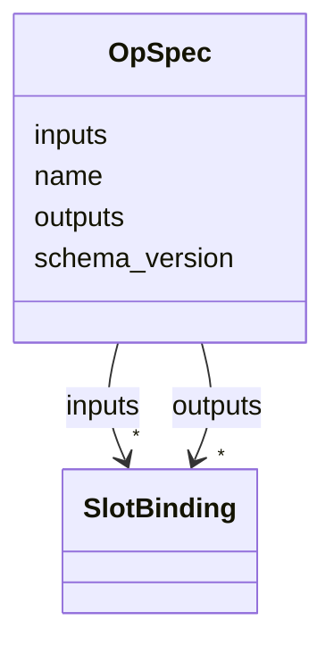

---
search:
  boost: 10.0
---

# Class: OpSpec 

<div data-search-exclude markdown="1">


URI: [phridge:OpSpec](https://github.com/phzwart/phridge/schema/phridge/OpSpec)





<!-- no inheritance hierarchy -->

## Slots

| Name | Cardinality and Range | Description | Inheritance |
| ---  | --- | --- | --- |
| [name](name.md) | 1 <br/> [String](String.md) |  | direct |
| [schema_version](schema_version.md) | 1 <br/> [Integer](Integer.md) |  | direct |
| [inputs](inputs.md) | * <br/> [SlotBinding](SlotBinding.md) |  | direct |
| [outputs](outputs.md) | * <br/> [SlotBinding](SlotBinding.md) |  | direct |


## Identifier and Mapping Information


### Schema Source


* from schema: https://github.com/phzwart/phridge/schema/phridge


## Mappings

| Mapping Type | Mapped Value |
| ---  | ---  |
| self | phridge:OpSpec |
| native | phridge:OpSpec |


## LinkML Source

<!-- TODO: investigate https://stackoverflow.com/questions/37606292/how-to-create-tabbed-code-blocks-in-mkdocs-or-sphinx -->

### Direct

<details>
```yaml
name: OpSpec
from_schema: https://github.com/phzwart/phridge/schema/phridge
rank: 1000
attributes:
  name:
    name: name
    from_schema: https://github.com/phzwart/phridge/schema/phridge
    identifier: true
    domain_of:
    - SlotBinding
    - OpSpec
    - Atom
    required: true
  schema_version:
    name: schema_version
    from_schema: https://github.com/phzwart/phridge/schema/phridge
    domain_of:
    - JobEnvelope
    - OpSpec
    range: integer
    required: true
  inputs:
    name: inputs
    from_schema: https://github.com/phzwart/phridge/schema/phridge
    domain_of:
    - JobEnvelope
    - OpSpec
    range: SlotBinding
    multivalued: true
    inlined: true
    inlined_as_list: false
  outputs:
    name: outputs
    from_schema: https://github.com/phzwart/phridge/schema/phridge
    domain_of:
    - JobEnvelope
    - OpSpec
    range: SlotBinding
    multivalued: true
    inlined: true
    inlined_as_list: false

```
</details>

### Induced

<details>
```yaml
name: OpSpec
from_schema: https://github.com/phzwart/phridge/schema/phridge
rank: 1000
attributes:
  name:
    name: name
    from_schema: https://github.com/phzwart/phridge/schema/phridge
    identifier: true
    owner: OpSpec
    domain_of:
    - SlotBinding
    - OpSpec
    - Atom
    range: string
    required: true
  schema_version:
    name: schema_version
    from_schema: https://github.com/phzwart/phridge/schema/phridge
    owner: OpSpec
    domain_of:
    - JobEnvelope
    - OpSpec
    range: integer
    required: true
  inputs:
    name: inputs
    from_schema: https://github.com/phzwart/phridge/schema/phridge
    owner: OpSpec
    domain_of:
    - JobEnvelope
    - OpSpec
    range: SlotBinding
    multivalued: true
    inlined: true
    inlined_as_list: false
  outputs:
    name: outputs
    from_schema: https://github.com/phzwart/phridge/schema/phridge
    owner: OpSpec
    domain_of:
    - JobEnvelope
    - OpSpec
    range: SlotBinding
    multivalued: true
    inlined: true
    inlined_as_list: false

```
</details></div>