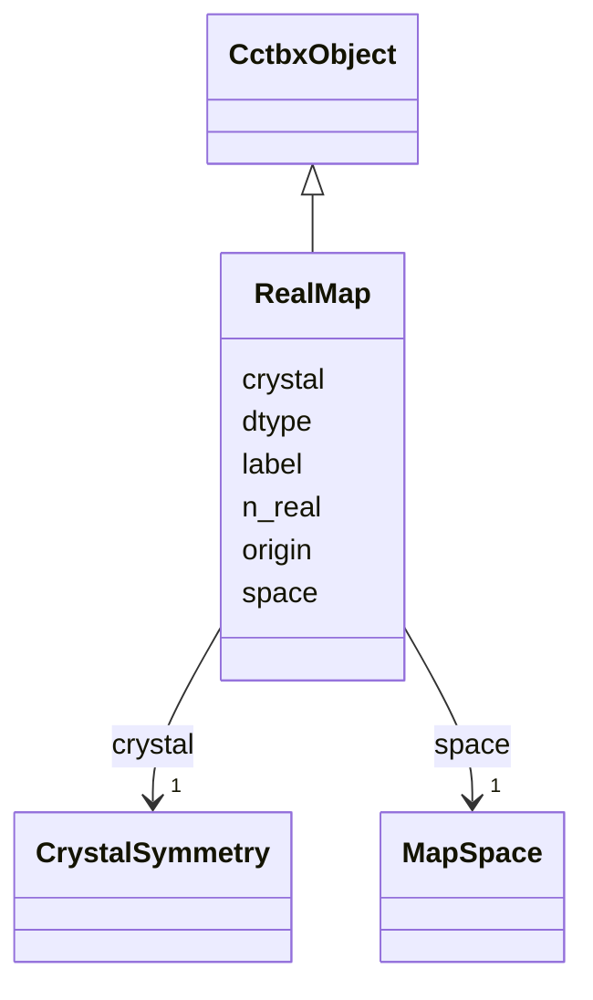

---
search:
  boost: 10.0
---

# Class: RealMap 


_Canonical real-space map (maptbx / iotbx.ccp4_map / flex.double 3-D). Packed data.shape must equal n_real (nx, ny, nz)._

__


<div data-search-exclude markdown="1">


URI: [phridge:RealMap](https://github.com/phzwart/phridge/schema/phridge/RealMap)





## Inheritance
* [CctbxObject](CctbxObject.md)
    * **RealMap**


## Slots

| Name | Cardinality and Range | Description | Inheritance |
| ---  | --- | --- | --- |
| [label](label.md) | 0..1 <br/> [String](String.md) | Map name (2FOFCWT, FOFC, etc | direct |
| [crystal](crystal.md) | 1 <br/> [CrystalSymmetry](CrystalSymmetry.md) |  | direct |
| [origin](origin.md) | 1..* <br/> [Integer](Integer.md) | Grid origin (grid units) | direct |
| [n_real](n_real.md) | 1..* <br/> [Integer](Integer.md) |  | direct |
| [space](space.md) | 1 <br/> [MapSpace](MapSpace.md) |  | direct |
| [dtype](dtype.md) | 1 <br/> [String](String.md) | Canonical store dtype; v1 is float64 | direct |


## Identifier and Mapping Information


### Schema Source


* from schema: https://github.com/phzwart/phridge/schema/phridge


## Mappings

| Mapping Type | Mapped Value |
| ---  | ---  |
| self | phridge:RealMap |
| native | phridge:RealMap |


## LinkML Source

<!-- TODO: investigate https://stackoverflow.com/questions/37606292/how-to-create-tabbed-code-blocks-in-mkdocs-or-sphinx -->

### Direct

<details>
```yaml
name: RealMap
description: 'Canonical real-space map (maptbx / iotbx.ccp4_map / flex.double 3-D).
  Packed data.shape must equal n_real (nx, ny, nz).

  '
from_schema: https://github.com/phzwart/phridge/schema/phridge
rank: 1000
is_a: CctbxObject
attributes:
  label:
    name: label
    description: Map name (2FOFCWT, FOFC, etc.)
    from_schema: https://github.com/phzwart/phridge/schema/cctbx_maps
    domain_of:
    - MillerArray
    - HendricksonLattman
    - ReflectionColumn
    - RealMap
    - ComplexMap
    - MapCoefficients
    - EmMap
  crystal:
    name: crystal
    from_schema: https://github.com/phzwart/phridge/schema/cctbx_maps
    domain_of:
    - MillerArray
    - HendricksonLattman
    - ReflectionFile
    - CrystalGridding
    - RealMap
    - ComplexMap
    - EmMap
    - CartesianSites
    - FractionalSites
    - Hierarchy
    - XrayStructure
    - GeometryRestraints
    range: CrystalSymmetry
    required: true
    inlined: true
  origin:
    name: origin
    description: Grid origin (grid units)
    from_schema: https://github.com/phzwart/phridge/schema/cctbx_maps
    rank: 1000
    domain_of:
    - RealMap
    - ComplexMap
    - EmMap
    range: integer
    required: true
    multivalued: true
    minimum_cardinality: 3
    maximum_cardinality: 3
  n_real:
    name: n_real
    from_schema: https://github.com/phzwart/phridge/schema/cctbx_maps
    domain_of:
    - CrystalGridding
    - RealMap
    - ComplexMap
    - EmMap
    range: integer
    required: true
    multivalued: true
    minimum_cardinality: 3
    maximum_cardinality: 3
  space:
    name: space
    from_schema: https://github.com/phzwart/phridge/schema/cctbx_maps
    domain_of:
    - CrystalGridding
    - RealMap
    - ComplexMap
    - EmMap
    range: MapSpace
    required: true
  dtype:
    name: dtype
    description: Canonical store dtype; v1 is float64
    from_schema: https://github.com/phzwart/phridge/schema/cctbx_maps
    domain_of:
    - ArrayMeta
    - ObjectRef
    - RealMap
    - ComplexMap
    - EmMap
    - CartesianSites
    - FractionalSites
    required: true

```
</details>

### Induced

<details>
```yaml
name: RealMap
description: 'Canonical real-space map (maptbx / iotbx.ccp4_map / flex.double 3-D).
  Packed data.shape must equal n_real (nx, ny, nz).

  '
from_schema: https://github.com/phzwart/phridge/schema/phridge
rank: 1000
is_a: CctbxObject
attributes:
  label:
    name: label
    description: Map name (2FOFCWT, FOFC, etc.)
    from_schema: https://github.com/phzwart/phridge/schema/cctbx_maps
    owner: RealMap
    domain_of:
    - MillerArray
    - HendricksonLattman
    - ReflectionColumn
    - RealMap
    - ComplexMap
    - MapCoefficients
    - EmMap
    range: string
  crystal:
    name: crystal
    from_schema: https://github.com/phzwart/phridge/schema/cctbx_maps
    owner: RealMap
    domain_of:
    - MillerArray
    - HendricksonLattman
    - ReflectionFile
    - CrystalGridding
    - RealMap
    - ComplexMap
    - EmMap
    - CartesianSites
    - FractionalSites
    - Hierarchy
    - XrayStructure
    - GeometryRestraints
    range: CrystalSymmetry
    required: true
    inlined: true
  origin:
    name: origin
    description: Grid origin (grid units)
    from_schema: https://github.com/phzwart/phridge/schema/cctbx_maps
    rank: 1000
    owner: RealMap
    domain_of:
    - RealMap
    - ComplexMap
    - EmMap
    range: integer
    required: true
    multivalued: true
    minimum_cardinality: 3
    maximum_cardinality: 3
  n_real:
    name: n_real
    from_schema: https://github.com/phzwart/phridge/schema/cctbx_maps
    owner: RealMap
    domain_of:
    - CrystalGridding
    - RealMap
    - ComplexMap
    - EmMap
    range: integer
    required: true
    multivalued: true
    minimum_cardinality: 3
    maximum_cardinality: 3
  space:
    name: space
    from_schema: https://github.com/phzwart/phridge/schema/cctbx_maps
    owner: RealMap
    domain_of:
    - CrystalGridding
    - RealMap
    - ComplexMap
    - EmMap
    range: MapSpace
    required: true
  dtype:
    name: dtype
    description: Canonical store dtype; v1 is float64
    from_schema: https://github.com/phzwart/phridge/schema/cctbx_maps
    owner: RealMap
    domain_of:
    - ArrayMeta
    - ObjectRef
    - RealMap
    - ComplexMap
    - EmMap
    - CartesianSites
    - FractionalSites
    range: string
    required: true

```
</details></div>