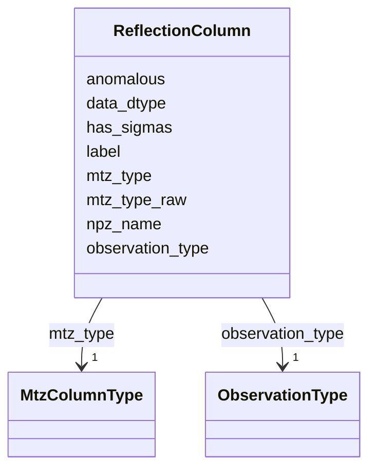

---
search:
  boost: 10.0
---

# Class: ReflectionColumn 


_One data column in a ReflectionFile (not H/K/L)._


<div data-search-exclude markdown="1">


URI: [phridge:ReflectionColumn](https://github.com/phzwart/phridge/schema/phridge/ReflectionColumn)





<!-- no inheritance hierarchy -->

## Slots

| Name | Cardinality and Range | Description | Inheritance |
| ---  | --- | --- | --- |
| [label](label.md) | 1 <br/> [String](String.md) |  | direct |
| [mtz_type](mtz_type.md) | 1 <br/> [MtzColumnType](MtzColumnType.md) |  | direct |
| [mtz_type_raw](mtz_type_raw.md) | 0..1 <br/> [String](String.md) | Original iotbx | direct |
| [observation_type](observation_type.md) | 1 <br/> [ObservationType](ObservationType.md) |  | direct |
| [anomalous](anomalous.md) | 1 <br/> [Boolean](Boolean.md) |  | direct |
| [has_sigmas](has_sigmas.md) | 1 <br/> [Boolean](Boolean.md) |  | direct |
| [npz_name](npz_name.md) | 1 <br/> [String](String.md) | Array name inside the packed npz (usually the label) | direct |
| [data_dtype](data_dtype.md) | 1 <br/> [String](String.md) |  | direct |


## Usages

| used by | used in | type | used |
| ---  | --- | --- | --- |
| [ReflectionFile](ReflectionFile.md) | [columns](columns.md) | range | [ReflectionColumn](ReflectionColumn.md) |


## Identifier and Mapping Information


### Schema Source


* from schema: https://github.com/phzwart/phridge/schema/phridge


## Mappings

| Mapping Type | Mapped Value |
| ---  | ---  |
| self | phridge:ReflectionColumn |
| native | phridge:ReflectionColumn |


## LinkML Source

<!-- TODO: investigate https://stackoverflow.com/questions/37606292/how-to-create-tabbed-code-blocks-in-mkdocs-or-sphinx -->

### Direct

<details>
```yaml
name: ReflectionColumn
description: One data column in a ReflectionFile (not H/K/L).
from_schema: https://github.com/phzwart/phridge/schema/phridge
rank: 1000
attributes:
  label:
    name: label
    from_schema: https://github.com/phzwart/phridge/schema/cctbx_reflections
    identifier: true
    domain_of:
    - MillerArray
    - HendricksonLattman
    - ReflectionColumn
    - RealMap
    - ComplexMap
    - MapCoefficients
    - EmMap
    required: true
  mtz_type:
    name: mtz_type
    from_schema: https://github.com/phzwart/phridge/schema/cctbx_reflections
    rank: 1000
    domain_of:
    - ReflectionColumn
    range: MtzColumnType
    required: true
  mtz_type_raw:
    name: mtz_type_raw
    description: Original iotbx.mtz column.type() if not in the enum
    from_schema: https://github.com/phzwart/phridge/schema/cctbx_reflections
    rank: 1000
    domain_of:
    - ReflectionColumn
  observation_type:
    name: observation_type
    from_schema: https://github.com/phzwart/phridge/schema/cctbx_reflections
    domain_of:
    - MillerArray
    - ReflectionColumn
    range: ObservationType
    required: true
  anomalous:
    name: anomalous
    from_schema: https://github.com/phzwart/phridge/schema/cctbx_reflections
    domain_of:
    - MillerArray
    - HendricksonLattman
    - ReflectionColumn
    range: boolean
    required: true
  has_sigmas:
    name: has_sigmas
    from_schema: https://github.com/phzwart/phridge/schema/cctbx_reflections
    domain_of:
    - MillerArray
    - ReflectionColumn
    range: boolean
    required: true
  npz_name:
    name: npz_name
    description: Array name inside the packed npz (usually the label)
    from_schema: https://github.com/phzwart/phridge/schema/cctbx_reflections
    rank: 1000
    domain_of:
    - ReflectionColumn
    required: true
  data_dtype:
    name: data_dtype
    from_schema: https://github.com/phzwart/phridge/schema/cctbx_reflections
    domain_of:
    - MillerArray
    - ReflectionColumn
    required: true

```
</details>

### Induced

<details>
```yaml
name: ReflectionColumn
description: One data column in a ReflectionFile (not H/K/L).
from_schema: https://github.com/phzwart/phridge/schema/phridge
rank: 1000
attributes:
  label:
    name: label
    from_schema: https://github.com/phzwart/phridge/schema/cctbx_reflections
    identifier: true
    owner: ReflectionColumn
    domain_of:
    - MillerArray
    - HendricksonLattman
    - ReflectionColumn
    - RealMap
    - ComplexMap
    - MapCoefficients
    - EmMap
    range: string
    required: true
  mtz_type:
    name: mtz_type
    from_schema: https://github.com/phzwart/phridge/schema/cctbx_reflections
    rank: 1000
    owner: ReflectionColumn
    domain_of:
    - ReflectionColumn
    range: MtzColumnType
    required: true
  mtz_type_raw:
    name: mtz_type_raw
    description: Original iotbx.mtz column.type() if not in the enum
    from_schema: https://github.com/phzwart/phridge/schema/cctbx_reflections
    rank: 1000
    owner: ReflectionColumn
    domain_of:
    - ReflectionColumn
    range: string
  observation_type:
    name: observation_type
    from_schema: https://github.com/phzwart/phridge/schema/cctbx_reflections
    owner: ReflectionColumn
    domain_of:
    - MillerArray
    - ReflectionColumn
    range: ObservationType
    required: true
  anomalous:
    name: anomalous
    from_schema: https://github.com/phzwart/phridge/schema/cctbx_reflections
    owner: ReflectionColumn
    domain_of:
    - MillerArray
    - HendricksonLattman
    - ReflectionColumn
    range: boolean
    required: true
  has_sigmas:
    name: has_sigmas
    from_schema: https://github.com/phzwart/phridge/schema/cctbx_reflections
    owner: ReflectionColumn
    domain_of:
    - MillerArray
    - ReflectionColumn
    range: boolean
    required: true
  npz_name:
    name: npz_name
    description: Array name inside the packed npz (usually the label)
    from_schema: https://github.com/phzwart/phridge/schema/cctbx_reflections
    rank: 1000
    owner: ReflectionColumn
    domain_of:
    - ReflectionColumn
    range: string
    required: true
  data_dtype:
    name: data_dtype
    from_schema: https://github.com/phzwart/phridge/schema/cctbx_reflections
    owner: ReflectionColumn
    domain_of:
    - MillerArray
    - ReflectionColumn
    range: string
    required: true

```
</details></div>