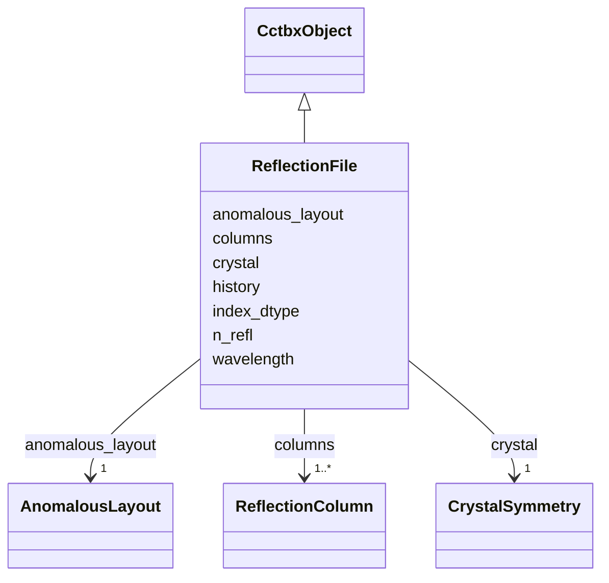

---
search:
  boost: 10.0
---

# Class: ReflectionFile 


_Canonical iotbx.mtz.object / miller array set sharing one hkl. JSON metadata; one npz with hkl plus named columns. Does not preserve MTZ batches, original-index columns, or history verbatim beyond the history strings slot._

__


<div data-search-exclude markdown="1">


URI: [phridge:ReflectionFile](https://github.com/phzwart/phridge/schema/phridge/ReflectionFile)





## Inheritance
* [CctbxObject](CctbxObject.md)
    * **ReflectionFile**


## Slots

| Name | Cardinality and Range | Description | Inheritance |
| ---  | --- | --- | --- |
| [crystal](crystal.md) | 1 <br/> [CrystalSymmetry](CrystalSymmetry.md) |  | direct |
| [wavelength](wavelength.md) | 0..1 <br/> [Float](Float.md) | Dataset wavelength (Å) when known | direct |
| [history](history.md) | * <br/> [String](String.md) | MTZ history lines | direct |
| [n_refl](n_refl.md) | 1 <br/> [Integer](Integer.md) |  | direct |
| [index_dtype](index_dtype.md) | 1 <br/> [String](String.md) |  | direct |
| [anomalous_layout](anomalous_layout.md) | 1 <br/> [AnomalousLayout](AnomalousLayout.md) |  | direct |
| [columns](columns.md) | 1..* <br/> [ReflectionColumn](ReflectionColumn.md) |  | direct |


## Identifier and Mapping Information


### Schema Source


* from schema: https://github.com/phzwart/phridge/schema/phridge


## Mappings

| Mapping Type | Mapped Value |
| ---  | ---  |
| self | phridge:ReflectionFile |
| native | phridge:ReflectionFile |


## LinkML Source

<!-- TODO: investigate https://stackoverflow.com/questions/37606292/how-to-create-tabbed-code-blocks-in-mkdocs-or-sphinx -->

### Direct

<details>
```yaml
name: ReflectionFile
description: 'Canonical iotbx.mtz.object / miller array set sharing one hkl. JSON
  metadata; one npz with hkl plus named columns. Does not preserve MTZ batches, original-index
  columns, or history verbatim beyond the history strings slot.

  '
from_schema: https://github.com/phzwart/phridge/schema/phridge
rank: 1000
is_a: CctbxObject
attributes:
  crystal:
    name: crystal
    from_schema: https://github.com/phzwart/phridge/schema/cctbx_reflections
    domain_of:
    - MillerArray
    - HendricksonLattman
    - ReflectionFile
    - CrystalGridding
    - RealMap
    - ComplexMap
    - EmMap
    - CartesianSites
    - FractionalSites
    - Hierarchy
    - XrayStructure
    - GeometryRestraints
    range: CrystalSymmetry
    required: true
    inlined: true
  wavelength:
    name: wavelength
    description: Dataset wavelength (Å) when known
    from_schema: https://github.com/phzwart/phridge/schema/cctbx_reflections
    rank: 1000
    domain_of:
    - ReflectionFile
    range: float
  history:
    name: history
    description: MTZ history lines
    from_schema: https://github.com/phzwart/phridge/schema/cctbx_reflections
    rank: 1000
    domain_of:
    - ReflectionFile
    multivalued: true
  n_refl:
    name: n_refl
    from_schema: https://github.com/phzwart/phridge/schema/cctbx_reflections
    domain_of:
    - MillerArray
    - HendricksonLattman
    - ReflectionFile
    - TargetResult
    range: integer
    required: true
  index_dtype:
    name: index_dtype
    from_schema: https://github.com/phzwart/phridge/schema/cctbx_reflections
    domain_of:
    - MillerArray
    - HendricksonLattman
    - ReflectionFile
    required: true
  anomalous_layout:
    name: anomalous_layout
    from_schema: https://github.com/phzwart/phridge/schema/cctbx_reflections
    domain_of:
    - MillerArray
    - HendricksonLattman
    - ReflectionFile
    range: AnomalousLayout
    required: true
  columns:
    name: columns
    from_schema: https://github.com/phzwart/phridge/schema/cctbx_reflections
    rank: 1000
    domain_of:
    - ReflectionFile
    range: ReflectionColumn
    required: true
    multivalued: true
    inlined: true

```
</details>

### Induced

<details>
```yaml
name: ReflectionFile
description: 'Canonical iotbx.mtz.object / miller array set sharing one hkl. JSON
  metadata; one npz with hkl plus named columns. Does not preserve MTZ batches, original-index
  columns, or history verbatim beyond the history strings slot.

  '
from_schema: https://github.com/phzwart/phridge/schema/phridge
rank: 1000
is_a: CctbxObject
attributes:
  crystal:
    name: crystal
    from_schema: https://github.com/phzwart/phridge/schema/cctbx_reflections
    owner: ReflectionFile
    domain_of:
    - MillerArray
    - HendricksonLattman
    - ReflectionFile
    - CrystalGridding
    - RealMap
    - ComplexMap
    - EmMap
    - CartesianSites
    - FractionalSites
    - Hierarchy
    - XrayStructure
    - GeometryRestraints
    range: CrystalSymmetry
    required: true
    inlined: true
  wavelength:
    name: wavelength
    description: Dataset wavelength (Å) when known
    from_schema: https://github.com/phzwart/phridge/schema/cctbx_reflections
    rank: 1000
    owner: ReflectionFile
    domain_of:
    - ReflectionFile
    range: float
  history:
    name: history
    description: MTZ history lines
    from_schema: https://github.com/phzwart/phridge/schema/cctbx_reflections
    rank: 1000
    owner: ReflectionFile
    domain_of:
    - ReflectionFile
    range: string
    multivalued: true
  n_refl:
    name: n_refl
    from_schema: https://github.com/phzwart/phridge/schema/cctbx_reflections
    owner: ReflectionFile
    domain_of:
    - MillerArray
    - HendricksonLattman
    - ReflectionFile
    - TargetResult
    range: integer
    required: true
  index_dtype:
    name: index_dtype
    from_schema: https://github.com/phzwart/phridge/schema/cctbx_reflections
    owner: ReflectionFile
    domain_of:
    - MillerArray
    - HendricksonLattman
    - ReflectionFile
    range: string
    required: true
  anomalous_layout:
    name: anomalous_layout
    from_schema: https://github.com/phzwart/phridge/schema/cctbx_reflections
    owner: ReflectionFile
    domain_of:
    - MillerArray
    - HendricksonLattman
    - ReflectionFile
    range: AnomalousLayout
    required: true
  columns:
    name: columns
    from_schema: https://github.com/phzwart/phridge/schema/cctbx_reflections
    rank: 1000
    owner: ReflectionFile
    domain_of:
    - ReflectionFile
    range: ReflectionColumn
    required: true
    multivalued: true
    inlined: true

```
</details></div>