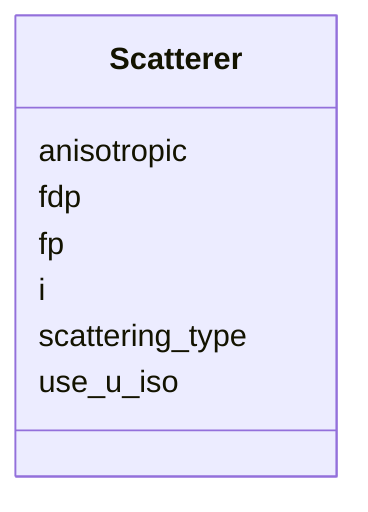

---
search:
  boost: 10.0
---

# Class: Scatterer 


_One cctbx.xray.scatterer label. Numeric site/occ/u live in the parent XrayStructure npz at the same index._

__


<div data-search-exclude markdown="1">


URI: [phridge:Scatterer](https://github.com/phzwart/phridge/schema/phridge/Scatterer)





<!-- no inheritance hierarchy -->

## Slots

| Name | Cardinality and Range | Description | Inheritance |
| ---  | --- | --- | --- |
| [i](i.md) | 1 <br/> [Integer](Integer.md) | Row index into packed sites; same i_seq as Hierarchy atoms and restraints | direct |
| [scattering_type](scattering_type.md) | 1 <br/> [String](String.md) | cctbx scattering type (C, N, S, AU, water, …) | direct |
| [fp](fp.md) | 0..1 <br/> [Float](Float.md) | f' when set | direct |
| [fdp](fdp.md) | 0..1 <br/> [Float](Float.md) | f'' when set | direct |
| [anisotropic](anisotropic.md) | 1 <br/> [Boolean](Boolean.md) | If true, npz u_star[i] is live (cctbx u_star, fractional) | direct |
| [use_u_iso](use_u_iso.md) | 1 <br/> [Boolean](Boolean.md) | cctbx flags | direct |


## Usages

| used by | used in | type | used |
| ---  | --- | --- | --- |
| [XrayStructure](XrayStructure.md) | [scatterers](scatterers.md) | range | [Scatterer](Scatterer.md) |


## Identifier and Mapping Information


### Schema Source


* from schema: https://github.com/phzwart/phridge/schema/phridge


## Mappings

| Mapping Type | Mapped Value |
| ---  | ---  |
| self | phridge:Scatterer |
| native | phridge:Scatterer |


## LinkML Source

<!-- TODO: investigate https://stackoverflow.com/questions/37606292/how-to-create-tabbed-code-blocks-in-mkdocs-or-sphinx -->

### Direct

<details>
```yaml
name: Scatterer
description: 'One cctbx.xray.scatterer label. Numeric site/occ/u live in the parent
  XrayStructure npz at the same index.

  '
from_schema: https://github.com/phzwart/phridge/schema/phridge
rank: 1000
attributes:
  i:
    name: i
    description: Row index into packed sites; same i_seq as Hierarchy atoms and restraints
    from_schema: https://github.com/phzwart/phridge/schema/cctbx_coordinates
    domain_of:
    - Atom
    - Scatterer
    range: integer
    required: true
  scattering_type:
    name: scattering_type
    description: cctbx scattering type (C, N, S, AU, water, …)
    from_schema: https://github.com/phzwart/phridge/schema/cctbx_coordinates
    rank: 1000
    domain_of:
    - Scatterer
    required: true
  fp:
    name: fp
    description: f' when set
    from_schema: https://github.com/phzwart/phridge/schema/cctbx_coordinates
    rank: 1000
    domain_of:
    - Scatterer
    range: float
  fdp:
    name: fdp
    description: f'' when set
    from_schema: https://github.com/phzwart/phridge/schema/cctbx_coordinates
    rank: 1000
    domain_of:
    - Scatterer
    range: float
  anisotropic:
    name: anisotropic
    description: If true, npz u_star[i] is live (cctbx u_star, fractional)
    from_schema: https://github.com/phzwart/phridge/schema/cctbx_coordinates
    rank: 1000
    domain_of:
    - Scatterer
    range: boolean
    required: true
  use_u_iso:
    name: use_u_iso
    description: cctbx flags.use_u_iso(); may be true together with anisotropic
    from_schema: https://github.com/phzwart/phridge/schema/cctbx_coordinates
    rank: 1000
    domain_of:
    - Scatterer
    range: boolean
    required: true

```
</details>

### Induced

<details>
```yaml
name: Scatterer
description: 'One cctbx.xray.scatterer label. Numeric site/occ/u live in the parent
  XrayStructure npz at the same index.

  '
from_schema: https://github.com/phzwart/phridge/schema/phridge
rank: 1000
attributes:
  i:
    name: i
    description: Row index into packed sites; same i_seq as Hierarchy atoms and restraints
    from_schema: https://github.com/phzwart/phridge/schema/cctbx_coordinates
    owner: Scatterer
    domain_of:
    - Atom
    - Scatterer
    range: integer
    required: true
  scattering_type:
    name: scattering_type
    description: cctbx scattering type (C, N, S, AU, water, …)
    from_schema: https://github.com/phzwart/phridge/schema/cctbx_coordinates
    rank: 1000
    owner: Scatterer
    domain_of:
    - Scatterer
    range: string
    required: true
  fp:
    name: fp
    description: f' when set
    from_schema: https://github.com/phzwart/phridge/schema/cctbx_coordinates
    rank: 1000
    owner: Scatterer
    domain_of:
    - Scatterer
    range: float
  fdp:
    name: fdp
    description: f'' when set
    from_schema: https://github.com/phzwart/phridge/schema/cctbx_coordinates
    rank: 1000
    owner: Scatterer
    domain_of:
    - Scatterer
    range: float
  anisotropic:
    name: anisotropic
    description: If true, npz u_star[i] is live (cctbx u_star, fractional)
    from_schema: https://github.com/phzwart/phridge/schema/cctbx_coordinates
    rank: 1000
    owner: Scatterer
    domain_of:
    - Scatterer
    range: boolean
    required: true
  use_u_iso:
    name: use_u_iso
    description: cctbx flags.use_u_iso(); may be true together with anisotropic
    from_schema: https://github.com/phzwart/phridge/schema/cctbx_coordinates
    rank: 1000
    owner: Scatterer
    domain_of:
    - Scatterer
    range: boolean
    required: true

```
</details></div>