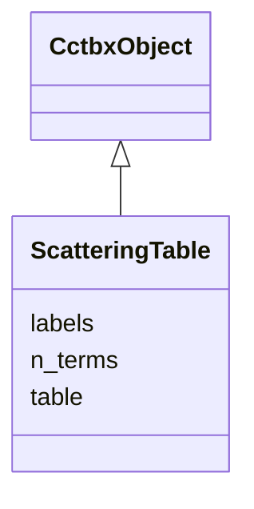

---
search:
  boost: 10.0
---

# Class: ScatteringTable 


_Gaussian form-factor coefficients per scattering type (cctbx scattering_type_registry, e.g. wk1995 / it1992 / n_gaussian). npz: gauss_a [T,K], gauss_b [T,K], gauss_c [T]; unused terms zero._

__


<div data-search-exclude markdown="1">


URI: [phridge:ScatteringTable](https://github.com/phzwart/phridge/schema/phridge/ScatteringTable)





## Inheritance
* [CctbxObject](CctbxObject.md)
    * **ScatteringTable**


## Slots

| Name | Cardinality and Range | Description | Inheritance |
| ---  | --- | --- | --- |
| [table](table.md) | 1 <br/> [String](String.md) | Registry table name (wk1995, it1992, n_gaussian,  | direct |
| [labels](labels.md) | 1..* <br/> [String](String.md) | Scattering type label per row (C, N, O, S, Se, water,  | direct |
| [n_terms](n_terms.md) | 1 <br/> [Integer](Integer.md) | K, number of Gaussian terms per row | direct |


## Identifier and Mapping Information


### Schema Source


* from schema: https://github.com/phzwart/phridge/schema/phridge


## Mappings

| Mapping Type | Mapped Value |
| ---  | ---  |
| self | phridge:ScatteringTable |
| native | phridge:ScatteringTable |


## LinkML Source

<!-- TODO: investigate https://stackoverflow.com/questions/37606292/how-to-create-tabbed-code-blocks-in-mkdocs-or-sphinx -->

### Direct

<details>
```yaml
name: ScatteringTable
description: 'Gaussian form-factor coefficients per scattering type (cctbx scattering_type_registry,
  e.g. wk1995 / it1992 / n_gaussian). npz: gauss_a [T,K], gauss_b [T,K], gauss_c [T];
  unused terms zero.

  '
from_schema: https://github.com/phzwart/phridge/schema/phridge
rank: 1000
is_a: CctbxObject
attributes:
  table:
    name: table
    description: Registry table name (wk1995, it1992, n_gaussian, ...)
    from_schema: https://github.com/phzwart/phridge/schema/cctbx_scattering
    rank: 1000
    domain_of:
    - ScatteringTable
    required: true
  labels:
    name: labels
    description: Scattering type label per row (C, N, O, S, Se, water, ...)
    from_schema: https://github.com/phzwart/phridge/schema/cctbx_scattering
    rank: 1000
    domain_of:
    - ScatteringTable
    required: true
    multivalued: true
  n_terms:
    name: n_terms
    description: K, number of Gaussian terms per row
    from_schema: https://github.com/phzwart/phridge/schema/cctbx_scattering
    rank: 1000
    domain_of:
    - ScatteringTable
    range: integer
    required: true

```
</details>

### Induced

<details>
```yaml
name: ScatteringTable
description: 'Gaussian form-factor coefficients per scattering type (cctbx scattering_type_registry,
  e.g. wk1995 / it1992 / n_gaussian). npz: gauss_a [T,K], gauss_b [T,K], gauss_c [T];
  unused terms zero.

  '
from_schema: https://github.com/phzwart/phridge/schema/phridge
rank: 1000
is_a: CctbxObject
attributes:
  table:
    name: table
    description: Registry table name (wk1995, it1992, n_gaussian, ...)
    from_schema: https://github.com/phzwart/phridge/schema/cctbx_scattering
    rank: 1000
    owner: ScatteringTable
    domain_of:
    - ScatteringTable
    range: string
    required: true
  labels:
    name: labels
    description: Scattering type label per row (C, N, O, S, Se, water, ...)
    from_schema: https://github.com/phzwart/phridge/schema/cctbx_scattering
    rank: 1000
    owner: ScatteringTable
    domain_of:
    - ScatteringTable
    range: string
    required: true
    multivalued: true
  n_terms:
    name: n_terms
    description: K, number of Gaussian terms per row
    from_schema: https://github.com/phzwart/phridge/schema/cctbx_scattering
    rank: 1000
    owner: ScatteringTable
    domain_of:
    - ScatteringTable
    range: integer
    required: true

```
</details></div>