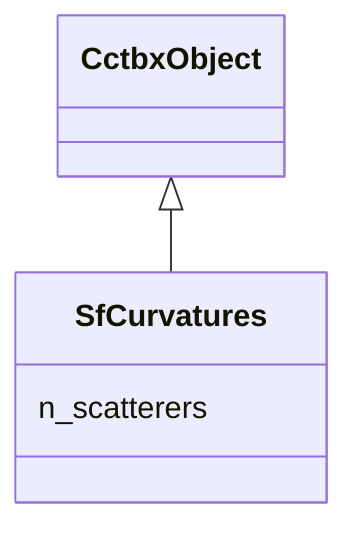

---
search:
  boost: 10.0
---

# Class: SfCurvatures 


_Per-atom Gauss-Newton curvature blocks diag/blocks of J^T H_F J, index-aligned with the XrayStructure. npz: site_frac [N,3,3], occupancy [N], u_iso [N], u_star [N,6,6], fp [N], fdp [N]. Inactive ADP entries are zero._

__


<div data-search-exclude markdown="1">


URI: [phridge:SfCurvatures](https://github.com/phzwart/phridge/schema/phridge/SfCurvatures)





## Inheritance
* [CctbxObject](CctbxObject.md)
    * **SfCurvatures**


## Slots

| Name | Cardinality and Range | Description | Inheritance |
| ---  | --- | --- | --- |
| [n_scatterers](n_scatterers.md) | 1 <br/> [Integer](Integer.md) |  | direct |


## Identifier and Mapping Information


### Schema Source


* from schema: https://github.com/phzwart/phridge/schema/phridge


## Mappings

| Mapping Type | Mapped Value |
| ---  | ---  |
| self | phridge:SfCurvatures |
| native | phridge:SfCurvatures |


## LinkML Source

<!-- TODO: investigate https://stackoverflow.com/questions/37606292/how-to-create-tabbed-code-blocks-in-mkdocs-or-sphinx -->

### Direct

<details>
```yaml
name: SfCurvatures
description: 'Per-atom Gauss-Newton curvature blocks diag/blocks of J^T H_F J, index-aligned
  with the XrayStructure. npz: site_frac [N,3,3], occupancy [N], u_iso [N], u_star
  [N,6,6], fp [N], fdp [N]. Inactive ADP entries are zero.

  '
from_schema: https://github.com/phzwart/phridge/schema/phridge
rank: 1000
is_a: CctbxObject
attributes:
  n_scatterers:
    name: n_scatterers
    from_schema: https://github.com/phzwart/phridge/schema/cctbx_scattering
    domain_of:
    - XrayStructure
    - SfGradients
    - SfCurvatures
    range: integer
    required: true

```
</details>

### Induced

<details>
```yaml
name: SfCurvatures
description: 'Per-atom Gauss-Newton curvature blocks diag/blocks of J^T H_F J, index-aligned
  with the XrayStructure. npz: site_frac [N,3,3], occupancy [N], u_iso [N], u_star
  [N,6,6], fp [N], fdp [N]. Inactive ADP entries are zero.

  '
from_schema: https://github.com/phzwart/phridge/schema/phridge
rank: 1000
is_a: CctbxObject
attributes:
  n_scatterers:
    name: n_scatterers
    from_schema: https://github.com/phzwart/phridge/schema/cctbx_scattering
    owner: SfCurvatures
    domain_of:
    - XrayStructure
    - SfGradients
    - SfCurvatures
    range: integer
    required: true

```
</details></div>