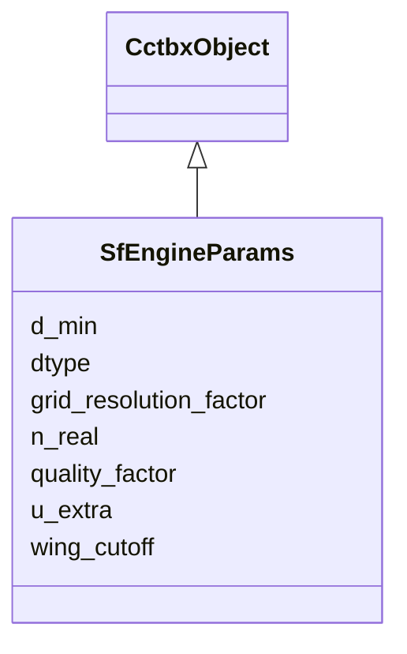

---
search:
  boost: 10.0
---

# Class: SfEngineParams 


_Gridding / accuracy controls for the FFT structure-factor engine. JSON only. Mirrors cctbx structure_factors.from_scatterers FFT settings (grid_resolution_factor, quality_factor, wing_cutoff)._

__


<div data-search-exclude markdown="1">


URI: [phridge:SfEngineParams](https://github.com/phzwart/phridge/schema/phridge/SfEngineParams)





## Inheritance
* [CctbxObject](CctbxObject.md)
    * **SfEngineParams**


## Slots

| Name | Cardinality and Range | Description | Inheritance |
| ---  | --- | --- | --- |
| [d_min](d_min.md) | 1 <br/> [Float](Float.md) |  | direct |
| [grid_resolution_factor](grid_resolution_factor.md) | 0..1 <br/> [Float](Float.md) | Grid spacing = d_min * factor (default 1/3) | direct |
| [quality_factor](quality_factor.md) | 0..1 <br/> [Float](Float.md) | cctbx quality_factor for u_base (default 100) | direct |
| [wing_cutoff](wing_cutoff.md) | 0..1 <br/> [Float](Float.md) | Relative density at the sampling cutoff radius (default 1e-4) | direct |
| [u_extra](u_extra.md) | 0..1 <br/> [Float](Float.md) | Override the extra isotropic U added before sampling | direct |
| [n_real](n_real.md) | * <br/> [Integer](Integer.md) | Explicit FFT gridding (nx, ny, nz); derived from d_min if absent | direct |
| [dtype](dtype.md) | 0..1 <br/> [String](String.md) | Compute dtype, float64 (default) or float32 | direct |


## Identifier and Mapping Information


### Schema Source


* from schema: https://github.com/phzwart/phridge/schema/phridge


## Mappings

| Mapping Type | Mapped Value |
| ---  | ---  |
| self | phridge:SfEngineParams |
| native | phridge:SfEngineParams |


## LinkML Source

<!-- TODO: investigate https://stackoverflow.com/questions/37606292/how-to-create-tabbed-code-blocks-in-mkdocs-or-sphinx -->

### Direct

<details>
```yaml
name: SfEngineParams
description: 'Gridding / accuracy controls for the FFT structure-factor engine. JSON
  only. Mirrors cctbx structure_factors.from_scatterers FFT settings (grid_resolution_factor,
  quality_factor, wing_cutoff).

  '
from_schema: https://github.com/phzwart/phridge/schema/phridge
rank: 1000
is_a: CctbxObject
attributes:
  d_min:
    name: d_min
    from_schema: https://github.com/phzwart/phridge/schema/cctbx_scattering
    domain_of:
    - CrystalGridding
    - SfEngineParams
    range: float
    required: true
  grid_resolution_factor:
    name: grid_resolution_factor
    description: Grid spacing = d_min * factor (default 1/3)
    from_schema: https://github.com/phzwart/phridge/schema/cctbx_scattering
    rank: 1000
    domain_of:
    - SfEngineParams
    range: float
  quality_factor:
    name: quality_factor
    description: cctbx quality_factor for u_base (default 100)
    from_schema: https://github.com/phzwart/phridge/schema/cctbx_scattering
    rank: 1000
    domain_of:
    - SfEngineParams
    range: float
  wing_cutoff:
    name: wing_cutoff
    description: Relative density at the sampling cutoff radius (default 1e-4)
    from_schema: https://github.com/phzwart/phridge/schema/cctbx_scattering
    rank: 1000
    domain_of:
    - SfEngineParams
    range: float
  u_extra:
    name: u_extra
    description: Override the extra isotropic U added before sampling
    from_schema: https://github.com/phzwart/phridge/schema/cctbx_scattering
    rank: 1000
    domain_of:
    - SfEngineParams
    range: float
  n_real:
    name: n_real
    description: Explicit FFT gridding (nx, ny, nz); derived from d_min if absent
    from_schema: https://github.com/phzwart/phridge/schema/cctbx_scattering
    domain_of:
    - CrystalGridding
    - RealMap
    - ComplexMap
    - EmMap
    - SfEngineParams
    range: integer
    multivalued: true
  dtype:
    name: dtype
    description: Compute dtype, float64 (default) or float32
    from_schema: https://github.com/phzwart/phridge/schema/cctbx_scattering
    domain_of:
    - ArrayMeta
    - ObjectRef
    - RealMap
    - ComplexMap
    - EmMap
    - CartesianSites
    - FractionalSites
    - SfEngineParams

```
</details>

### Induced

<details>
```yaml
name: SfEngineParams
description: 'Gridding / accuracy controls for the FFT structure-factor engine. JSON
  only. Mirrors cctbx structure_factors.from_scatterers FFT settings (grid_resolution_factor,
  quality_factor, wing_cutoff).

  '
from_schema: https://github.com/phzwart/phridge/schema/phridge
rank: 1000
is_a: CctbxObject
attributes:
  d_min:
    name: d_min
    from_schema: https://github.com/phzwart/phridge/schema/cctbx_scattering
    owner: SfEngineParams
    domain_of:
    - CrystalGridding
    - SfEngineParams
    range: float
    required: true
  grid_resolution_factor:
    name: grid_resolution_factor
    description: Grid spacing = d_min * factor (default 1/3)
    from_schema: https://github.com/phzwart/phridge/schema/cctbx_scattering
    rank: 1000
    owner: SfEngineParams
    domain_of:
    - SfEngineParams
    range: float
  quality_factor:
    name: quality_factor
    description: cctbx quality_factor for u_base (default 100)
    from_schema: https://github.com/phzwart/phridge/schema/cctbx_scattering
    rank: 1000
    owner: SfEngineParams
    domain_of:
    - SfEngineParams
    range: float
  wing_cutoff:
    name: wing_cutoff
    description: Relative density at the sampling cutoff radius (default 1e-4)
    from_schema: https://github.com/phzwart/phridge/schema/cctbx_scattering
    rank: 1000
    owner: SfEngineParams
    domain_of:
    - SfEngineParams
    range: float
  u_extra:
    name: u_extra
    description: Override the extra isotropic U added before sampling
    from_schema: https://github.com/phzwart/phridge/schema/cctbx_scattering
    rank: 1000
    owner: SfEngineParams
    domain_of:
    - SfEngineParams
    range: float
  n_real:
    name: n_real
    description: Explicit FFT gridding (nx, ny, nz); derived from d_min if absent
    from_schema: https://github.com/phzwart/phridge/schema/cctbx_scattering
    owner: SfEngineParams
    domain_of:
    - CrystalGridding
    - RealMap
    - ComplexMap
    - EmMap
    - SfEngineParams
    range: integer
    multivalued: true
  dtype:
    name: dtype
    description: Compute dtype, float64 (default) or float32
    from_schema: https://github.com/phzwart/phridge/schema/cctbx_scattering
    owner: SfEngineParams
    domain_of:
    - ArrayMeta
    - ObjectRef
    - RealMap
    - ComplexMap
    - EmMap
    - CartesianSites
    - FractionalSites
    - SfEngineParams
    range: string

```
</details></div>