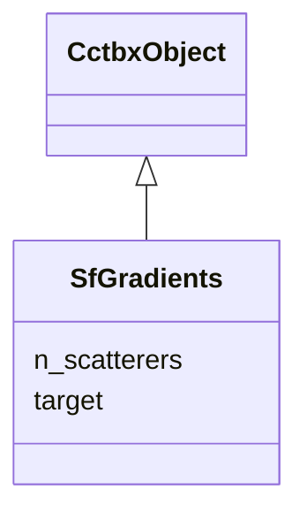

---
search:
  boost: 10.0
---

# Class: SfGradients 


_d(target)/d(scatterer parameters), index-aligned with the XrayStructure the gradients were computed for. All arrays are present; entries for inactive parameters (u_iso of an anisotropic scatterer, u_star of an isotropic one) are zero. npz: d_site_frac [N,3], d_occupancy [N], d_u_iso [N], d_u_star [N,6], d_fp [N], d_fdp [N]._

__


<div data-search-exclude markdown="1">


URI: [phridge:SfGradients](https://github.com/phzwart/phridge/schema/phridge/SfGradients)





## Inheritance
* [CctbxObject](CctbxObject.md)
    * **SfGradients**


## Slots

| Name | Cardinality and Range | Description | Inheritance |
| ---  | --- | --- | --- |
| [n_scatterers](n_scatterers.md) | 1 <br/> [Integer](Integer.md) |  | direct |
| [target](target.md) | 0..1 <br/> [Float](Float.md) | Target value when the gradients came from a target op | direct |


## Identifier and Mapping Information


### Schema Source


* from schema: https://github.com/phzwart/phridge/schema/phridge


## Mappings

| Mapping Type | Mapped Value |
| ---  | ---  |
| self | phridge:SfGradients |
| native | phridge:SfGradients |


## LinkML Source

<!-- TODO: investigate https://stackoverflow.com/questions/37606292/how-to-create-tabbed-code-blocks-in-mkdocs-or-sphinx -->

### Direct

<details>
```yaml
name: SfGradients
description: 'd(target)/d(scatterer parameters), index-aligned with the XrayStructure
  the gradients were computed for. All arrays are present; entries for inactive parameters
  (u_iso of an anisotropic scatterer, u_star of an isotropic one) are zero. npz: d_site_frac
  [N,3], d_occupancy [N], d_u_iso [N], d_u_star [N,6], d_fp [N], d_fdp [N].

  '
from_schema: https://github.com/phzwart/phridge/schema/phridge
rank: 1000
is_a: CctbxObject
attributes:
  n_scatterers:
    name: n_scatterers
    from_schema: https://github.com/phzwart/phridge/schema/cctbx_scattering
    domain_of:
    - XrayStructure
    - SfGradients
    range: integer
    required: true
  target:
    name: target
    description: Target value when the gradients came from a target op
    from_schema: https://github.com/phzwart/phridge/schema/cctbx_scattering
    rank: 1000
    domain_of:
    - SfGradients
    range: float

```
</details>

### Induced

<details>
```yaml
name: SfGradients
description: 'd(target)/d(scatterer parameters), index-aligned with the XrayStructure
  the gradients were computed for. All arrays are present; entries for inactive parameters
  (u_iso of an anisotropic scatterer, u_star of an isotropic one) are zero. npz: d_site_frac
  [N,3], d_occupancy [N], d_u_iso [N], d_u_star [N,6], d_fp [N], d_fdp [N].

  '
from_schema: https://github.com/phzwart/phridge/schema/phridge
rank: 1000
is_a: CctbxObject
attributes:
  n_scatterers:
    name: n_scatterers
    from_schema: https://github.com/phzwart/phridge/schema/cctbx_scattering
    owner: SfGradients
    domain_of:
    - XrayStructure
    - SfGradients
    range: integer
    required: true
  target:
    name: target
    description: Target value when the gradients came from a target op
    from_schema: https://github.com/phzwart/phridge/schema/cctbx_scattering
    rank: 1000
    owner: SfGradients
    domain_of:
    - SfGradients
    range: float

```
</details></div>