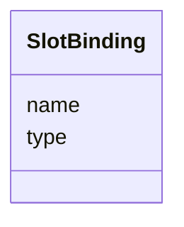

---
search:
  boost: 10.0
---

# Class: SlotBinding 

<div data-search-exclude markdown="1">


URI: [phridge:SlotBinding](https://github.com/phzwart/phridge/schema/phridge/SlotBinding)





<!-- no inheritance hierarchy -->

## Slots

| Name | Cardinality and Range | Description | Inheritance |
| ---  | --- | --- | --- |
| [name](name.md) | 1 <br/> [String](String.md) |  | direct |
| [type](type.md) | 1 <br/> [String](String.md) | Generic kind (array, json, blob) or cctbx class name | direct |


## Usages

| used by | used in | type | used |
| ---  | --- | --- | --- |
| [OpSpec](OpSpec.md) | [inputs](inputs.md) | range | [SlotBinding](SlotBinding.md) |
| [OpSpec](OpSpec.md) | [outputs](outputs.md) | range | [SlotBinding](SlotBinding.md) |


## Identifier and Mapping Information


### Schema Source


* from schema: https://github.com/phzwart/phridge/schema/phridge


## Mappings

| Mapping Type | Mapped Value |
| ---  | ---  |
| self | phridge:SlotBinding |
| native | phridge:SlotBinding |


## LinkML Source

<!-- TODO: investigate https://stackoverflow.com/questions/37606292/how-to-create-tabbed-code-blocks-in-mkdocs-or-sphinx -->

### Direct

<details>
```yaml
name: SlotBinding
from_schema: https://github.com/phzwart/phridge/schema/phridge
rank: 1000
attributes:
  name:
    name: name
    from_schema: https://github.com/phzwart/phridge/schema/phridge
    rank: 1000
    identifier: true
    domain_of:
    - SlotBinding
    - OpSpec
    - Atom
    required: true
  type:
    name: type
    description: Generic kind (array, json, blob) or cctbx class name
    from_schema: https://github.com/phzwart/phridge/schema/phridge
    domain_of:
    - JobError
    - SlotBinding
    required: true

```
</details>

### Induced

<details>
```yaml
name: SlotBinding
from_schema: https://github.com/phzwart/phridge/schema/phridge
rank: 1000
attributes:
  name:
    name: name
    from_schema: https://github.com/phzwart/phridge/schema/phridge
    rank: 1000
    identifier: true
    owner: SlotBinding
    domain_of:
    - SlotBinding
    - OpSpec
    - Atom
    range: string
    required: true
  type:
    name: type
    description: Generic kind (array, json, blob) or cctbx class name
    from_schema: https://github.com/phzwart/phridge/schema/phridge
    owner: SlotBinding
    domain_of:
    - JobError
    - SlotBinding
    range: string
    required: true

```
</details></div>