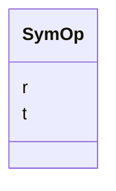

---
search:
  boost: 10.0
---

# Class: SymOp 


_One symmetry operator in fractional coordinates. r is row-major 3x3 (9 values), t is 3 values. Rational parts are stored as floats._

__


<div data-search-exclude markdown="1">


URI: [phridge:SymOp](https://github.com/phzwart/phridge/schema/phridge/SymOp)





<!-- no inheritance hierarchy -->

## Slots

| Name | Cardinality and Range | Description | Inheritance |
| ---  | --- | --- | --- |
| [r](r.md) | 1..* <br/> [Float](Float.md) |  | direct |
| [t](t.md) | 1..* <br/> [Float](Float.md) |  | direct |


## Usages

| used by | used in | type | used |
| ---  | --- | --- | --- |
| [CrystalSymmetry](CrystalSymmetry.md) | [symops](symops.md) | range | [SymOp](SymOp.md) |


## Identifier and Mapping Information


### Schema Source


* from schema: https://github.com/phzwart/phridge/schema/phridge


## Mappings

| Mapping Type | Mapped Value |
| ---  | ---  |
| self | phridge:SymOp |
| native | phridge:SymOp |


## LinkML Source

<!-- TODO: investigate https://stackoverflow.com/questions/37606292/how-to-create-tabbed-code-blocks-in-mkdocs-or-sphinx -->

### Direct

<details>
```yaml
name: SymOp
description: 'One symmetry operator in fractional coordinates. r is row-major 3x3
  (9 values), t is 3 values. Rational parts are stored as floats.

  '
from_schema: https://github.com/phzwart/phridge/schema/phridge
rank: 1000
attributes:
  r:
    name: r
    from_schema: https://github.com/phzwart/phridge/schema/cctbx
    rank: 1000
    domain_of:
    - SymOp
    range: float
    required: true
    multivalued: true
    minimum_cardinality: 9
    maximum_cardinality: 9
  t:
    name: t
    from_schema: https://github.com/phzwart/phridge/schema/cctbx
    rank: 1000
    domain_of:
    - SymOp
    range: float
    required: true
    multivalued: true
    minimum_cardinality: 3
    maximum_cardinality: 3

```
</details>

### Induced

<details>
```yaml
name: SymOp
description: 'One symmetry operator in fractional coordinates. r is row-major 3x3
  (9 values), t is 3 values. Rational parts are stored as floats.

  '
from_schema: https://github.com/phzwart/phridge/schema/phridge
rank: 1000
attributes:
  r:
    name: r
    from_schema: https://github.com/phzwart/phridge/schema/cctbx
    rank: 1000
    owner: SymOp
    domain_of:
    - SymOp
    range: float
    required: true
    multivalued: true
    minimum_cardinality: 9
    maximum_cardinality: 9
  t:
    name: t
    from_schema: https://github.com/phzwart/phridge/schema/cctbx
    rank: 1000
    owner: SymOp
    domain_of:
    - SymOp
    range: float
    required: true
    multivalued: true
    minimum_cardinality: 3
    maximum_cardinality: 3

```
</details></div>