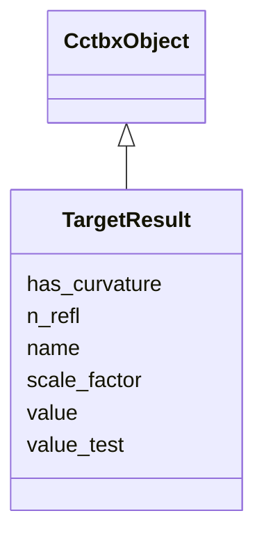

---
search:
  boost: 10.0
---

# Class: TargetResult 


_Evaluation of a reciprocal-space target on a reflection list. npz: per_reflection [N], d_target_d_f_calc complex128[N] (cctbx convention dQ/dA + i dQ/dB, zero on free reflections), optional curv_radial [N] (d2g/d|F|2) and curv_tangential [N] ((dg/d|F|)/|F|) for amplitude-only targets._

__


<div data-search-exclude markdown="1">


URI: [phridge:TargetResult](https://github.com/phzwart/phridge/schema/phridge/TargetResult)





## Inheritance
* [CctbxObject](CctbxObject.md)
    * **TargetResult**


## Slots

| Name | Cardinality and Range | Description | Inheritance |
| ---  | --- | --- | --- |
| [name](name.md) | 1 <br/> [String](String.md) | Registered target name (ls, ml_f,  | direct |
| [value](value.md) | 1 <br/> [Float](Float.md) | Target on the work set | direct |
| [value_test](value_test.md) | 0..1 <br/> [Float](Float.md) | Target on the test set when r_free flags were given | direct |
| [n_refl](n_refl.md) | 1 <br/> [Integer](Integer.md) |  | direct |
| [scale_factor](scale_factor.md) | 0..1 <br/> [Float](Float.md) | Scale used or fitted by the target | direct |
| [has_curvature](has_curvature.md) | 1 <br/> [Boolean](Boolean.md) |  | direct |


## Identifier and Mapping Information


### Schema Source


* from schema: https://github.com/phzwart/phridge/schema/phridge


## Mappings

| Mapping Type | Mapped Value |
| ---  | ---  |
| self | phridge:TargetResult |
| native | phridge:TargetResult |


## LinkML Source

<!-- TODO: investigate https://stackoverflow.com/questions/37606292/how-to-create-tabbed-code-blocks-in-mkdocs-or-sphinx -->

### Direct

<details>
```yaml
name: TargetResult
description: 'Evaluation of a reciprocal-space target on a reflection list. npz: per_reflection
  [N], d_target_d_f_calc complex128[N] (cctbx convention dQ/dA + i dQ/dB, zero on
  free reflections), optional curv_radial [N] (d2g/d|F|2) and curv_tangential [N]
  ((dg/d|F|)/|F|) for amplitude-only targets.

  '
from_schema: https://github.com/phzwart/phridge/schema/phridge
rank: 1000
is_a: CctbxObject
attributes:
  name:
    name: name
    description: Registered target name (ls, ml_f, ...)
    from_schema: https://github.com/phzwart/phridge/schema/cctbx_scattering
    domain_of:
    - SlotBinding
    - OpSpec
    - Atom
    - TargetResult
    required: true
  value:
    name: value
    description: Target on the work set
    from_schema: https://github.com/phzwart/phridge/schema/cctbx_scattering
    rank: 1000
    domain_of:
    - TargetResult
    range: float
    required: true
  value_test:
    name: value_test
    description: Target on the test set when r_free flags were given
    from_schema: https://github.com/phzwart/phridge/schema/cctbx_scattering
    rank: 1000
    domain_of:
    - TargetResult
    range: float
  n_refl:
    name: n_refl
    from_schema: https://github.com/phzwart/phridge/schema/cctbx_scattering
    domain_of:
    - MillerArray
    - HendricksonLattman
    - ReflectionFile
    - TargetResult
    range: integer
    required: true
  scale_factor:
    name: scale_factor
    description: Scale used or fitted by the target
    from_schema: https://github.com/phzwart/phridge/schema/cctbx_scattering
    rank: 1000
    domain_of:
    - TargetResult
    range: float
  has_curvature:
    name: has_curvature
    from_schema: https://github.com/phzwart/phridge/schema/cctbx_scattering
    rank: 1000
    domain_of:
    - TargetResult
    range: boolean
    required: true

```
</details>

### Induced

<details>
```yaml
name: TargetResult
description: 'Evaluation of a reciprocal-space target on a reflection list. npz: per_reflection
  [N], d_target_d_f_calc complex128[N] (cctbx convention dQ/dA + i dQ/dB, zero on
  free reflections), optional curv_radial [N] (d2g/d|F|2) and curv_tangential [N]
  ((dg/d|F|)/|F|) for amplitude-only targets.

  '
from_schema: https://github.com/phzwart/phridge/schema/phridge
rank: 1000
is_a: CctbxObject
attributes:
  name:
    name: name
    description: Registered target name (ls, ml_f, ...)
    from_schema: https://github.com/phzwart/phridge/schema/cctbx_scattering
    owner: TargetResult
    domain_of:
    - SlotBinding
    - OpSpec
    - Atom
    - TargetResult
    range: string
    required: true
  value:
    name: value
    description: Target on the work set
    from_schema: https://github.com/phzwart/phridge/schema/cctbx_scattering
    rank: 1000
    owner: TargetResult
    domain_of:
    - TargetResult
    range: float
    required: true
  value_test:
    name: value_test
    description: Target on the test set when r_free flags were given
    from_schema: https://github.com/phzwart/phridge/schema/cctbx_scattering
    rank: 1000
    owner: TargetResult
    domain_of:
    - TargetResult
    range: float
  n_refl:
    name: n_refl
    from_schema: https://github.com/phzwart/phridge/schema/cctbx_scattering
    owner: TargetResult
    domain_of:
    - MillerArray
    - HendricksonLattman
    - ReflectionFile
    - TargetResult
    range: integer
    required: true
  scale_factor:
    name: scale_factor
    description: Scale used or fitted by the target
    from_schema: https://github.com/phzwart/phridge/schema/cctbx_scattering
    rank: 1000
    owner: TargetResult
    domain_of:
    - TargetResult
    range: float
  has_curvature:
    name: has_curvature
    from_schema: https://github.com/phzwart/phridge/schema/cctbx_scattering
    rank: 1000
    owner: TargetResult
    domain_of:
    - TargetResult
    range: boolean
    required: true

```
</details></div>