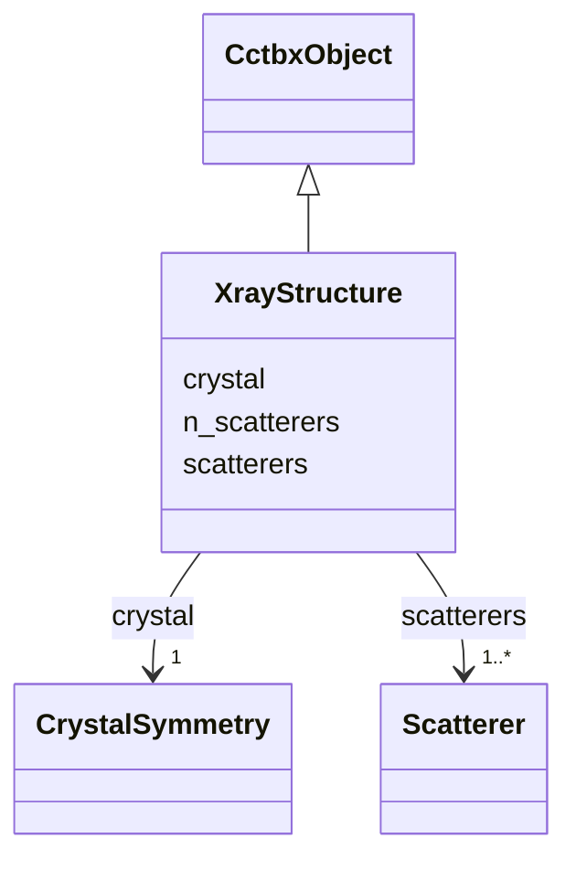

---
search:
  boost: 10.0
---

# Class: XrayStructure 


_Canonical cctbx.xray.structure. npz: sites_frac [N,3], occupancy [N], u_iso [N], u_star [N,6] (U* fractional, adptbx.u_cart_as_u_star). Mixed iso/aniso allowed._

__


<div data-search-exclude markdown="1">


URI: [phridge:XrayStructure](https://github.com/phzwart/phridge/schema/phridge/XrayStructure)





## Inheritance
* [CctbxObject](CctbxObject.md)
    * **XrayStructure**


## Slots

| Name | Cardinality and Range | Description | Inheritance |
| ---  | --- | --- | --- |
| [crystal](crystal.md) | 1 <br/> [CrystalSymmetry](CrystalSymmetry.md) |  | direct |
| [n_scatterers](n_scatterers.md) | 1 <br/> [Integer](Integer.md) |  | direct |
| [scatterers](scatterers.md) | 1..* <br/> [Scatterer](Scatterer.md) |  | direct |


## Identifier and Mapping Information


### Schema Source


* from schema: https://github.com/phzwart/phridge/schema/phridge


## Mappings

| Mapping Type | Mapped Value |
| ---  | ---  |
| self | phridge:XrayStructure |
| native | phridge:XrayStructure |


## LinkML Source

<!-- TODO: investigate https://stackoverflow.com/questions/37606292/how-to-create-tabbed-code-blocks-in-mkdocs-or-sphinx -->

### Direct

<details>
```yaml
name: XrayStructure
description: 'Canonical cctbx.xray.structure. npz: sites_frac [N,3], occupancy [N],
  u_iso [N], u_star [N,6] (U* fractional, adptbx.u_cart_as_u_star). Mixed iso/aniso
  allowed.

  '
from_schema: https://github.com/phzwart/phridge/schema/phridge
rank: 1000
is_a: CctbxObject
attributes:
  crystal:
    name: crystal
    from_schema: https://github.com/phzwart/phridge/schema/cctbx_coordinates
    domain_of:
    - MillerArray
    - HendricksonLattman
    - ReflectionFile
    - CrystalGridding
    - RealMap
    - ComplexMap
    - EmMap
    - CartesianSites
    - FractionalSites
    - Hierarchy
    - XrayStructure
    - GeometryRestraints
    range: CrystalSymmetry
    required: true
    inlined: true
  n_scatterers:
    name: n_scatterers
    from_schema: https://github.com/phzwart/phridge/schema/cctbx_coordinates
    rank: 1000
    domain_of:
    - XrayStructure
    - SfGradients
    range: integer
    required: true
  scatterers:
    name: scatterers
    from_schema: https://github.com/phzwart/phridge/schema/cctbx_coordinates
    rank: 1000
    domain_of:
    - XrayStructure
    range: Scatterer
    required: true
    multivalued: true
    inlined: true

```
</details>

### Induced

<details>
```yaml
name: XrayStructure
description: 'Canonical cctbx.xray.structure. npz: sites_frac [N,3], occupancy [N],
  u_iso [N], u_star [N,6] (U* fractional, adptbx.u_cart_as_u_star). Mixed iso/aniso
  allowed.

  '
from_schema: https://github.com/phzwart/phridge/schema/phridge
rank: 1000
is_a: CctbxObject
attributes:
  crystal:
    name: crystal
    from_schema: https://github.com/phzwart/phridge/schema/cctbx_coordinates
    owner: XrayStructure
    domain_of:
    - MillerArray
    - HendricksonLattman
    - ReflectionFile
    - CrystalGridding
    - RealMap
    - ComplexMap
    - EmMap
    - CartesianSites
    - FractionalSites
    - Hierarchy
    - XrayStructure
    - GeometryRestraints
    range: CrystalSymmetry
    required: true
    inlined: true
  n_scatterers:
    name: n_scatterers
    from_schema: https://github.com/phzwart/phridge/schema/cctbx_coordinates
    rank: 1000
    owner: XrayStructure
    domain_of:
    - XrayStructure
    - SfGradients
    range: integer
    required: true
  scatterers:
    name: scatterers
    from_schema: https://github.com/phzwart/phridge/schema/cctbx_coordinates
    rank: 1000
    owner: XrayStructure
    domain_of:
    - XrayStructure
    range: Scatterer
    required: true
    multivalued: true
    inlined: true

```
</details></div>