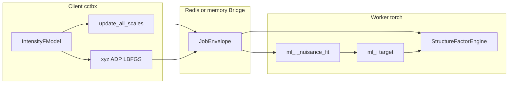
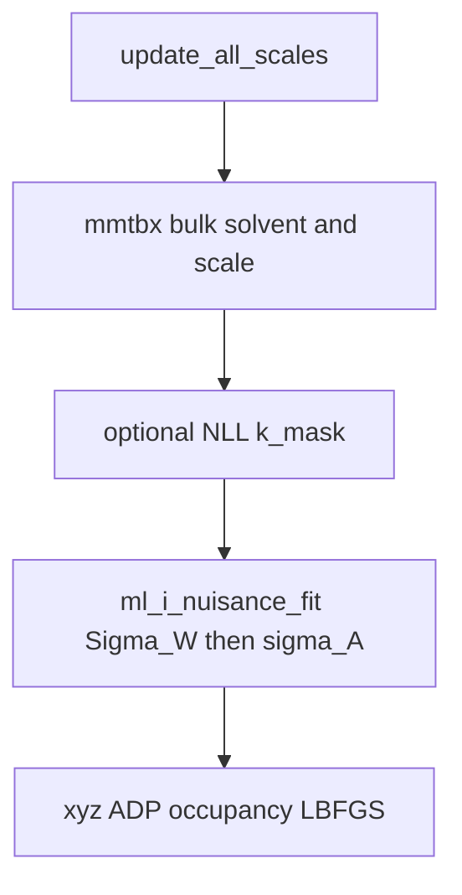

# Spatial σ_A v2 — Phase 0 inspection

Read-only survey of the existing FFT engine, `ml_i` target, scaling/alternation,
LinkML contract, CLI, and tests, against the working note
[spec.pdf](spec.pdf) (copy of [`../per_atom_error_model.pdf`](../per_atom_error_model.pdf),
9 pages, 23 September 2026). Equation numbers follow that PDF.

Phases 1–5 stay blocked until a separate sign-off. This note records what the
codebase already does and what the spec still needs.

**Equation numbering.** The implementation brief’s “eq. 12” for `d_j(h)` is
PDF **eq. 14** (`d_j(h) = D_0(s) exp(λ(x_j) − κ(x_j) s²/4)`). PDF eq. 12 is
Read’s uniform `σ_A`.

**Name collision.** The repo already has a different “spatial σ_A”: the
inverse-mask two-channel `F_eff` mix, flag `--spatial-sigmaA` /
`PHRIDGE_SPATIAL_SIGMA_A`
([`../../src/phridge/contrib/intensity_ll/local_sigma_a.py`](../../src/phridge/contrib/intensity_ll/local_sigma_a.py)).
That file’s unused `residual` slot is labelled “v2 intra-molecular ψ” and is
**not** this spec. The new flag `--spatial-sigmaA-v2` must stay a separate,
default-off path.

---

## 1. Structure-factor engine

There is no `from_scatterers` symbol on the worker. The analogue is `sf_calc`
→ `StructureFactorEngine.f_calc`.

- **Ops:** [`../../src/phridge/sfcalc/ops.py`](../../src/phridge/sfcalc/ops.py)
  `sf_calc` (105–108), `sf_gradients` (114–130), `scattering_model` (57–85).
- **Engine:** [`../../src/phridge/sfcalc/engine/engine.py`](../../src/phridge/sfcalc/engine/engine.py)
  lines 1–16, 212–424. Ten Eyck real-space Gaussians + `torch.fft.fftn` +
  gather at `−h`.
- **Façade:** [`../../src/phridge/sfcalc/client.py`](../../src/phridge/sfcalc/client.py)
  `StructureFactorServer.from_scatterers` (674–717).
- **Registry:** [`../../src/phridge/ops.py`](../../src/phridge/ops.py) 248–263;
  worker map [`../../src/phridge/worker/ops/__init__.py`](../../src/phridge/worker/ops/__init__.py)
  12–19.

**Inputs** assembled in `scattering_model` and `ScatteringModel`
([`engine.py`](../../src/phridge/sfcalc/engine/engine.py) 40–81):

- Coordinates: `sites_frac` `(N, 3)`
- Occupancy: `occupancy` `(N,)`
- Isotropic ADP: `u_iso` `(N,)`
- Anisotropic ADP: `u_star` `(N, 6)` + per-scatterer `anisotropic` bool
- `fp` / `fdp`
- Gaussian table: `gauss_a/b/c` + `type_index`
- Symops: `rot` `(S,3,3)`, `trans` `(S,3)` from `crystal.symops` (required;
  missing raises at ops.py 60–61)
- Grid: `EngineParams` `d_min`, `grid_resolution_factor`, `quality_factor`,
  `wing_cutoff`, `u_extra`, optional `n_real` (85–98, 237–241)

**Per-atom anisotropic ADPs: yes.** Forward path branches in `density`
(346–358) to `_iso_terms` vs `_aniso_terms` / `_gauss` (382–414). Box size
uses the max eigenvalue of `U_cart` (274–276). Tests vs cctbx direct:
[`../../tests/test_xtal_engine.py`](../../tests/test_xtal_engine.py) 65–76,
87–112.

**Packed gradient order — two layouts.**

1. **Wire / npz**
   ([`../../src/phridge/sfcalc/packing.py`](../../src/phridge/sfcalc/packing.py)
   62–63;
   [`../../schema/cctbx_scattering.yaml`](../../schema/cctbx_scattering.yaml)
   81–89): `d_site_frac (N,3)`, `d_occupancy`, `d_u_iso`, `d_u_star (N,6)`,
   `d_fp`, `d_fdp`. Fractional sites and `u_star`, not Cartesian.
2. **cctbx LBFGS convention 2** (`RemoteGradients.packed()`,
   [`../../src/phridge/sfcalc/client.py`](../../src/phridge/sfcalc/client.py)
   99–130): per scatterer, cartesian site (3) if `grad_site`; `u_iso`;
   **`u_cart` (6)** via `adptbx.grad_u_star_as_u_cart`; occupancy; fp/fdp
   (global any-flag quirk).

Match to cctbx is tested both as component arrays vs `gradients_direct`
(`test_xtal_engine.py` 87–112) and as `packed()` vs cctbx `packed()`
(277–288).

**Implication for the spec.** Eq. 25’s modified model (occupancy `w_j`, ADP
`U_ADP_j + U_j`) is a first-class engine input. `D_0(s)` is atom-independent
and is **not** an engine parameter: fold it into reflection coefficients
after `f_calc`, or into `dL/dF*` before `sf_gradients`.

---

## 2. Gradient path

The repo never names a standalone Agarwal routine. Docs state the
equivalence: VJP through the FFT is the Agarwal gradient-map trick
([`../engine.md`](../engine.md) 24–28; engine docstring 13–15).

**Exact point `dL/dF*` → atoms** —
[`StructureFactorEngine.gradients`](../../src/phridge/sfcalc/engine/engine.py)
443–460:

1. Form `q = Re Σ_h conj(G_h) F_h` with `G = d_target_d_f_calc` (cctbx
   `dQ/dA + i dQ/dB`).
2. `torch.autograd.grad(q, params)` through gather → FFT adjoint → `density`.
3. Occupancy and ADP derivatives come from backprop through Ten Eyck grid
   sampling (`index_add` of Gaussians, 359–364), **not** from a separate
   “build map then sample” API.

Target-side `G_h`:
[`Target.evaluate`](../../src/phridge/sfcalc/targets/base.py) 108–119
autograds the reduced NLL w.r.t. complex `f_calc`. Intensity chain:
[`ml_i_target_and_gradients`](../../src/phridge/contrib/intensity_ll/ops.py)
2004–2050.

**Occupancy / ADP:**

- Occupancy: weight `w` in `density` (333, 359–360) → autograd.
- `u_iso`: `_iso_terms` (382–391).
- `u_star`: `_aniso_terms` (393–414).

**Direct summation** exists only on the Gauss–Newton path
(`gauss_newton_blocks`, 546–697): explicit `exp(2π i h·x)`,
`exp(−2π² hᵀ U h)` for curvature/preconditioning, not for `sf_gradients`.

**Visualization maps** (separate from atomic grads): client `fft_map` of
Miller coefficients from `d_target_d_f_model`
([`../../src/phridge/client/intensity/maps.py`](../../src/phridge/client/intensity/maps.py)
65–85, 310–315).

**Implication.** Mean-term grads (spec §10, eq. 25) reuse `sf_gradients` on
the **modified** `XrayStructure` with coefficients `D_0(s) · dL/dF_eff*`.
Occupancy grads are `∂L/∂w_j`; ADP grads are `∂L/∂(U_ADP+U_j)` hence
`∂L/∂U_j`. There is no public “sample gradient map against atom” helper —
the engine already does that via autograd.

---

## 3. Target layer (`ml_i`)

Registered as `IntensityLogLikelihood` in
[`../../src/phridge/contrib/intensity_ll/target.py`](../../src/phridge/contrib/intensity_ll/target.py)
99–243. Core integral:
[`mli.py`](../../src/phridge/contrib/intensity_ll/mli.py)
`log_likelihood_normal` / `_t` (442–522).

**This is not the spec’s Rice.** `ml_i` is Rice/Woolfson **× experimental
intensity-noise quadrature**. The spec (§4, eqs 7–9) is closed-form
Rice/Woolfson with **no experimental error**. Spec tests say “no
experimental error anywhere.” The kernels `acen_E` / `cen_E` (mli.py
159–198) already bake `log_normal_noise` into the integrand.

**Variance / σ_A entry (all per-reflection after interpolation):**

- `obs.sigmas` — σ(I); else scalar `sigma`
- `obs.beta` — Wilson `Σ = ⟨|F|²⟩/ε` (`sigma_wilson`)
- `obs.alpha` — `σ_A`
- `obs.beta_residual` — free residual in normalized units; absent →
  classical `a = 1 − σ_A²` (target.py 153–196)

Normalization
([`mli.normalize`](../../src/phridge/contrib/intensity_ll/mli.py) 527–540):
`E_C = |F_c| / √(ε Σ_W)`, `Z_o = I / (ε Σ_W)`.

**What is exposed**

- Per-reflection NLL `t_h` (`per_reflection`, target.py 198–243)
- Scalar work-set mean
  ([`base.py`](../../src/phridge/sfcalc/targets/base.py) 96–99)
- **`d_target_d_f_calc`**: one complex per reflection, zeros on free set
  (base.py 65–69, 116–119)
- Optional `curv_radial` / `curv_tangential` for amplitude-only targets

**What is not exposed**

- No `dL/dF_eff*` symbol (spatial v1 just substitutes `F_eff` for `f_calc`
  before `evaluate`)
- **No `dL/dSigma` / `dL/dΣ_Δ` anywhere** on `TargetEval` or `TargetResult`
- Nuisance arrays are frozen during the coordinate step
  ([`engine.py`](../../src/phridge/client/intensity/engine.py)
  `_common_eval_kwargs` 2668–2686)

**Implication.** Do not reuse `ml_i` as the spec density. Implement eqs 7–9
as a named Rice/Woolfson NLL on `(F_eff, Σ_Δ)` under the new package,
returning both `dL/dF_eff*` and `dL/dΣ_Δ` per reflection. Comment (A3)–(A4)
at the Gaussian/circular step. Later, experimental σ(I) can join the
denominator (spec §8) without changing the field model.

---

## 4. Scaling

Split across the Redis/memory boundary.

**Client (cctbx / mmtbx)** —
[`IntensityFModel.update_all_scales`](../../src/phridge/client/intensity/engine.py)
3303–3579:

1. `mmtbx.bulk_solvent.f_model_all_scales` for `k_iso`, `k_aniso`, `k_mask`
   (3358–3405)
2. Residual scale folded into `k_isotropic` (3407–3421)
3. Optional worker `ml_i_bulk_solvent_fit` (NLL `k_mask`; `k_sol`/`B_sol`
   are a caption of the curve) — client call 2004–2054, op
   [`bulk_solvent_op.py`](../../src/phridge/contrib/intensity_ll/bulk_solvent_op.py)

**Worker (torch)** — `ml_i_nuisance_fit`
([`ops.py`](../../src/phridge/contrib/intensity_ll/ops.py) 745–822,
1608–1730): stage 1 `Σ_W`, stage 2 `σ_A` / `β` / `ν`, optional v1 spatial
`u`. Client stores `sigma_a`, `sigma_wilson`, `beta_residual` (engine.py
3555–3579).

**Frozen during a coordinate cycle.** Yes. Scales and shell tables are
refit at the start of the macrocycle (`update_all_scales`); LBFGS uses the
last fit. Default Phenix driver is in-process (`PHRIDGE_MEMORY=1`), same
`Bridge.call` contract as Redis ([`../redis.md`](../redis.md) 8–11).

---

## 5. Alternation

**Phenix path** (primary):

- Scale/nuisance: `update_all_scales` (engine.py 3303–3667)
- Then Phenix inner LBFGS:
  [`phenix_hook.py`](../../src/phridge/client/intensity/phenix_hook.py)
  774–831
- Interleaved mode (`PHRIDGE_TARGET_MODE=interleaved`) wraps inner blocks
  with a surrogate; not a field step

**Standalone**
[`refine_lbfgs`](../../src/phridge/client/intensity/refine.py) 1208–1267:
coords → B → scale/solvent → `σ_A`/`ν`. Opposite order to Phenix (coords
first).

**Where the field step slots in.** Spec §10: atoms frozen while fitting
`(λ, κ, D_0, Σ_miss)`; then `(w_j, U_j)` frozen as constants during the
coordinate/ADP step; never evaluate `λ(x_j)` live during (iii). On the
Phenix path that is **after existing scale/bulk + current nuisance fit,
still inside `update_all_scales`, before LBFGS**. On standalone it is after
scale/solvent and before (or replacing) the current `σ_A` step. Existing v1
spatial `u` already lives inside `ml_i_nuisance_fit` stage 2 (engine.py
3507–3553) — do not overload that; add a separate v2 field-step call.

**Fisher sub-mode.** `gauss_newton_blocks` already returns
`site_frac (N,3,3)`
([`engine.py`](../../src/phridge/sfcalc/engine/engine.py) 546–638; op in
[`ops.py`](../../src/phridge/ops.py) 308–314; schema `SfCurvatures`). Those
blocks are **fractional**. Spec `U_j` (eq. 23) is Cartesian Ų, so invert
the 3×3 after transforming to Cartesian. Off-diagonal sparse inverse is
not implemented; spec allows the usual diagonal-block approximation. Flag:
`--spatial-sigmaA-v2-fisher` / `PHRIDGE_SPATIAL_SIGMA_A_V2_FISHER`, default
off.

---

## 6. Schema

**In:** `JobEnvelope.inputs` → `XrayStructure` + `ScatteringTable` +
`SfEngineParams` + `MillerArray` + optional `array`/`json`
([`../../schema/phridge.yaml`](../../schema/phridge.yaml) 139–172;
[`../../schema/cctbx_coordinates.yaml`](../../schema/cctbx_coordinates.yaml)
114–159;
[`../../schema/cctbx_scattering.yaml`](../../schema/cctbx_scattering.yaml)
33–79).

**Out:** `TargetResult` (`per_reflection`, `d_target_d_f_calc`, optional
curvatures), `SfGradients` (fixed npz fields above), optional
`SfCurvatures`.

**Optional-block pattern today:** LinkML slots without `required`; Pydantic
`Optional[...] = None`; op-level `"array"` / `"json"` (intensity ops
already do this for `alpha`, `beta`, `local_sigma_a`). Precedent: v1
spatial σ_A ships as **json + arrays, no new kind**
([`local_sigma_a.md`](../../src/phridge/contrib/intensity_ll/local_sigma_a.md)
494–499).
[`../../src/phridge/contrib/AGENTS.md`](../../src/phridge/contrib/AGENTS.md)
prefers that.

**Smallest typed extension that still honours “new data that crosses the
boundary gets a schema entry”**, in
[`cctbx_scattering.yaml`](../../schema/cctbx_scattering.yaml):

- **`SpatialSigmaAV2`** (`is_a: CctbxObject`), JSON: `enabled`, field cutoff
  Å, regulariser hyperparameters (`alpha`, spectral `v_k` schedule),
  `n_coeff`, `n_shells`. npz (or sibling `array` slots): unique real
  Fourier coefficients for `λ` and `κ` (`c_0` excluded), shell tables
  `D_0(s)`, `Sigma_miss(s)`, bin edges.
- **`SpatialSigmaAV2Result`**: field-coefficient gradients (`d_lambda_c`,
  `d_kappa_c`, `d_D0`, `d_Sigma_miss`) plus diagnostics `w (N,)`, `U` as
  `u_err_star (N,6)` or `tr_U (N,)`.

No `JobEnvelope` change: new `OpSpec` input/output names only. Follow-up:
pydantic in [`../../src/phridge/models.py`](../../src/phridge/models.py)
(hand-aligned, not codegen —
[`../../scripts/generate_models.py`](../../scripts/generate_models.py)
3–6), `CCTBX_TYPES` +
[`../../src/phridge/codec.py`](../../src/phridge/codec.py) 60–103,
`REQUIRED_CLASSES` in the generator, `make schema-docs`, jsonschema fixture
in [`../../tests/test_linkml_validate.py`](../../tests/test_linkml_validate.py).

When the flag is off the block is `None` and no object is packed.

---

## 7. CLI

| Entry | Role |
|---|---|
| [`../../scripts/phenix_refine_mli.py`](../../scripts/phenix_refine_mli.py) 69–210 | Strips Phridge flags → `PHRIDGE_*` env |
| [`../../scripts/run_phenix_intensity.sh`](../../scripts/run_phenix_intensity.sh) 80–161, 495–502 | Same env exports |
| [`../../src/phridge/client/intensity/cli.py`](../../src/phridge/client/intensity/cli.py) 454–510 | Standalone `phridge-intensity`; **no** spatial-σ_A flags today |
| [`../../src/phridge/worker/runner.py`](../../src/phridge/worker/runner.py) 186–220 | `--runtime`, `--redis-url`, `--device`, `--preload` only |

Feature toggle pattern: CLI → env → `IntensityFModel` reads env → optional
kwargs on `bridge.call`. Worker has **no** feature flags; the payload is
the switch. Catalog:
[`../phenix_refine_integration.md`](../phenix_refine_integration.md)
398–448.

**v2 plumbing:** `--spatial-sigmaA-v2` / `--spatial-sigmaA-v2-fisher` on
the Phenix driver and wrapper (and standalone CLI for parity), mapping to
`PHRIDGE_SPATIAL_SIGMA_A_V2` and `PHRIDGE_SPATIAL_SIGMA_A_V2_FISHER`.
Absent → no schema block, no worker construction.

---

## 8. Tests

- Root: [`../../tests/`](../../tests/) (~40 modules); contrib:
  [`../../tests/contrib/`](../../tests/contrib/). Markers `gpu`, `slow`.
  [`../../tests/conftest.py`](../../tests/conftest.py) imports cctbx before
  torch.
- **Synthetic structures:** `cctbx.development.random_structure.xray_structure`
  in [`../../tests/test_xtal_engine.py`](../../tests/test_xtal_engine.py)
  27–50 (P1, P21, C2, P4132, R3:H, P212121; iso/aniso). Intensity:
  [`../../tests/test_intensity_engine.py`](../../tests/test_intensity_engine.py)
  20–43. Hand-built P1:
  [`../../tests/contrib/test_interleaved.py`](../../tests/contrib/test_interleaved.py)
  351–408. Intensity series:
  [`synthetic.py`](../../src/phridge/contrib/intensity_ll/synthetic.py).
  **No two-domain layout fixture** for field recovery.
- **Finite-difference harness:** no shared utility. Established pattern in
  `test_xtal_engine.py`: `test_gradient_convention_finite_difference`
  (115–141), GN HVP FD (367–394), GN site-block FD (491+). Also
  `curvature_by_finite_difference` in
  [`surrogate.py`](../../src/phridge/contrib/intensity_ll/surrogate.py);
  free-β map FD in
  [`../../tests/contrib/test_free_beta.py`](../../tests/contrib/test_free_beta.py).
- Contrib policy: registration, pydantic accept/reject, jsonschema if
  schema changes, numeric smoke
  ([`AGENTS.md`](../../src/phridge/contrib/AGENTS.md) 26–31).
- New tests live at `tests/contrib/test_spatial_sigmaa_v2.py` (or one file
  per §11 item) with function names matching spec §11.

---

## 9. Gaps (spec needs, codebase does not have)

1. **Closed-form Rice/Woolfson on `(F_eff, Σ_Δ)`** (eqs 7–9). `ml_i` is a
   different density (Rice × σ(I) quadrature) and has no `dL/dΣ`.
2. **Per-reflection `dL/dΣ_Δ`.** Not on `TargetEval` / `TargetResult`. Must
   be added in the new target (or as an optional `TargetResult` npz key).
3. **`Σ_Δ(h)` (eq. 4).** Phase-free sum
   `Σ_j f_j² T_j² (w_j − d_j²) + Σ_miss(s)`. Form factors are inlined
   inside `gauss_newton_blocks` (engine.py 603–608); no public `Σ_j f² T²`
   helper.
4. **Symmetry-adapted, band-limited Fourier bases** for `λ(x)`, `κ(x)`:
   Hermitian pairing, centric phase restrictions, `c_0 = 0`, cutoff in Å,
   evaluate **at atom positions only** (spec §6). Nothing like this exists.
   Symops are available on `CrystalSymmetry.symops`.
5. **Per-atom `w_j`, `U_j`, shell `D_0` / `Σ_miss`, field coefficients** —
   no schema, no packer.
6. **Field-coefficient gradients** (eq. 29) and regulariser (eqs 15–16) —
   not implemented.
7. **Fisher closure:** 3×3 GN site blocks exist but are fractional; no
   `M⁻¹ → U_j` (Cartesian Ų); no sparse off-diagonal inverse (acceptable
   as the usual approximation, labelled).
8. **Anisotropic variance-gradient map** (self-Patterson at the origin,
   spec §10) — not present. Stub `NotImplementedError` + xfail as
   specified. Isotropic route (radial bin `dL/dΣ`, tabulate per element ×
   total B) is also new.
9. **Two-domain synthetic crystal** with a non-trivial space group that has
   centric reflections — not in fixtures. Need this for
   `test_field_recovery` / circularity / Gaussianity.
10. **Existing spatial σ_A v1** must remain untouched.
    `--spatial-sigmaA-v2` off ⇒ byte-identical outputs
    (`test_flag_off_is_inert`).
11. **Standalone CLI** has no spatial flags; Phenix path is env-driven.
    Both need the new flag for the feature to be reachable.
12. **Production `ml_i` always has experimental error.** Spec omits it.
    Keep v2 tests on the closed-form Rice; do not silently switch the
    Phenix `ml_i` path when the flag is off.

**What can be reused without duplication**

- FFT engine + aniso ADPs on the modified model (eq. 25)
- `sf_gradients` / Agarwal–Ten Eyck VJP for the mean term
- `gauss_newton_blocks` site 3×3 for Fisher (with frame conversion)
- `StructureFactorServer` / `Bridge` / existing op registration
- Env-flag CLI pattern
- FD patterns in `test_xtal_engine.py`
- `random_structure` + space groups with centrics (e.g. `P212121`, `P21`)

Approximations (A1)–(A5) are not mentioned in current code. Any new code
that relies on them must carry a comment naming the label.

---

## Recommended layout (later phases; not implemented here)

Package: `src/phridge/contrib/spatial_sigmaa_v2/` — sibling of
`intensity_ll`, not nested in it (avoids colliding with `local_sigma_a`
“v2 residual ψ”). Follow
[`../../src/phridge/contrib/AGENTS.md`](../../src/phridge/contrib/AGENTS.md):
`from __future__ import annotations`, pydantic options, no torch on client
helpers.

- `fields.py` — §6 bases
- `per_atom.py` — eq. 14 / 25
- `moments.py` — eqs 3–4 via existing FFT + new `Σ_Δ` sum
- `target.py` — eqs 7–9 + `dL/dF*`, `dL/dΣ`
- `gradients.py` — §10, isotropic variance first
- `regulariser.py` — eqs 15–16
- Tests named exactly as spec §11

Each later phase still ends with a short note in this directory and waits
for sign-off.

Phase 1 (schema + `--spatial-sigmaA-v2` plumbing, inert when off) starts
only on a separate go-ahead.
