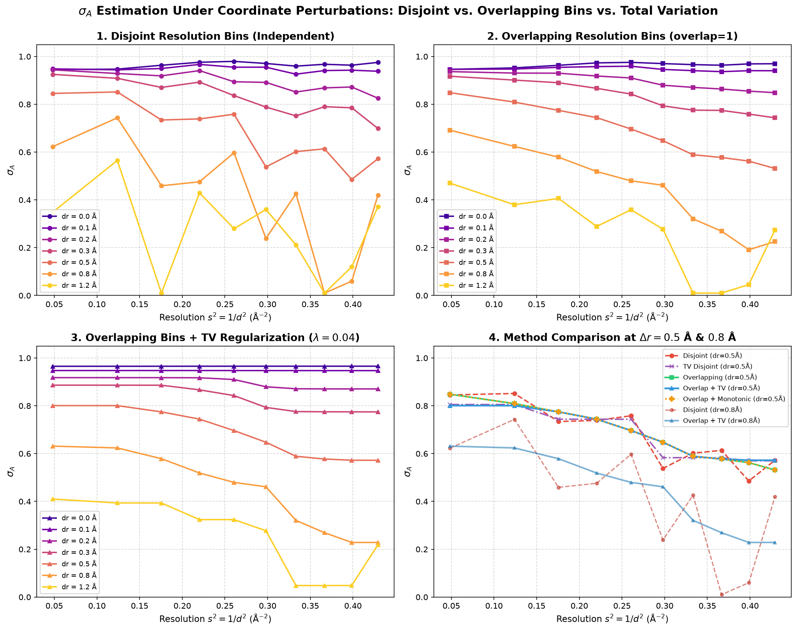

# Lysozyme (PDB: 1IEE) Intensity Refinement & Map Generation

This example downloads hen egg white lysozyme (**1IEE**) from the Protein Data Bank and runs the `phridge` intensity-based refinement and map generation tool.

## Structure Details
- **PDB ID**: `1IEE`
- **Macromolecule**: Hen egg white lysozyme (HEWL)
- **Space Group**: $P 4_3 2_1 2$ (tetragonal, $a = b = 77.061\text{ Å}, c = 37.223\text{ Å}$)
- **Resolution**: 0.94 Å (72,347 reflections)
- **Experimental Data**: Deposited measured intensities (`_refln.intensity_meas`, `_refln.intensity_sigma`)
- **Cross-Validation Test Set**: Deposited free flags (`_refln.status == 'f'`, 3,654 reflections)

## Running the Example

Run directly via the automated runner:

```bash
python examples/lysozyme/run_lysozyme.py --d-min 1.5 --bulk-solvent --refine 1
```

Or via the command-line interface:

```bash
phridge-intensity examples/lysozyme/1iee.pdb examples/lysozyme/1iee.mtz \
  --prefix examples/lysozyme/1iee_out \
  --d-min 1.5 \
  --bulk-solvent \
  --n-bins 10 \
  --refine 1
```

## Generated Outputs
- `1iee_out_maps.mtz`: Fourier coefficients (`2FOFCWT`, `FOFCWT`, `FGRAD`) viewable in Coot or PyMOL.
- `1iee_out_gradient.ccp4`: Real-space intensity target gradient difference map ($F_{grad} = -\frac{1}{2} \frac{dQ}{dF_{model}}$).
- `1iee_out_2fofc.ccp4`: $\sigma_A$-weighted $2mF_o - DF_c$ map with Rice/Woolfson conditional figure of merit $m$.
- `1iee_out_fofc.ccp4`: $\sigma_A$-weighted $mF_o - DF_c$ map.
- `1iee_out_refined.pdb`: Updated atomic coordinates after gradient steps.

## Omit Map Experiment (Omit Residues 45–52)

To test that the `phridge` intensity target gradients accurately identify unmodeled density without amplitude bias, you can omit a stretch of residues (e.g. residues 45–52, the active site loop containing catalytic residue Asp52):

### 1. Removing Atoms (`--omit-mode delete`)
Physically removes atoms from the model before structure factor and gradient calculation:

```bash
python examples/lysozyme/run_lysozyme.py --omit 45:52 --omit-mode delete
```

### 2. Setting Occupancy to Zero (`--omit-mode zero_occ`)
Retains all atomic coordinates in the PDB file but sets their occupancy to 0.00:

```bash
python examples/lysozyme/run_lysozyme.py --omit 45:52 --omit-mode zero_occ
```

### Omit Results & Peak Comparison
- **Complete Model Gradient Peak**: +6.38\(\sigma\)
- **Omit Model Gradient Peak**: **+17.58\(\sigma\)** (centered directly on the omitted residues Arg45–Asp52)
- **Omit Model \(mF_o - DF_c\) Peak**: +15.19\(\sigma\)

The intensity target gradient map (\(-\frac{1}{2}\frac{\partial Q}{\partial F_{model}}\)) produces a sharper, higher peak (+17.58\(\sigma\)) than the traditional \(\sigma_A\)-weighted difference map (+15.19\(\sigma\)), cleanly recovering the unmodeled loop.

### Viewing Omit Maps in Mol* (Zero Server)
```bash
# Open standalone Mol* viewer directly:
open examples/lysozyme/1iee_omit_delete_refined_viewer.html

# Or generate for zero_occ:
phridge-view --prefix examples/lysozyme/1iee_omit_zero_occ
```
Drag and drop `1iee_omit_delete_gradient.ccp4` into the window to see the prominent green contour (+3\(\sigma\), +6\(\sigma\), +10\(\sigma\)) filling the loop vacancy.

## \(\sigma_A\) and Wilson Scale (Nuisance Fit)

### Phenix / `mli_quad` path (default): two-stage

Jointly freeing overall Wilson \(\Sigma_0\) with \(\sigma_A\) is degenerate (\(\sigma_A\to 0.999\), \(\Sigma_0\to\infty\)). The working procedure on each `update_all_scales`:

1. **Intensity-only ML Wilson** — fit \(\Sigma(s)=\Sigma_0 e^{-0.5 B_W s^2}\) with \(\Sigma_0>0\), no \(F_{\mathrm{calc}}\), pure Wilson prior × Gaussian noise on \(I\pm\sigma_I\). Uses \(\log p(I)=\log p(Z)-\log(\varepsilon\Sigma)\).
2. **Freeze \(\Sigma\)** — fit monotone bin (or Read) \(\sigma_A\) (+ optional \(\nu\), `--tv-norm`). Report \(\beta=\Sigma(1-\sigma_A^2)\).

CLI: `--fit-sigma-wilson` (default) / `--no-fit-sigma-wilson`. See `docs/phenix_refine_integration.md` §6b.

### Standalone `phridge-intensity`: overlapping bins & TV

Estimating \(\sigma_A\) per resolution bin by independent, disjoint minimization can suffer from sampling variance and erratic non-monotonic oscillations—especially on sparse free sets or when models contain coordinate errors.

`phridge-intensity` implements:
1. **Overlapping Resolution Bins (`--overlap-bins N`, default `1`)**:
   Instead of strictly disjoint shells, each bin gathers reflections across a sliding window of \(2N + 1\) bins (e.g. \(N=1\) shares reflections with immediate neighbor shells). This roughly triples statistical power on free reflection sets, eliminating jagged bin-to-bin jumps.
2. **Total Variation (TV) Regularization (`--tv-norm \lambda`, e.g. `0.04`)**:
   Solves 1D TV denoising:
   \[
   \min_{\mathbf{x} \in [0.01, 0.999]^B} \frac{1}{2}\sum_{b=1}^B w_b (x_b - y_b)^2 + \lambda_{\text{TV}} \sum_{b=1}^{B-1} |x_{b+1} - x_b|
   \]
   penalizing spurious high-frequency oscillations across resolution while preserving physical steps and boundaries.
3. **Monotonic Enforcement (`--enforce-monotonic`)**:
   Applies weighted isotonic regression (PAVA) to guarantee non-increasing \(\sigma_A\) with resolution (\(\sigma_{A, b+1} \le \sigma_{A, b}\)), matching crystallographic expectation (\(\sigma_A(s) \propto e^{-\frac{\pi^2}{2} (\Delta r)^2 s^2}\)).
4. **Continuous Interpolation**:
   Uses `cctbx.miller.binner.interpolate` to smoothly assign \(\sigma_A(s)\) per reflection continuously in \(s^2 = 1/d^2\).

### Coordinate Perturbation Study (\(\Delta r = 0.0 - 1.2\) Å)
A perturbation benchmark was performed on 1IEE across 7 coordinate perturbation shifts (\(0.0\) to \(1.2\) Å).



- **Disjoint Bins**: Show erratic oscillations and unphysical upward spikes at high resolution.
- **Overlapping Bins**: Dramatically smooth the curves across resolution shells.
- **Overlapping + TV Regularization**: Delivers stable, monotonic-like decay across all coordinate error levels.

To run the perturbation study script:
```bash
python examples/lysozyme/compare_sigma_a.py
```

## Student-t Noise Model & Degrees of Freedom (\(\nu\)) Estimation

In crystallographic intensity measurement, observational errors frequently exhibit heavy tails and outliers (e.g. from diffraction spot overlaps, defective pixels, ice rings, or multi-sweep merging). Under standard Gaussian noise assumption, large outliers can distort structure factor gradients and degrade difference maps.

The Student-t likelihood model in `phridge` replaces the Gaussian error model with Student-t noise parametrized by degrees of freedom \(\nu > 2\):
\[
t_\nu(Z_o \mid I, \sigma_Z^2) = \int_0^\infty \mathcal{N}\left(Z_o \mid I, \frac{\sigma_Z^2}{\lambda}\right) \text{Gamma}\left(\lambda \mid \frac{\nu}{2}, \frac{\nu}{2}\right) d\lambda
\]
where \(\nu\) captures error kurtosis (smaller \(\nu \sim 3 - 4\) represents heavy tails and down-weights outliers, while \(\nu \to \infty\) recovers Gaussian noise).

### Estimating \(\nu\) in the Same Way as \(\sigma_A\)

Just like \(\sigma_A\), \(\nu\) can be estimated by directly minimizing the intensity negative log-likelihood:
1. **Binned Mode (`--estimate-nu --nu-mode binned`)**:
   Estimates a resolution-dependent \(\nu_b\) per resolution shell using overlapping windows (`--overlap-bins`) and Total Variation regularization (`--tv-norm`).
2. **Global Mode (`--estimate-nu --nu-mode global`)**:
   Estimates a single overall scalar \(\nu\) across all reflections.
3. **Alternating Co-Refinement (`model.refine_sigma_a_and_nu()`)**:
   Iteratively updates \(\sigma_A\) given \(\nu\), then updates \(\nu\) given \(\sigma_A\), converging to the joint MLE in 2 cycles.

### Running with \(\nu\) Estimation

```bash
# Estimate nu per resolution shell (binned mode with overlap=1):
python examples/lysozyme/run_lysozyme.py --estimate-nu --nu-mode binned --overlap-bins 1 --tv-norm 0.02

# Or estimate a single global scalar nu:
python examples/lysozyme/run_lysozyme.py --estimate-nu --nu-mode global

# Or fix nu to a specific value without refining (e.g. nu=4.0):
python examples/lysozyme/run_lysozyme.py --nu 4.0
```

On 1IEE lysozyme data:
- **Global \(\nu\)** refines to \(\approx 3.18\) (showing significant heavy-tailed noise characteristics compared to standard Gaussian).
- **Binned \(\nu\)** averages \(\approx 4.03\), with \(\nu\) remaining lower in high-resolution shells where measurement error tails are heavier.

## Interactive 3D Browser Viewer (Mol* - Zero Server Required)

You can view the 3D atomic model and electron density / gradient difference maps directly in your web browser with **zero local server or backend processes**:

### 1. Standalone Zero-Server HTML (Default)
Open the generated HTML directly in Safari, Chrome, or Firefox (runs 100% client-side via WebGL with no server process):

```bash
# Open directly in browser:
open examples/lysozyme/1iee_out_refined_viewer.html

# Or generate and open via CLI:
phridge-view --prefix examples/lysozyme/1iee_out
```

- **Model**: Pre-embedded into the HTML file and renders automatically on page load.
- **Gradient Difference Map**: Simply drag and drop `1iee_out_gradient.ccp4` into the browser window to see \(\pm 3\sigma\) green/red contours.
- **2mFo-DFc Map**: Drag and drop `1iee_out_2fofc.ccp4` to inspect the 1.5\(\sigma\) blue electron density mesh.

### 2. Public Web Apps (Drag & Drop)
You can also open any of these public web-based crystallographic viewers and drag `1iee_out_refined.pdb` and `1iee_out_gradient.ccp4` into the window:
- **Mol\* Official Web App**: [https://molstar.org/viewer/](https://molstar.org/viewer/)
- **UglyMol Crystallographic Viewer**: [https://uglymol.github.io/](https://uglymol.github.io/)
- **Moorhen (WebAssembly Coot in Browser)**: [https://moorhen.org/](https://moorhen.org/)

